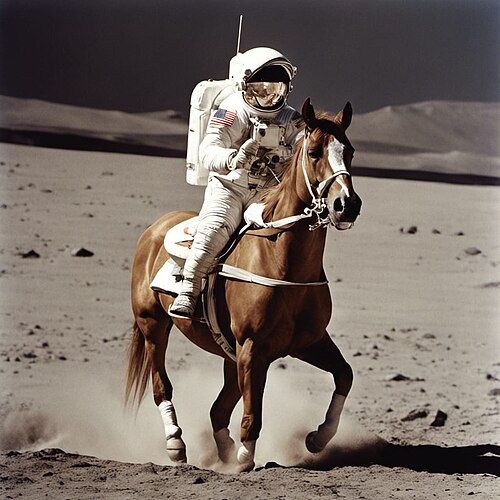

## The success story {.smaller}

:::: {.columns}
::: {.column width="55%"}
Diffusion models made **photorealistic image generation from text** a consumer product:

- **DALL·E 2** (OpenAI, 2022) — the famous *"an astronaut riding a horse"*
- **Stable Diffusion** (2022) — open-source, latent diffusion; ran on a gaming GPU
- **Imagen** (Google), **Midjourney** — an award-winning art scene almost overnight

Type a sentence → get an image that never existed. Diffusion is the engine.
:::
::: {.column width="45%"}
{width="100%"}

::: {style="font-size: 0.55em; color: #777;"}
"An astronaut riding a horse" — Stable Diffusion XL (Wikimedia Commons)
:::
:::
::::

## Far beyond images {.smaller}

The same mathematical recipe now drives:

- **Video** — Sora (OpenAI), Veo (Google): text → coherent video clips
- **Audio & speech** — music and voice synthesis
- **Science** — protein *design* (RFdiffusion); **AlphaFold 3**'s structure module is a diffusion model; weather forecasting (GenCast)
- **…and now language** — diffusion LLMs generate text by *denoising whole passages in parallel* instead of one token at a time: Mercury (Inception Labs), Gemini Diffusion, LLaDA (all 2025)

. . .

One idea, moving discipline to discipline. That is usually the signature of good mathematics.

## The field agrees {.smaller}

- **ICLR 2021 Outstanding Paper** — *Score-Based Generative Modeling through SDEs* (Song et al.): the continuous-time framework we build up to in Modules 5–6
- **ICML 2024 Best Paper** — *Discrete Diffusion Modeling…* (Lou, Meng, Ermon): diffusion for text
- Top-venue best-paper awards keep landing on diffusion papers — this is where the field's frontier is

. . .

**This course:** the mathematics behind that success, in a deliberately simpler setting — low dimensions, Gaussians, formulas you can derive by hand. By the end, you read those papers.

## So *what is* diffusion? {.center}

Forget AI for ten minutes.

Put a drop of ink in still water. Watch.

. . .

It spreads. Always. Nobody stirs, nothing pushes — **pure randomness moves matter from crowded to empty**, and structure dissolves into uniformity.

That spreading is diffusion. The mathematics of it is 200 years old.

## Two centuries before AI/ML {.smaller}

| Year | Who | What diffused |
|---|---|---|
| 1822 | Fourier | **Heat** — the heat equation |
| 1827 | Brown | **Pollen grains** jiggling in water |
| 1855 | Fick | **Chemicals** — concentration gradients |
| 1900 | Bachelier | **Stock prices** — five years *before* Einstein |
| 1905 | Einstein | Brownian motion ⇒ **atoms are real** (Perrin's Nobel) |
| 1931 | Kolmogorov | The **probability theory** of diffusion processes |
| 1962 | Rogers | **Ideas** — "diffusion of innovations" |
| 1973 | Black–Scholes–Merton | **Option prices** — finance runs on diffusions |

Same equations every time. You will recognize all of them in this course.

## Then it made it big in AI {.smaller}

| Year | Step |
|---|---|
| 2015 | Sohl-Dickstein et al. — borrow *non-equilibrium thermodynamics* for generative modeling |
| 2019 | Song & Ermon — generate by following the **score** |
| 2020 | Ho et al. — **DDPM**: diffusion matches GANs on images |
| 2021 | Song et al. — one **SDE** unifies everything |
| 2022 | DALL·E 2, Imagen, Stable Diffusion — the public moment |
| 2024– | Video, proteins, weather, **language** |

. . .

The one twist AI added to 200 years of physics: **run the diffusion backwards.**

## The plan for this course {.center}

Physics destroys structure with noise — reliably, predictably.

We will learn to *undo* it: mathematics that turns noise back into data.

. . .

And we start with the smallest example that contains the whole idea:

**two data points.** →
