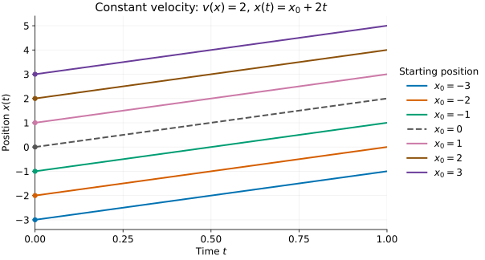
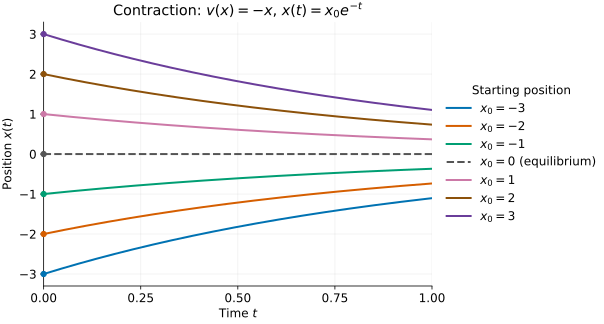
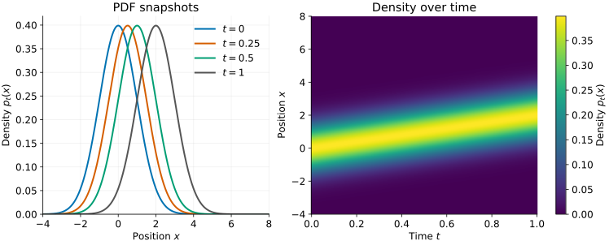
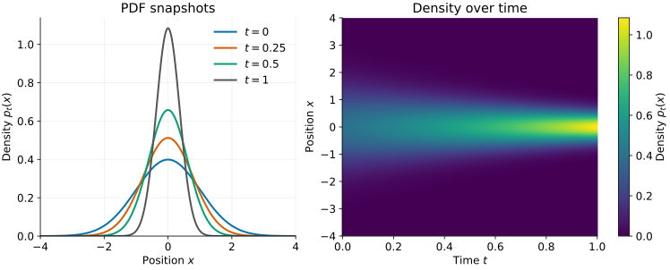
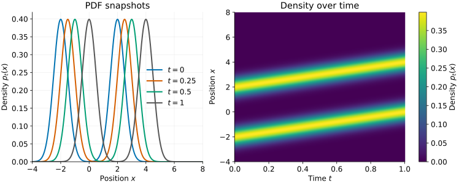
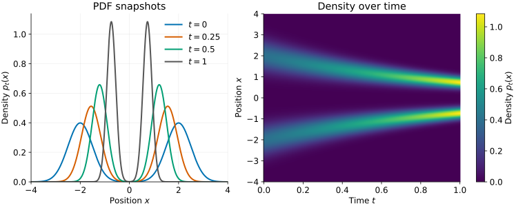
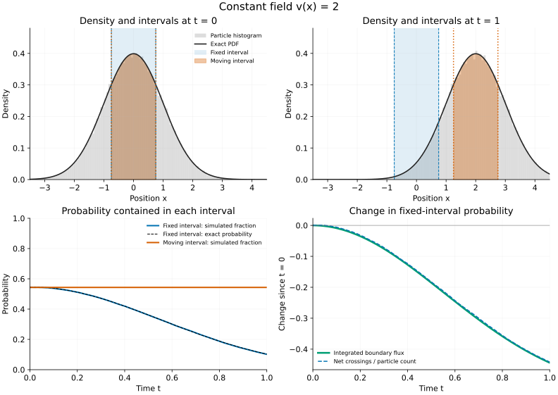
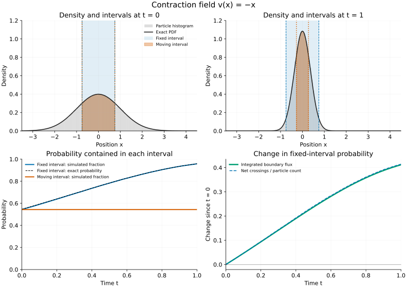

# 12 · Probability-Flow ODE - Part 1 {.unnumbered}

::: {.callout-note}
## Draft — Part 1: scope

These lecture notes are in development and may be revised.

This part sets up the sampling problem in one dimension: how to construct a
vector field whose flow connects the data distribution to a known prior.
All states are real-valued, and time is normalized to $0\le t\le1$.
We develop the one-dimensional transport and probability-flow construction.
The extension to higher dimensions is stated in
[Part 2](./31-probability-flow-ode-part-2.qmd). [Part 3](./32-probability-flow-ode-part-3.qmd) develops score estimation and
Tweedie's formula. [Part 4](./33-probability-flow-ode-part-4.qmd) supplies
CPU notebooks, and [Part 5](./34-probability-flow-ode-part-5.qmd) annotates
an image-model training and sampling implementation.
:::

## Summary: the problem, the sampling procedure, and the main result

**The goal is sampling.** Given observations from an unknown data density
$p_{\mathrm{data}}$, we want to generate new samples from it. We start from
a known prior distribution that is easy to sample, chosen here to be
standard normal.

**Our sampling procedure is numerical ODE integration.** Draw a position
at $t=1$ from the prior, then integrate

$$\frac{dx(t)}{dt}=v(x(t),t)$$

backward to $t=0$. For a positive step size $h$, an explicit Euler step is

$$x(t-h)\approx x(t)-h\,v(x(t),t).$$

The initial draw supplies the randomness. Conditional on that draw, the ODE
trajectory is deterministic. Given a suitable vector field, we therefore
have a numerical procedure for generating samples. Which distribution it
produces depends on both the field and the starting law.

**The unknown is the vector field.** We must construct $v(x,t)$ so that the
population densities induced by its flow satisfy the boundary conditions

$$\boxed{p_0=p_{\mathrm{data}},\qquad
p_1=p_{\mathrm{prior}}=\mathcal N(0,1).}$$

These are conditions on distributions, not prescribed endpoint positions
for each particle. If the field defines a well-posed invertible flow with
these endpoint laws, drawing from the prior at $t=1$ and following the flow
backward gives a sample from $p_{\mathrm{data}}$ at $t=0$.

**The central question is how to construct such a vector field.** The
tutorial develops two constructions. First, in one dimension, we prescribe
a density path between the endpoints and recover its velocity using CDFs
and conservation of probability. Second, we use forward diffusion to specify
a density path, then recover a deterministic field that reproduces it.

**The main result for the diffusion construction** is

$$\boxed{v(x,t)=-\frac{\beta}{2}\bigl[x+s_t(x)\bigr],
\qquad s_t(x)=\partial_x\log p_t(x).}$$

Here $\beta>0$ is the chosen constant rate of the forward diffusion and
$s_t$ is the **score** of its intermediate density. We will derive this
field by expressing the diffusion's density evolution as a continuity
equation. Under suitable regularity assumptions, the resulting
probability-flow ODE has the same densities as the stochastic process,
although their individual trajectories differ.

This identifies what we need to learn: the intermediate score. Once that
function is available, we can evaluate the vector field and use the ODE
sampling procedure above. The CDF construction meets the Gaussian endpoint
exactly; the finite-rate diffusion construction generally has
$p_1\approx p_{\mathrm{prior}}$. Replacing its actual terminal law by the
Gaussian, estimating the score, and numerically integrating the ODE introduce
terminal-distribution, estimation, and numerical errors, respectively.

**The derivation proceeds in five steps.**

1. Describe particle trajectories and flows using an ODE.
2. Use the continuity equation to describe density evolution; its conservation
   derivation is in Appendix A.
3. Demonstrate with CDFs how a prescribed one-dimensional density path
   determines a vector field.
4. Construct another density path through forward stochastic corruption.
5. Use its Fokker–Planck equation and match its probability flux to obtain
   the probability-flow vector field; the Fokker–Planck derivation is in Appendix C.

The sections below develop these results. Learning the intermediate scores
from corrupted data is the subsequent problem.

## 1. Moving data points: vector fields and trajectories

Represent each data point on the real line as a **particle**
whose position can change with time. If a particle starts at $x_0$, write
$x(t)$ for its position at time $t$, so that $x(0)=x_0$.

We specify a vector field that determines each particle's velocity as a
function of its position and time.

### A vector field assigns a local velocity

At each position $x$ and time $t$, the vector field specifies a velocity,
written as

$$v(x,t).$$

This is a **vector field**. In one dimension, a vector is simply a signed
number:

- $v(x,t)>0$: move to the right.
- $v(x,t)<0$: move to the left.
- $v(x,t)=0$: the velocity is zero at that position and time.

The field describes the **rate of positional change**, not a displacement
by itself. Over a short time interval $h>0$, the displacement is approximately
$h\,v(x,t)$.

If the vector field does not depend on time, we write $v(x)$ instead of $v(x,t)$.
This is a time-independent vector field.

### Trajectories as solutions of an ODE

The particle's velocity equals the vector field evaluated at its current
position and time:

$$\boxed{\frac{dx(t)}{dt}=v(x(t),t),\qquad x(0)=x_0.}$$

This is an **ordinary differential equation (ODE)** with an initial condition.
The vector field supplies the local rule; solving the ODE gives the
**trajectory** $t\mapsto x(t)$, the particle's position over time.

The argument $x(t)$ on the right is the particle's current position. Because
this position changes, even a time-independent vector field can produce a
velocity that varies along the trajectory.

Each starting point supplies a different initial condition. Solving the same
ODE for all the data points describes the motion of the entire collection.
For the simple fields below, each initial condition has a unique trajectory.

### Example 1: a constant vector field

Take

$$v(x)=c,$$

where $c$ is a constant. The velocity is the same at every position. The ODE
and its solution are

$$\frac{dx(t)}{dt}=c,
\qquad\boxed{x(t)=x_0+ct.}$$

For $c=2$, every particle moves two units to the right per unit time. A
particle starting at $x_0=-1$ is at $x(0.5)=0$ and $x(1)=1$. For negative $c$,
the motion is to the left.

Every particle undergoes the same translation, so the distances between
particles remain unchanged.

The horizontal axis is time and the vertical axis is position on the line.
Each curve is a function $x(t)$, not a path in two-dimensional space. Its slope
at a given time is the particle's velocity.

### Example 2: contraction toward the origin

Now take

$$v(x)=-x.$$

At $x=2$, the velocity is $-2$: move left. At $x=-3$, it is $+3$: move right.
At $x=0$, it is zero. The velocity is directed toward the origin, with
magnitude equal to the distance from it.

The ODE is

$$\frac{dx(t)}{dt}=-x(t),\qquad x(0)=x_0.$$

Its solution is

$$\boxed{x(t)=x_0e^{-t}.}$$

We can check it directly: differentiating gives
$dx(t)/dt=-x_0e^{-t}=-x(t)$, and at $t=0$ the value is $x_0$.

A particle starting at $x_0=2$ has positions $2$, $2e^{-1/2}$, and $2e^{-1}$
at times $0$, $0.5$, and $1$. It moves toward zero and slows down as it gets
closer. A particle starting at a negative position approaches zero from the
left. A particle starting at zero stays there: zero is an **equilibrium**.

Unlike constant motion, contraction changes the distances between particles.
For two starting points $x_0$ and $y_0$,

$$|x(t)-y(t)|=e^{-t}|x_0-y_0|.$$

The collection contracts. Distinct particles approach one another but do not
merge at any finite time in this example.

The curves flatten as the particles approach the origin: their speeds decrease.
At every finite time the trajectories remain distinct, even when they appear
close together in the plot.

### Probability induced by transport

So far we have followed individual particles. Now consider the **population**
they form. Suppose their initial positions are sampled from a probability
density $p_0(x)$. The ODE moves every starting position $x_0$ to a new position
$x(t)$, so it also moves the population into a new density, which we call
$p_t(x)$.

A finite collection of points gives a histogram approximating this density.
Strictly, the finite collection itself has point masses; the smooth PDF
(probability density function) describes the underlying population. We use
this smooth description to study how probability moves.

The motion is deterministic once a starting position is specified. But a
random starting position $X_0$ produces a random position $X_t$. Its density
$p_t$ is the **probability density induced by the transport**.

The vector field and the initial density together determine this evolution.
The vector field alone does not specify how the particles were initially
distributed.

#### The continuity equation and its interpretation {#continuity-equation}

For particles moving with velocity $v(x,t)$, conservation of probability gives

$$\boxed{\partial_t p_t(x)=-\partial_x\bigl[p_t(x)v(x,t)\bigr].}$$

This is the **continuity equation**. Define the **probability flux**
$J(x,t)=p_t(x)v(x,t)$: the signed rate at which probability crosses position
$x$. Positive flux is rightward; negative flux is leftward. The equation is
therefore $\partial_t p_t=-\partial_xJ$.

At a fixed position, density decreases when more probability leaves a small
surrounding interval than enters it. Thus, if flux increases from left to
right ($\partial_xJ>0$), density decreases ($\partial_t p_t<0$). If flux
decreases from left to right, density increases. Equal incoming and outgoing
flux leaves the interval's probability unchanged.

For any fixed interval $[x_L,x_R]$, the corresponding balance is

$$\boxed{\frac{d}{dt}\int_{x_L}^{x_R}p_t(x)\,dx
=J(x_L,t)-J(x_R,t).}$$

The partial derivative $\partial_t$ holds position fixed; $\partial_x$ holds
time fixed. With vanishing flux at infinity, total probability stays one.
But preserving total probability alone is not sufficient: the continuity
equation also requires the density changes to agree locally with the
specified velocity. The word “continuity” here refers to this conservation
balance, not merely to continuity of the function $p_t$.

The [conservation argument and derivation are in Appendix A](#appendix-continuity).
The [simulations in the appendix](#conservation-simulations) illustrate the
interval balance and its relation to particle motion.

#### Constant velocity: the density translates

Write $x_t=x(t)$ for a particle trajectory; $X_t$ denotes a random particle
position. For a smooth flow, conservation in a small moving interval gives

$$p_t(x_t)\frac{\partial x_t}{\partial x_0}=p_0(x_0),$$

as derived in [Appendix A.1](#moving-interval-conservation). This relates
local stretching to the transported density in the examples below.

For $v(x)=c$, the trajectory is $x_t=x_0+ct$. A small interval keeps its
width, because $\partial x_t/\partial x_0=1$. Conservation therefore gives

$$\boxed{p_t(x)=p_0(x-ct).}$$

The density shifts without changing its shape or height. As a concrete
example, start with a standard normal population:

$$p_0(x)=\frac1{\sqrt{2\pi}}e^{-x^2/2}.$$

For $c=2$,

$$\boxed{p_t(x)=\frac1{\sqrt{2\pi}}
\exp\left[-\frac{(x-2t)^2}{2}\right],\qquad
X_t\sim\mathcal N(2t,1).}$$

The mean moves to the right at speed two; the variance stays one.

**Check the continuity equation.** Differentiating the translated density,

$$\partial_tp_t=-c\,p_0'(x-ct)
=-\partial_x(cp_t),$$

exactly as required by the velocity field.

#### Contraction: the density narrows and rises

For $v(x)=-x$, the trajectory is $x_t=e^{-t}x_0$. An initial interval shrinks
by $e^{-t}$, so conservation requires the density along it to rise by $e^t$.
Since the starting point that reaches $x$ is $x_0=e^tx$,

$$\boxed{p_t(x)=e^t p_0(e^t x).}$$

Starting from the same standard normal density gives

$$\boxed{p_t(x)=\frac{e^t}{\sqrt{2\pi}}
\exp\left[-\frac{e^{2t}x^2}{2}\right],\qquad
X_t\sim\mathcal N(0,e^{-2t}).}$$

The mean stays zero. The standard deviation decreases as $e^{-t}$, while
the peak height increases as $e^t$. The area under the curve stays one.
A taller PDF does not mean more total probability: it means the same
probability is concentrated into a narrower region.

**Check the continuity equation.** Differentiating gives

$$\partial_tp_t=p_t+x\partial_xp_t
=\partial_x(xp_t)=-\partial_x((-x)p_t),$$

again matching the particle velocity.

At every finite time this is still a Gaussian density with positive variance.
At the terminal time $t=1$, its variance is $e^{-2}>0$; it has not
collapsed to a point mass. The narrowing PDF is the population-level description of the converging
trajectories plotted above.

#### A two-component Gaussian population

The transport laws do not require a Gaussian initial density. To see how they
move a population with two peaks, take an equal mixture of two Gaussians:

$$p_0(x)=\tfrac12\mathcal N(x;-2,0.5^2)
+\tfrac12\mathcal N(x;2,0.5^2).$$

Here $\mathcal N(x;\mu,a^2)$ denotes the Gaussian density evaluated at $x$,
with mean $\mu$ and variance $a^2$. Half the initial population belongs to each
component. The component means are $-2$ and $2$, and each component has
standard deviation $0.5$.

**Constant motion, $v(x)=2$.** Every particle moves by $2t$, so both component
means shift by $2t$ while their variances stay fixed:

$$\boxed{p_t(x)=
\tfrac12\mathcal N(x;-2+2t,0.5^2)
+\tfrac12\mathcal N(x;2+2t,0.5^2).}$$

This is again $p_t(x)=p_0(x-2t)$. The two peaks travel together without changing
the overall shape. Their separation stays constant.

**Contraction, $v(x)=-x$.** Every position is multiplied by $e^{-t}$.
Both component means and component standard deviations shrink by that factor:

$$\boxed{p_t(x)=
\tfrac12\mathcal N(x;-2e^{-t},0.5^2e^{-2t})
+\tfrac12\mathcal N(x;2e^{-t},0.5^2e^{-2t}).}$$

This is $p_t(x)=e^tp_0(e^tx)$. Both peaks move toward zero, become narrower,
and rise. The weights remain one half, and the total area remains one.

The two peaks remain distinct at every finite time: their separation and widths
shrink in the same proportion. Thus the ratio of component-mean separation to
component standard deviation remains $4/0.5=8$. At $t=1$, the mixture still has two distinct peaks and positive
component variances.

The continuity equation also holds for this mixture. Each transported component
satisfies $\partial_tp=-\partial_x(pv)$ under the same field $v$. Adding these
equations with weights one half shows that their mixture satisfies it too.

### From trajectories to a flow: the transport question

An ODE gives a trajectory for each starting point. Collecting all these
trajectories defines a **flow map**:

$$\boxed{\Psi_{0\to t}(x_0)=x(t).}$$

For a fixed time $t$, this map tells us where every initial point has moved.
As $t$ varies, we obtain a family of maps. Our two examples give

$$\begin{aligned}
v(x)=2 &: \qquad \Psi_{0\to t}(x_0)=x_0+2t,\\
v(x)=-x &: \qquad \Psi_{0\to t}(x_0)=e^{-t}x_0.
\end{aligned}$$

Now let the starting population be the data distribution:

$$X_0\sim p_{\mathrm{data}},\qquad p_0=p_{\mathrm{data}}.$$

Here $x_0$ is one position; $X_0$ is a random position with density
$p_{\mathrm{data}}$. Applying the flow to this random starting point gives
$X_t=\Psi_{0\to t}(X_0)$, whose density is $p_t$.

Previously, we specified a vector field and calculated the resulting density.
We now seek a vector field that produces a specified terminal density. On the
normalized interval $[0,1]$, our aim is

$$\boxed{p_{\mathrm{data}}\xrightarrow{\Psi_{0\to1}}p_1\approx\mathcal N(0,1).}$$

**Can we determine a vector field that transports the data distribution into
an approximately standard Gaussian?**

This does not happen merely by running any ODE for long enough. Our constant
field translates the two-component mixture; our contraction field shrinks it.
Neither changes its shape relative to its own scale into that of a single
Gaussian. We need a field chosen for the desired transport.

If we can construct such a field, two further questions become natural:

- Can we run its flow backward to recover the original distribution?
- If we start with a random Gaussian point and follow that backward flow,
  will the result be a sample from the data distribution?

For exact smooth ODE transport through $t=0$, assume the data distribution
has a smooth positive density. Exact transport,
approximate Gaussian endpoints, and the conditions for running backward will
need to be distinguished as we answer these questions.

### An invertible flow gives a sampling procedure

Suppose we have a vector field whose flow carries the data density into a
known terminal density $p_1$. Assume its trajectories exist uniquely both
forward and backward throughout $[0,1]$, so that the flow is invertible.
Running backward gives the inverse map:

$$\Psi_{1\to0}=\Psi_{0\to1}^{-1}.$$

To sample from the initial distribution, draw from $p_1$ and apply the inverse flow:

$$\boxed{X_1\sim p_1,\qquad X_{\mathrm{sample}}=\Psi_{1\to0}(X_1)
\quad\Longrightarrow\quad X_{\mathrm{sample}}\sim p_{\mathrm{data}}.}$$

The generated sample is random because the terminal position is sampled
from $p_1$. Conditional on that position, the ODE trajectory is deterministic. We do not need to know which original data
point produced it: a fresh terminal draw gives a fresh sample from the original
**distribution**. If instead we reverse a particular particle's forward path,
we recover that particle's particular starting point.

#### Worked example: standard Gaussian to a shifted, wider Gaussian

Let the data distribution be $\mathcal N(2,4)$, with mean $2$ and standard
deviation $2$. Choose the time-independent field

$$v(x)=-(\log 2)(x+2).$$

Here $\log$ is the natural logarithm. This is contraction toward $-2$, with
rate $\log 2$. Setting $y(t)=x(t)+2$ reduces the ODE to
$dy/dt=-(\log 2)y$, so

$$x(t)=-2+(x_0+2)2^{-t}.$$

At time one, the flow is

$$\boxed{\Psi_{0\to1}(x_0)=\frac{x_0-2}{2}.}$$

Thus $X_0\sim\mathcal N(2,4)$ becomes $X_1\sim\mathcal N(0,1)$ exactly.
At intermediate times its mean is $-2+4\,2^{-t}$ and its standard deviation
is $2\,2^{-t}$: at $t=1$ these are $0$ and $1$.

Reverse this flow starting from a fresh $X_1\sim\mathcal N(0,1)$:

$$x(t)=-2+(X_1+2)2^{1-t},\qquad t:1\to0.$$

At time zero we obtain

$$\boxed{X_{\mathrm{sample}}=2+2Z\sim\mathcal N(2,4).}$$

The inverse transports the whole Gaussian population to the desired mean and
spread. It does not send every particle to the same point.

#### Simulate sampling with Euler steps backward in time

Usually the inverse flow has no explicit formula. We then approximate backward
integration. For a positive step magnitude $h$, use

$$x(t-h)\approx x(t)-h\,v(x(t),t).$$

In our example this becomes

$$x\leftarrow x+h(\log 2)(x+2),\qquad t\leftarrow t-h.$$

Start at $t=1$ with independent standard normal draws, and repeat until $t=0$.
The figure uses $20{,}000$ draws and $200$ explicit Euler steps backward in time of size
$h=1/200$. The final histogram approximates the target Gaussian; the middle
panel follows a small subset of those same simulated particles.

The explicit inverse gives the exact target law. The simulated histogram has
finite-sample fluctuations, and Euler adds numerical error. More generally,
starting from standard normal gives exact recovery only if the actual terminal
law is standard normal; an approximate terminal match introduces another error.

Given a suitable vector field, we can therefore sample by integrating the ODE
backward. We next consider how to construct the vector field.

### Designing a vector field through a desired density evolution

We seek a vector field that transports particles drawn from
$p_0=p_{\mathrm{data}}$ so that their final density is approximately
standard normal. Reversing that motion would give us a sampling procedure.

The constant and contraction vector fields translate
or rescale every particle in the same way. A more general field $v(x,t)$ can
move particles at different speeds in different regions, changing the shape
of their density. An ODE can be sufficient for generation, as demonstrated
by the Gaussian example above.

For a more complicated data density, one approach is to specify a family of
intermediate densities:

$$p_0=p_{\mathrm{data}},\qquad p_t\text{ for }0<t<1,
\qquad p_1\approx\mathcal N(0,1).$$

This specifies an entire path of densities, not just two endpoints. Many
different paths could connect the same endpoints. Once we choose a path,
conservation of probability constrains the velocity that can produce it.

#### Initial, terminal, and intermediate CDFs

The initial CDF is determined by the data distribution:

$$F_0(x)=\int_{-\infty}^x p_{\mathrm{data}}(y)\,dy.$$

For the terminal distribution, choose an exactly standard Gaussian for this
construction. Write its PDF as $\phi$ and its CDF as $\Phi$, so
$p_1=\phi$ and $F_1=\Phi$. At intermediate times, $F_t$ is the CDF of the
**chosen intermediate density** $p_t$. It is neither the original data CDF
nor the Gaussian CDF, in general.

Knowing the two endpoint distributions lets us construct a connecting path,
but does not select a unique path. For example, choose a smooth increasing
function $a(t)$ with $a(0)=0$ and $a(1)=1$, and set

$$\begin{aligned}
F_t(x)&=(1-a(t))F_0(x)+a(t)\Phi(x),\\
p_t(x)&=(1-a(t))p_{\mathrm{data}}(x)+a(t)\phi(x).
\end{aligned}$$

At each time this is a normalized mixture density. This specifies the
population density, not a rule that randomly switches individual particles
between components. The ODE will move particles deterministically. It is one possible path
from the data density to the Gaussian. We now ask which particle velocities
would realize that path.

#### Derivation: recover velocity from the density path

Suppose $p_t(x)$ is smooth and positive, integrates to one at each time, and
has sufficient regularity for the following differentiation and integration.
Our continuity equation is

$$\partial_t p_t(x)=-\partial_x\bigl(p_t(x)v(x,t)\bigr).$$

Define the cumulative distribution function (CDF)

$$F_t(x)=\int_{-\infty}^{x}p_t(y)\,dy.$$

$F_t(x)$ is the fraction of particles to the left of position $x$ at time $t$.
Here $F_t$ denotes a CDF; our particle flow map remains $\Psi_{0\to t}$.

Integrate the continuity equation from $-\infty$ to $x$, assuming no probability
flux enters from the left boundary:

$$\begin{aligned}
\partial_tF_t(x)
&=-\int_{-\infty}^{x}\partial_y\bigl(p_t(y)v(y,t)\bigr)\,dy\\
&=-p_t(x)v(x,t),
\end{aligned}$$

where we used $\lim_{y\to-\infty}p_t(y)v(y,t)=0$. Hence

$$\boxed{v(x,t)=-\frac{\partial_tF_t(x)}{p_t(x)}.}$$

This formula has a direct particle interpretation. If the fraction of particles
to the left of $x$ is decreasing, then $\partial_tF_t(x)<0$: probability must
be flowing to the right through $x$, so $v(x,t)>0$. Dividing the flux by the
local density converts the amount of probability crossing per unit time into
the particles' velocity.

We can check the converse directly. Define $v$ by this formula, with
sufficient smoothness to interchange derivatives. Then

$$-\partial_x(p_tv)=\partial_x\partial_tF_t
=\partial_t\partial_xF_t=\partial_t p_t.$$

Thus the constructed field satisfies the required continuity equation.
In one dimension, the zero-flux condition at $-\infty$ fixes the integration
constant, so this velocity is unique wherever $p_t>0$ for the specified path.
This does not imply uniqueness when only the two endpoint densities are given.

We can also construct its trajectories explicitly. Suppose $F_t(x)$ is
continuously differentiable in $(x,t)$, with $p_t(x)=\partial_xF_t(x)>0$
and CDF limits zero and one for every $t\in[0,1]$. For a finite initial
position $x_0$, define

$$\boxed{x(t)=F_t^{-1}(F_0(x_0)).}$$

The fixed value $F_0(x_0)$ lies in $(0,1)$, so the inverse exists at each
time. Implicit differentiation of $F_t(x(t))=F_0(x_0)$ gives
$\dot x=-\partial_tF_t/p_t=v$. These trajectories realize the path and have
inverse map $x_0=F_0^{-1}(F_t(x(t)))$. Every solution must preserve this same
CDF value (as shown in the next subsection) and hence follow this trajectory. The smoothness and positivity
assumptions are essential; very small densities can still make numerical
evaluation difficult.

For the mixture path just chosen, this gives the explicit construction

$$\boxed{
v(x,t)=\frac{a'(t)\,[F_0(x)-\Phi(x)]}
{(1-a(t))p_{\mathrm{data}}(x)+a(t)\phi(x)}.
}$$

Thus, with a sufficiently regular, positive data density and its CDF known,
we can choose a path and construct its field. The intermediate $F_t$ in the
general formula is now completely specified by that choice.

#### Percentile preservation along trajectories

The cumulative probability is constant along a trajectory. To verify this,
consider a trajectory with $\dot x(t)=v(x(t),t)$. The chain rule gives

$$\begin{aligned}
\frac{d}{dt}F_t(x(t))
&=\partial_tF_t(x(t))+p_t(x(t))\dot x(t)\\
&=-p_t(x(t))v(x(t),t)+p_t(x(t))v(x(t),t)=0.
\end{aligned}$$

Thus

$$\boxed{F_t(x(t))=F_0(x_0).}$$

A particle that starts at the 30th percentile stays at the 30th percentile of
the evolving population. Its position changes, and the density can change
shape, while the particles retain their order. This is consistent with the
fact that trajectories of a well-posed one-dimensional ODE cannot cross at
the same time.

#### Check the formula on our two fields

For translation, $p_t(x)=p_0(x-ct)$, so

$$F_t(x)=F_0(x-ct),\qquad
\partial_tF_t(x)=-c\,p_0(x-ct)=-c\,p_t(x).$$

Substituting gives $v(x,t)=c$.

For contraction, $p_t(x)=e^tp_0(e^tx)$, so

$$F_t(x)=F_0(e^tx),\qquad
\partial_tF_t(x)=xe^tp_0(e^tx)=xp_t(x).$$

It returns $v(x,t)=-x$. We can therefore work in either direction: a known
field determines the density evolution from an initial density, or a suitable
prescribed density evolution determines a field through conservation.

#### What this construction establishes in one dimension

If the endpoint CDFs are known and strictly increasing, percentile preservation
also gives the endpoint map directly:

$$\Phi(x_1)=F_0(x_0)
\quad\Longrightarrow\quad
\boxed{x_1=\Phi^{-1}(F_0(x_0)).}$$

For sampling, reverse this map:

$$\boxed{X_1\sim\mathcal N(0,1),\qquad
X=F_0^{-1}(\Phi(X_1)).}$$

Since $\Phi(X_1)$ is uniform on $(0,1)$, this is the usual inverse-transform
sampling method. We therefore have a simpler sampling alternative in this setting: evaluate
inverse CDFs without solving an ODE. The ODE construction demonstrates that
we can also realize the transport as continuous particle motion. The endpoint
map specifies where particles finish; choosing the intermediate density path
specifies how they get there over time.

An analytic data CDF is not essential. Given observations $x^{(1)},\ldots,x^{(M)}$,
we can estimate it using

$$\widehat F_0(x)=\frac1M\sum_{i=1}^M\mathbf1\{x^{(i)}\le x\}.$$

Its generalized inverse already gives a sampler for the empirical distribution.
However, this CDF is a staircase, and that distribution consists of point
masses. It cannot be transported exactly into a continuous Gaussian by a
deterministic map. To construct a smooth field using our formula,
we can first fit a smooth positive density to the observations and use its
CDF. The resulting field transports this estimated density, introducing
estimation error as well as any numerical integration error.

#### What must be estimated to evaluate the vector field?

For our chosen mixture path, the vector field is

$$v(x,t)=\frac{a'(t)\,[F_0(x)-\Phi(x)]}
{(1-a(t))p_{\mathrm{data}}(x)+a(t)\phi(x)}.$$

The schedule $a(t)$ is chosen by us, and the Gaussian functions $\phi$ and
$\Phi$ are known. The unknown quantities are the data density
$p_{\mathrm{data}}(x)$ and its CDF $F_0(x)$. These are what we must estimate
from observations before evaluating this vector field at an arbitrary position.

For example, let $\widehat p_0$ be a smooth positive density estimate, and
use its corresponding CDF

$$\widehat F_0(x)=\int_{-\infty}^x\widehat p_0(y)\,dy.$$

Substituting this consistent pair into the formula gives an estimated vector
field. Its exact flow transports $\widehat p_0$ to the Gaussian along the
chosen mixture path. Integrating it backward from Gaussian samples therefore
samples $\widehat p_0$; approximating the integration with Euler steps adds
numerical error. Agreement with the true data distribution depends on the
quality of the density estimate.

This separates three parts of the construction:

1. Choose a family of densities connecting the data and terminal distributions.
2. Derive a vector field that realizes this density evolution.
3. Estimate the unknown functions in that field from data, then use the field
   in a numerical solver to generate samples.

#### Why seek an alternative to the CDF construction?

The special advantage of one dimension is that particles can be ordered from
left to right and labeled by a single percentile. Multivariate CDFs exist,
but a single cumulative probability no longer specifies a unique position.
The scalar inverse-CDF construction therefore does not extend directly.
Applying separate CDF transformations to individual coordinates also does
not generally remove their statistical dependence.

Higher-dimensional constructions require additional information about that
joint dependence. Estimating and using these distributions becomes difficult
as the dimension increases. This motivates an alternative that can be learned
from samples without explicitly constructing CDFs. We continue to develop it
in one dimension.

### The score: an alternative quantity to estimate

For a smooth positive density $p_t$, define its **score** by

$$\boxed{s_t(x)=\partial_x\log p_t(x)
=\frac{\partial_xp_t(x)}{p_t(x)}.}$$

The derivative is with respect to the data position $x$. It measures the local
change in log density: for a small displacement $\delta$,

$$\log p_t(x+\delta)-\log p_t(x)\approx s_t(x)\delta.$$

The score has a value at every position and thus defines a vector field in
one dimension. In higher dimensions its definition uses the gradient of the
log density, so it does not depend on a left-to-right ordering of points.

For a density specified up to a normalizing constant, the score does not
depend on that constant. If $p_t(x)=\widetilde p_t(x)/C_t$, where $C_t$ is
independent of $x$, then

$$\partial_x\log p_t(x)=\partial_x\log\widetilde p_t(x).$$

We can aim to estimate this function directly with a model $s_\theta(x,t)$.
Methods for learning density scores from samples are called **score matching**.
We will introduce a training objective later, after specifying how the
intermediate distributions are constructed. These observations motivate
estimating scores; they do not guarantee that score estimation is easy.

#### A score estimate does not yet specify a sampling dynamics

Knowing a score and choosing it as the particle velocity are separate steps.
For example, the fixed density $p(x)=\mathcal N(x;0,1)$ has score $s(x)=-x$.
Choosing $v=s$ gives $x(t)=e^{-t}x_0$. If the initial population is already
standard normal, this motion changes its variance to $e^{-2t}$, instead of
preserving the target distribution.

This example shows that setting velocity equal to the score does not in
general solve the sampling problem. It does not show that the score lacks
the information needed to construct a suitable transport. We still need a
specified density evolution and a derivation of the dynamics that realizes it.

### Constructing the vector field through a forward stochastic process

Our objective remains to find a vector field $v(x,t)$ whose ODE transports
an initial data distribution to a prescribed terminal distribution:

$$\frac{dx(t)}{dt}=v(x(t),t),\qquad
p_0=p_{\mathrm{data}},\qquad p_1\approx\mathcal N(0,1).$$

The initial distribution $p_0$ is supplied to the dynamics. The vector field
then determines its evolution through the continuity equation. Specifying
the initial and terminal distributions does not uniquely determine either
the intermediate densities or the vector field.

In the CDF construction, we selected intermediate densities explicitly. We
now consider another construction: specify a **forward stochastic process**
whose distributions evolve from the data distribution toward a standard
Gaussian. We can then use its density equation to derive a deterministic
vector field with the same density evolution.

The construction has four stages:

1. Specify a forward stochastic process initialized with data samples, with
   a terminal distribution close to standard normal.
2. Derive the equation governing its intermediate densities $p_t$.
3. Find a vector field whose continuity equation reproduces that density
   evolution. Its ODE is the **probability-flow ODE** associated with the
   stochastic process.
4. Generate samples by integrating this ODE backward from the terminal
   distribution.

Agreement here means agreement of the distributions at each time. The
stochastic process and the deterministic ODE need not have the same
individual trajectories. As before, exact recovery assumes the correct
terminal distribution, an exact vector field, and exact integration.

#### Choosing corruption to meet the terminal requirement

Adding independent, zero-mean Gaussian noise alone retains the initial mean
and increases the variance, when these moments exist. It does not generally
produce a standard normal terminal distribution. We will instead contract
the current positions and add Gaussian noise with a variance chosen to
compensate for that contraction at the target distribution.

The next section specifies both coefficients using a contraction factor
for one time step. We choose the total attenuation over $[0,1]$ to be small
so that the terminal population is close to standard normal.

The purpose of introducing the SDE is to obtain a tractable density evolution
from which to derive the desired vector field. That derivation will determine
how the intermediate score $s_t(x)$ enters the probability-flow velocity.
The same forward process also admits a reverse stochastic sampling dynamics,
which requires its own derivation. Its derivation is deferred to a later tutorial; here we sample by integrating
the deterministic probability-flow ODE backward.

## 2. Forward diffusion and its probability-flow ODE

The CDF construction already meets our endpoint requirements. Its chosen
path is

$$p_t(x)=(1-a(t))p_{\mathrm{data}}(x)+a(t)\phi(x),$$

so $a(0)=0$ gives $p_0=p_{\mathrm{data}}$ and $a(1)=1$ gives $p_1=\phi$.
We derived the vector field that realizes this path, subject to the stated
regularity conditions. We now construct a different density path by applying
random transitions to particles. Simulating this path requires only data samples. Evaluating its deterministic
vector field will require the score of its intermediate density.

### Forward diffusion in three forms {#forward-three-forms}

#### 1. One-step corruption

Take $N$ steps of size $h=1/N$, at times $t_k=kh$ for $k=0,\ldots,N$. Write $X_{t_k}$ for a random
particle position at step $k$. Choose a contraction factor $0<\alpha_h<1$
for an interval of duration $h$. Use the same factor at every step:

$$\boxed{X_{t_{k+1}}=\alpha_hX_{t_k}+\sqrt{1-\alpha_h^2}\,\varepsilon_k,
\qquad \varepsilon_k\sim\mathcal N(0,1).}$$

The variables $\varepsilon_k$ are independent across steps and independent of $X_0$.
Each update first contracts the current position by $\alpha_h$ and then
adds a Gaussian displacement of variance $1-\alpha_h^2$. Different particles receive
independent noise draws.

Conditioned on the current position $X_{t_k}=x$, the next position has law

$$X_{t_{k+1}}\mid X_{t_k}=x
\sim\mathcal N(\alpha_hx,1-\alpha_h^2).$$

This transition is directly available for simulation, even when the current
population density is unknown. Unlike an ODE, the update does not assign a
unique next position to a given current position.

#### 2. Cumulative corruption in one draw

After $k$ steps, $t_k=kh$ and the accumulated attenuation is
$\alpha_{t_k}=(\alpha_h)^k$. The conditional law at this time can be sampled
directly from the clean position:

$$\boxed{X_{t_k}\overset{d}{=}\alpha_{t_k}X_0+
\sqrt{1-\alpha_{t_k}^2}\,\varepsilon,
\qquad\varepsilon\sim\mathcal N(0,1),}$$

More explicitly, the conditional distribution is

$$\boxed{X_{t_k}\mid X_0=x_0\sim
\mathcal N(\alpha_{t_k}x_0,1-\alpha_{t_k}^2).}$$

In the sampling formula, $\varepsilon$ is independent of $X_0$. The symbol $\overset{d}{=}$
means equality in distribution. Here $\alpha_{t_k}$ describes all $k$ steps,
and the single Gaussian term summarizes their accumulated noise. It is not
just the last step's noise.

The recurrence in step 1 generates a sequence of positions. This formula
instead generates a position at one selected time without computing the
intermediate steps. Conditional on $X_0$ the law is Gaussian; averaging over
the data produces the generally non-Gaussian marginal $p_t$.

For our constant-rate construction, extend the attenuation to $0\le t\le1$
by $\alpha_t=(\alpha_h)^{t/h}$, with $\alpha_0=1$. It satisfies
$\alpha_{t+u}=\alpha_t\alpha_u$ when $t+u\le1$. Composing transitions of
durations $t$ and $u$ gives attenuation $\alpha_t\alpha_u$ and noise variance

$$\alpha_u^2(1-\alpha_t^2)+(1-\alpha_u^2)
=1-(\alpha_t\alpha_u)^2.$$

Thus the transitions are consistent under subdivision, and the cumulative
formula applies at any chosen time. The derivation is in
[Appendix B.1](#cumulative-corruption-derivation).

#### 3. The corresponding continuous-time SDE

Express the same attenuation function using its constant rate:

$$\boxed{\beta=-\frac{2\log\alpha_h}{h}>0,
\qquad \alpha_t=e^{-\beta t/2}.}$$

The continuous-time process with the transitions above is

$$\boxed{dX_t=-\frac{\beta}{2}X_t\,dt+\sqrt\beta\,dW_t.}$$

Here $W_t$ is standard Brownian motion: it starts at zero, has continuous
paths, and has independent Gaussian increments over disjoint time intervals,
with $W_{t+h}-W_t\sim\mathcal N(0,h)$. The term $-\beta X_t/2$ is the drift;
$\sqrt\beta$ is the noise coefficient. The stochastic increment $dW_t$ is
not an ordinary velocity multiplied by $dt$.

These three forms describe the same forward process: an exact transition
for one interval, its cumulative conditional law from time zero, and its
continuous-time SDE. The SDE specifies the density path from which we will
recover the deterministic vector field. The small-step expansion, Brownian
interpretation, and Euler–Maruyama approximation are derived in
[Appendix B](#appendix-forward-sde). Its exact finite-interval transition is
verified in [Appendix B.4](#exact-forward-transition).

### Why these coefficients give a standard Gaussian target

First suppose the current population is already standard normal. Since the
new noise is independent, the next population is Gaussian with mean zero
and variance

$$\alpha_h^2+(1-\alpha_h^2)=1.$$

Thus this transition preserves $\mathcal N(0,1)$. The noise variance exactly
compensates for the variance reduction caused by contraction when the current
variance is one.

We must also show that a non-Gaussian initial population approaches this
law. Preservation of a distribution alone does not establish convergence.

At the terminal time $t_N=1$, the accumulated attenuation is
$\alpha_1=(\alpha_h)^N$, and

$$\boxed{X_1\overset{d}{=}\alpha_1X_0+
\sqrt{1-\alpha_1^2}\,\varepsilon.}$$

Choose the attenuation so that $\alpha_1$ is small. As $\alpha_1$ tends to
zero, this terminal law converges in distribution to standard normal. For
positive $\alpha_1$, it generally retains a contribution from the data.
Refining the time grid while keeping the same attenuation function does not
change $\alpha_1$ or improve this terminal match; it only changes the time
resolution of the simulation.

When the initial mean $m_0$ and variance $V_0$ exist, the corresponding moments
are

$$\boxed{\mathbb E[X_{t_k}]=\alpha_{t_k}m_0,\qquad
\operatorname{Var}(X_{t_k})=1+\alpha_{t_k}^2(V_0-1).}$$

For small $\alpha_1$, the terminal mean and variance are close to their
standard normal values. The
previous distributional argument establishes convergence of the whole law,
not only these two moments. The term *variance preserving* means in this
construction that an initial variance of one remains one; other initial
variances change toward one.

### The density path defined by these transitions

Using the attenuation function defined in Form 2, we can write the density
at any intermediate time.

For every fixed $0<t\le1$, its density can be written as

$$p_t(x)=\int_{\mathbb R}
\mathcal N(x;\alpha_t y,1-\alpha_t^2)\,p_{\mathrm{data}}(y)\,dy.$$

Here $\mathcal N(x;m,V)$ denotes the Gaussian density evaluated at $x$.
The integral describes the population law; we do not need to evaluate it to
simulate the forward steps. Unlike the earlier CDF mixture path, this path
contracts every initial position and spreads its conditional distribution
by Gaussian noise.

For every $t>0$ with nonzero noise variance, Gaussian corruption gives a
smooth, strictly positive density, even if the starting data law is discrete.
For a discrete law the integral is understood as an average over its points.
This makes the intermediate score well defined. It does not guarantee a
smooth invertible ODE all the way to a discrete endpoint at $t=0$.

::: {.callout-note}
### Training estimates the score; inference generates samples

The forward process also provides a way to construct training examples.
Draw a clean observation $x_0$ from the dataset, choose a time $0<t\le1$,
and draw independent noise $\varepsilon\sim\mathcal N(0,1)$. Form

$$x_t=\alpha_t x_0+\sqrt{1-\alpha_t^2}\,\varepsilon,
\qquad 0<t\le1.$$

Here $\alpha_t$ is the accumulated attenuation defined above. This generates
a noisy example at the selected time directly, without
simulating all preceding steps. Repeating with different observations,
times, and noise draws supplies training data for a neural network
$s_\theta(x,t)$ that estimates the intermediate score.

**Training:** learn $s_\theta(x,t)\approx\partial_x\log p_t(x)$ from these
corrupted examples. The marginal score is unknown, but the Gaussian
corruption gives a known conditional-score target,

$$\partial_{x_t}\log p(x_t\mid x_0)
=-\frac{\varepsilon}{\sqrt{1-\alpha_t^2}}.$$

This individual target is not the marginal score. Its conditional mean given
$(x_t,t)$ equals the marginal score, independently of any training procedure.
Squared-error regression estimates that conditional mean. These two facts
justify **denoising score matching**; we will derive the identity in the
training section.

**Inference:** keep the trained network fixed, draw a terminal Gaussian
sample, and integrate the probability-flow vector field constructed from
the learned score from $t=1$ toward $t=0$ to generate a data sample. We derive
that field in the next part of this section. Training estimates the
unknown function in the vector field; inference uses that field in the
sampling procedure.
:::

### Example: a two-component Gaussian data distribution

Use the same initial mixture as in the ODE examples:

$$p_0(x)=\tfrac12\mathcal N(x;-2,0.5^2)
+\tfrac12\mathcal N(x;2,0.5^2).$$

Conditioned on either component, the initial Gaussian is scaled by
$\alpha_t$ and independent Gaussian noise is added. Therefore

$$\boxed{p_t(x)=
\tfrac12\mathcal N(x;-2\alpha_t,V_t^{\mathrm{comp}})
+\tfrac12\mathcal N(x;2\alpha_t,V_t^{\mathrm{comp}}),
\qquad V_t^{\mathrm{comp}}=1-\tfrac34\alpha_t^2.}$$

Here $V_t^{\mathrm{comp}}$ is the variance within either component. The
whole mixture has variance $1+\tfrac{13}{4}\alpha_t^2$, including the
separation of the component means.

As the attenuation decreases, the component means approach zero while their
variances approach one. A small terminal attenuation therefore gives a
mixture close to a single standard Gaussian. Under the
previous deterministic contraction $v=-x$, both component widths and their
separation decreased proportionally. Here the added noise increases the
component widths while contraction reduces their separation.

The figure uses $\alpha_t=e^{-4t}$ (so $\beta=8$), with $N=200$ steps, $h=0.005$,
and terminal time $t=1$.
It compares exact marginal densities with a simulation of $30{,}000$
particles using the stated Gaussian transition. The middle panel connects
sampled positions of twelve particles; it does not show ODE trajectories.

At $t=1$, the component means are approximately $\pm0.0366$ and their
variances are approximately $0.99975$. The terminal distribution is close
to standard normal but is not exactly Gaussian. The simulation uses the
specified transition exactly; the histogram has finite-sample fluctuations.

We have now constructed a forward process that meets the initial condition
and approaches the desired terminal distribution. We have not yet derived
the deterministic vector field for this path. To do that, we next use the
Fokker–Planck equation governing the density evolution of its SDE.

### Recovering a vector field from the forward diffusion path

The forward transitions specify a family of densities $p_t$. We now ask:
**which deterministic vector field transports particles through these same
densities?** We use the density equation associated with the SDE in Form 3 of the forward process
and express it as a continuity equation. Matching its probability flux will
determine the vector field.

#### The Fokker–Planck equation for the forward density {#forward-fokker-planck}

The forward SDE determines how the population density changes. For our
process, its **Fokker–Planck equation** is

$$\boxed{\partial_t p_t(x)
=\frac{\beta}{2}\partial_x(xp_t(x))
+\frac{\beta}{2}\partial_x^2p_t(x).}$$

The first term is the transport contribution from the drift $f(x)=-\beta x/2$.
The second term describes the redistribution of probability due to Gaussian
noise. The equation specifies the density path starting from
$p_0=p_{\mathrm{data}}$.

The [derivation from the forward transition is in Appendix C](#appendix-fokker-planck).
Here we use the density equation to recover a deterministic vector field:
we will express its right-hand side as $-\partial_x(p_tv)$ and identify $v$.

::: {.callout-note}
#### Standard 1D SDE and its Fokker–Planck equation

An **Itô SDE** in one dimension is written

$$dX_t=f(X_t,t)\,dt+g(X_t,t)\,dW_t,$$

where $f(x,t)$ is the drift, $g(x,t)$ is the noise coefficient, and $W_t$
is standard Brownian motion. The Itô convention evaluates the coefficients
at the beginning of each small time step. The corresponding Euler–Maruyama
update is

$$X_{t+h}\approx X_t+f(X_t,t)h+g(X_t,t)\sqrt h\,\varepsilon,
\qquad \varepsilon\sim\mathcal N(0,1),$$

with a fresh independent $\varepsilon$ at each step. Under suitable regularity, the
density $p_t(x)$ satisfies

$$\boxed{\partial_t p_t(x)
=-\partial_x\!\left[f(x,t)p_t(x)\right]
+\frac12\partial_x^2\!\left[g(x,t)^2p_t(x)\right].}$$

When the noise coefficient depends only on time, $g(x,t)=g(t)$, this reduces to

$$\partial_t p_t(x)
=-\partial_x\!\left[f(x,t)p_t(x)\right]
+\frac12g(t)^2\partial_x^2p_t(x).$$

For our forward process, $f(x,t)=-\beta x/2$ and $g(x,t)=\sqrt\beta$.
Substitution gives precisely the forward-density equation stated above.
Setting $g=0$ recovers the deterministic continuity equation with velocity $f$.
:::

#### Express the same density evolution as conservation of probability

Both contributions can be written as a probability flux:

$$\partial_t p_t=-\partial_xJ,\qquad
J(x,t)=-\frac{\beta}{2}xp_t(x)-\frac{\beta}{2}\partial_xp_t(x).$$

The deterministic drift contributes $fp_t$. The noise contributes
$-\frac{\beta}{2}\partial_xp_t$, a flux directed toward decreasing density.
With vanishing flux at infinity, the total probability remains one. Thus
Fokker–Planck is also a local conservation equation, now including the
probability flux due to diffusion.

For deterministic transport, the flux is $p_tv$. To reproduce this density
path, set $p_tv=J$. Wherever $p_t>0$,

$$\begin{aligned}
v(x,t)
&=-\frac{\beta}{2}x-\frac{\beta}{2}
\frac{\partial_xp_t(x)}{p_t(x)}\\
&=-\frac{\beta}{2}\bigl[x+s_t(x)\bigr],
\qquad s_t(x)=\partial_x\log p_t(x).
\end{aligned}$$

We have therefore obtained the required vector field:

$$\boxed{\frac{dx(t)}{dt}=v(x(t),t)
=-\frac{\beta}{2}\bigl[x(t)+s_t(x(t))\bigr].}$$

The score appears because dividing the diffusion flux by the density produces
$\partial_xp_t/p_t$. Its coefficient and sign are determined by matching
the prescribed density evolution. They were not selected by setting velocity
equal to the score.

Under regularity and uniqueness assumptions for the density evolution and
the ODE flow, initializing this ODE with density $p_0$ produces the same
marginal densities $p_t$ as the stochastic process. This is the constant-rate,
one-dimensional VP case of the probability-flow ODE of
[Song et al.](https://arxiv.org/abs/2011.13456); see also
[Song's explanation, equation (14)](https://yang-song.net/blog/2021/score/).

#### Relation to our CDF construction

The earlier formula

$$v(x,t)=-\frac{\partial_tF_t(x)}{p_t(x)}$$

applies to a suitable smooth, positive density path with zero flux at the
left boundary. It was not restricted to the interpolated mixture path used
as our first example. We can therefore apply it to the density path produced
by forward diffusion. The following steps show why it gives the field we
have just derived.

**Step 1: identify the density and its CDF.** Here $p_t$ is the density
produced by the forward stochastic process, and

$$F_t(x)=\int_{-\infty}^x p_t(y)\,dy.$$

For example, $F_t(0)$ is the probability that a particle lies to the left of
zero at time $t$. In this calculation, $x$ is a fixed evaluation position;
we are not following a moving particle. The variable $y$ simply denotes
positions integrated over to the left of $x$.

This $F_t$ is generally different from
$(1-a(t))F_0(x)+a(t)\Phi(x)$ in our earlier mixture construction. Both paths
start from the data, but their intermediate distributions differ. We are
comparing two ways to compute the field for the **same diffusion path**,
not claiming that the mixture path and the diffusion path have the same field.

**Step 2: calculate how the probability to the left of $x$ changes.**
Differentiate at fixed $x$ and use the conservation equation:

$$\begin{aligned}
\partial_tF_t(x)
&=\int_{-\infty}^x\partial_t p_t(y)\,dy\\
&=-\int_{-\infty}^x\partial_yJ(y,t)\,dy\\
&=-J(x,t)+\lim_{y\to-\infty}J(y,t).
\end{aligned}$$

Assume that the flux vanishes at the left boundary. Then

$$\boxed{\partial_tF_t(x)=-J(x,t).}$$

The sign follows from conservation: a positive net flux at $x$ transports
probability to the right across $x$, reducing the probability in
$(-\infty,x]$. For stochastic motion, $J$ is the net population flux, not
an individual particle's velocity.

**Step 3: substitute the flux of our forward diffusion.** Its Fokker–Planck
equation gave

$$J(x,t)=-\frac{\beta}{2}x p_t(x)-\frac{\beta}{2}\partial_xp_t(x).$$

Therefore the change in its CDF is

$$\boxed{\partial_tF_t(x)
=\frac{\beta}{2}x p_t(x)+\frac{\beta}{2}\partial_xp_t(x).}$$

This is how the forward process supplies the time derivative of the CDF.
We obtain it from local density quantities without evaluating the cumulative
integral explicitly.

**Step 4: recover the deterministic velocity.** For particles moving under
an ODE, the flux at $x$ is $p_t(x)v(x,t)$. To reproduce the same CDF change,
we require

$$-p_t(x)v(x,t)=\partial_tF_t(x).$$

Dividing by the positive density and substituting Step 3 gives

$$\begin{aligned}
v(x,t)
&=-\frac{\partial_tF_t(x)}{p_t(x)}\\
&=-\frac{\frac{\beta}{2}x p_t(x)
+\frac{\beta}{2}\partial_xp_t(x)}{p_t(x)}\\
&=-\frac{\beta}{2}x
-\frac{\beta}{2}\frac{\partial_xp_t(x)}{p_t(x)}\\
&=\boxed{-\frac{\beta}{2}\bigl[x+s_t(x)\bigr]}.
\end{aligned}$$

This is exactly the probability-flow velocity obtained by matching fluxes.
The CDF calculation and the flux calculation express the same conservation
requirement in integral and local forms.

**Step 5: interpret the resulting ODE transport.** Along an ODE trajectory,
the chain rule gives

$$\begin{aligned}
\frac{d}{dt}F_t(x(t))
&=\partial_tF_t(x(t))+p_t(x(t))\dot x(t)\\
&=-p_t(x(t))v(x(t),t)+p_t(x(t))v(x(t),t)=0.
\end{aligned}$$

Thus the deterministic particle keeps its percentile in the diffusion-defined
family of densities: $F_t(x(t))=F_0(x_0)$. This statement applies to the
constructed ODE trajectories, not to individual stochastic trajectories.
The ODE pairs initial and final positions by $x_1=F_1^{-1}(F_0(x_0))$.
The SDE pairs them through the noisy transition. Their joint laws for
$(X_0,X_1)$ differ even though both endpoint marginals agree. Running the ODE
backward from a forward-SDE output therefore does not, in general, recover
that particle's original position.

The forward process has therefore provided a density path, and conservation
has provided an ODE that realizes it. In the earlier construction, evaluating
the field required the chosen CDF path and its time derivative. Here the
Fokker–Planck equation replaces the general pair $(\partial_tF_t,p_t)$ in
the velocity formula with the single local quantity $s_t(x)$, together with
the known rate $\beta$. Learning that time-dependent score remains a separate
statistical problem; this is not a claim that score estimation is automatically
easier than estimating a one-dimensional density.

#### Check: a standard normal population remains standard normal

If $p_0=\phi$, our forward process preserves this density, so $p_t=\phi$ and
$s_t(x)=-x$ at every time. The probability-flow velocity is then

$$v(x,t)=-\frac{\beta}{2}[x-x]=0.$$

Every ODE particle stays at its initial position. In the stochastic process,
particles continue to move, but their population remains standard normal.
The marginal densities agree even though the trajectories differ.

This also distinguishes the derived field from our earlier choice $v=s=-x$,
which contracted a standard normal population. The probability-flow field
includes both the prescribed drift and the score contribution required to
reproduce the chosen density path.

#### Solved example: Gaussian data with changing mean and variance

Take $p_0=\mathcal N(m_0,V_0)$ with $V_0>0$. The forward process gives

$$p_t=\mathcal N(m_t,V_t),\qquad
m_t=\alpha_t m_0,\qquad V_t=1+\alpha_t^2(V_0-1).$$

Here $V_t$ is the variance of the whole population. Differentiating the log
Gaussian density gives its score,

$$s_t(x)=-\frac{x-m_t}{V_t}.$$

The derived probability-flow field is therefore

$$\boxed{v(x,t)=-\frac{\beta}{2}
\left[x-\frac{x-m_t}{V_t}\right].}$$

We can solve this ODE explicitly:

$$\boxed{x(t)=m_t+\sqrt{\frac{V_t}{V_0}}(x_0-m_0).}$$

**Verify the initial condition and velocity.** At $t=0$ this gives $x(0)=x_0$.
Since $\alpha_t=e^{-\beta t/2}$, we have

$$\dot m_t=-\frac{\beta}{2}m_t,\qquad
\dot V_t=-\beta(V_t-1).$$

Differentiating the proposed solution then gives

$$\begin{aligned}
\dot x(t)
&=\dot m_t+\frac{\dot V_t}{2V_t}(x(t)-m_t)\\
&=-\frac{\beta}{2}m_t
-\frac{\beta}{2}\left(1-\frac1{V_t}\right)(x(t)-m_t)\\
&=-\frac{\beta}{2}\left[x(t)-\frac{x(t)-m_t}{V_t}\right].
\end{aligned}$$

This is exactly the derived vector field. Moreover, if
$X_0\sim\mathcal N(m_0,V_0)$, the affine transformation in the solution has
mean $m_t$ and variance $V_t$. It therefore produces the same marginal law
as the forward stochastic process. This is a direct check using the solved
ODE, independently of the flux derivation.

**Compare the two particle motions.** The ODE sends each initial position to
one specified position. At a fixed $t>0$, the stochastic process instead has
conditional variance $1-\alpha_t^2>0$ given that initial position. The two
processes agree on the population density while associating initial and
later positions differently.

**Generate samples by inversion.** For $X_1\sim\mathcal N(m_1,V_1)$, the inverse
flow gives

$$\boxed{X_{\mathrm{sample}}=m_0+\sqrt{\frac{V_0}{V_1}}(X_1-m_1)
\sim\mathcal N(m_0,V_0).}$$

For the earlier data example $\mathcal N(2,4)$ and our rate $\beta=8$,
$m_1=2e^{-4}$ and $V_1=1+3e^{-8}$. This terminal law is close to standard
normal. Using the actual terminal law in the inverse gives exact recovery;
replacing it with standard normal gives approximate recovery. The earlier
hand-chosen field $-(\log2)(x+2)$ reached standard normal exactly at time one.
These are different density paths starting from the same Gaussian data.

#### Sampling once this vector field is available

For a general initial data density, start with $X_1\sim p_1$ and integrate
this ODE from $1$ to $0$. Assuming an invertible flow, the resulting law is
$p_0=p_{\mathrm{data}}$. With a positive step magnitude $h$, an explicit Euler
step backward in time is

$$\boxed{x(t-h)\approx x(t)-h\,v(x(t),t)
=x(t)+\frac{\beta h}{2}\bigl[x(t)+s_t(x(t))\bigr].}$$

The score here is the score of the population marginal $p_t$, not of the
conditional transition density. At positive times Gaussian corruption makes
it well defined. Extending a regular flow through $t=0$ requires the smooth
positive data-density assumptions used above. With a singular data law,
that endpoint may require a limit rather than an invertible smooth flow.
The conditional training target also grows in scale near zero because its
noise standard deviation tends to zero; we will address the training-time
choice when developing the loss.

The required unknown function is now the score $s_t$ at intermediate times
and positions. Replacing it by a learned estimate introduces score-estimation
error; starting from standard normal instead of the actual finite-time $p_1$
introduces terminal-distribution error. Numerical integration introduces a
further approximation.

This completes the vector-field construction for the specified forward path.
It establishes an ODE sampler given the intermediate scores. Deriving the
reverse stochastic sampler and learning those scores are separate subsequent
steps.

## Appendix A. Conservation of probability and the continuity equation {#appendix-continuity}

### A.1. Conservation of probability under transport {#moving-interval-conservation}

Each particle carries a fixed probability weight. Assume trajectories exist
throughout the time interval and no probability is lost at the boundary.
Particles are neither created nor destroyed, so total probability remains one:

$$\int_{-\infty}^{\infty}p_t(x)\,dx=1.$$

More locally, an interval carried along by the particles contains the same
probability as before. If its endpoints follow the ODE, then

$$\int_{x_L(t)}^{x_R(t)}p_t(x)\,dx
=\int_{x_L(0)}^{x_R(0)}p_0(x)\,dx.$$

This moving interval follows the same particles. A fixed interval, by contrast,
can gain or lose particles through its endpoints. For a smooth flow, shrinking
the moving interval gives the differential change-of-variables relation:

$$p_0(x_0)\,dx_0=p_t(x_t)\,dx_t.$$

Here $dx_0$ and $dx_t$ are the initial and transported interval widths.
For the smooth ODE flows considered here, uniqueness prevents trajectories
from crossing at the same time.
Their maps preserve order and have positive derivatives: $1$ for translation
and $e^{-t}$ for contraction. Dividing by $dx_0$ gives

$$\boxed{p_t(x_t)\frac{\partial x_t}{\partial x_0}=p_0(x_0).}$$

The derivative measures the stretching of a small interval. If the interval
shrinks, its density rises to keep the probability unchanged. If it expands,
its density falls. The conserved quantity is probability, while its density
per unit length can change. We now express this conservation law using a
fixed interval to derive the continuity equation.

Assume the density $p_t(x)$ and vector field $v(x,t)$ are sufficiently smooth,
and probability is neither created nor destroyed. We follow the probability
inside a fixed interval $[x_L,x_R]$ while particles move through it. Its
endpoints do not move.

### A.2. Probability crossing a boundary

At position $x$, define the signed probability flux

$$J(x,t)=p_t(x)v(x,t).$$

To understand this product, suppose $v(x,t)>0$. Over a short time $h$,
particles in a strip of width approximately $v(x,t)h$ immediately to the
left of $x$ cross to its right. That strip contains probability approximately
$p_t(x)v(x,t)h$. Dividing by $h$ gives the crossing rate $p_t(x)v(x,t)$.
Negative velocity gives a negative, leftward flux.

At the left endpoint of our interval, positive flux enters. At the right
endpoint, positive flux leaves. Thus

$$\begin{aligned}
&\int_{x_L}^{x_R}p_{t+h}(x)\,dx-
\int_{x_L}^{x_R}p_t(x)\,dx\\
&\qquad=h\bigl[J(x_L,t)-J(x_R,t)\bigr]+o(h).
\end{aligned}$$

Here $o(h)$ denotes a remainder whose ratio to $h$ tends to zero as $h\to0$.
Dividing by $h$ and taking the limit gives the fixed-interval conservation law:

$$\boxed{\frac{d}{dt}\int_{x_L}^{x_R}p_t(x)\,dx
=J(x_L,t)-J(x_R,t).}$$

The signs also cover entry through the right boundary: if $J(x_R,t)<0$,
then $-J(x_R,t)>0$ contributes positively to the interval's probability.

### A.3. From the interval balance to a local equation

Because the endpoints are fixed, smoothness allows us to differentiate
inside the integral:

$$\frac{d}{dt}\int_{x_L}^{x_R}p_t(x)\,dx
=\int_{x_L}^{x_R}\partial_t p_t(x)\,dx.$$

By the fundamental theorem of calculus,

$$J(x_L,t)-J(x_R,t)
=-\int_{x_L}^{x_R}\partial_xJ(x,t)\,dx.$$

Combining these identities yields

$$\int_{x_L}^{x_R}\left[\partial_t p_t(x)+\partial_xJ(x,t)\right]dx=0.$$

This holds for every interval. If the continuous integrand were positive or
negative at some position, it would retain that sign in a small surrounding
interval, giving a nonzero integral. Therefore the integrand must vanish:

$$\boxed{\partial_t p_t(x)=-\partial_xJ(x,t)
=-\partial_x\bigl[p_t(x)v(x,t)\bigr].}$$

This is the continuity equation. Integrating it over a fixed interval
recovers the boundary-flux balance, so the integral and differential forms
express the same local conservation law.
[MIT's control-volume notes](https://ocw.mit.edu/courses/16-01-unified-engineering-i-ii-iii-iv-fall-2005-spring-2006/3bd40cbc5a3e608582476937d91d0822_f06_fall.pdf)
use the corresponding argument to derive the fluid continuity equation from
mass conservation.

### A.4. Check the signs for contraction

For $v(x)=-x$ and the fixed interval $[-1,1]$,

$$J(-1,t)=p_t(-1),\qquad J(1,t)=-p_t(1).$$

Consequently,

$$\frac{d}{dt}\Pr(-1\le X_t\le1)=p_t(-1)+p_t(1).$$

Particles enter from both sides, so the probability in this fixed interval
increases when there is positive density at the boundaries. Total probability
over the entire line remains unchanged.

### A.5. Simulation: fixed intervals and intervals moving with the particles {#conservation-simulations}

Draw $80{,}000$ independent positions from $p_0=\mathcal N(0,1)$ and assign
each particle equal probability weight. Move the same particles over
$0\le t\le1$ using the exact ODE solutions. Using exact trajectories here
lets us examine conservation without numerical ODE error.

We compare two intervals, initially both $[-0.75,0.75]$:

- The **fixed interval** stays at these positions. Its probability changes
  when particles cross its endpoints.
- The **moving interval** has endpoints that follow the same ODE as the
  particles. It contains the same particles throughout the simulation.

In each figure, the top panels show the initial and final histograms, the
exact PDF, and both intervals. Blue dashed boundaries mark the fixed
interval; orange dotted boundaries mark the moving interval. The orange
shaded area under the PDF is the probability in the moving interval.
The bottom-left panel counts the fraction of particles in each interval.

**Constant field, $v(x)=2$.** The positions are $x(t)=x_0+2t$, and the
moving interval is $[-0.75+2t,0.75+2t]$. It translates with the particles
and retains the same probability. The fixed interval loses probability as
the population shifts to the right.

**Contraction field, $v(x)=-x$.** The positions are $x(t)=e^{-t}x_0$, and
the moving interval is $[-0.75e^{-t},0.75e^{-t}]$. It becomes narrower while
its enclosed density rises. Its probability stays constant. The fixed
interval gains probability because particles enter from both sides.

In this run, the moving interval contains $54.325\%$ of the particles at
every time. The fixed interval starts with the same fraction but ends with
$10.140\%$ under translation and approximately $95.766\%$ under contraction.
The probability of the entire population remains one in both simulations.

**The bottom-right panels check the continuity equation quantitatively.**
For the fixed interval, integrating the boundary-flux balance over time gives

$$\boxed{
\int_{-0.75}^{0.75}p_t(x)\,dx-
\int_{-0.75}^{0.75}p_0(x)\,dx
=\int_0^t\bigl[J(-0.75,u)-J(0.75,u)\bigr]du.
}$$

The green curve evaluates the right-hand side using $J=p_tv$ and the exact
PDF, with numerical quadrature in time. The blue dashed curve counts net
particle entries minus exits, divided by the total particle count. It equals
the observed change in the fraction inside the interval. Agreement with the
green curve connects individual crossings to the continuum density equation.
Small discrepancies reflect finite-sample fluctuations and time quadrature.

For a moving interval, the endpoints' own motion must also be included.
Writing their velocities as $\dot x_L$ and $\dot x_R$, differentiation of
the integral gives

$$\begin{aligned}
\frac{d}{dt}\int_{x_L(t)}^{x_R(t)}p_t(x)\,dx
&=J(x_L,t)-J(x_R,t)\\
&\quad+p_t(x_R)\dot x_R-p_t(x_L)\dot x_L.
\end{aligned}$$

When the endpoints follow the particles, $\dot x_L=v(x_L,t)$ and
$\dot x_R=v(x_R,t)$. Since $J=p_tv$, these terms cancel exactly. This is why
the moving-interval probability remains constant even when its width changes.

### A.6. Density evolution along a trajectory

At a fixed position, the density changes at rate $\partial_tp_t(x)$.
A moving particle also enters regions with different densities. The chain rule
therefore gives

$$\frac{d}{dt}p_t(x(t))
=\partial_tp_t(x(t))+v(x(t),t)\partial_xp_t(x(t)).$$

This is the **material derivative**: the rate of change seen while following
the particle. Expand the product in the continuity equation and substitute:

$$\boxed{\frac{d}{dt}p_t(x(t))
=-p_t(x(t))\,\partial_xv(x(t),t).}$$

The velocity slope is the local *relative* stretching rate of a small moving
interval. A negative slope compresses it and raises its density; a positive
slope expands it and lowers its density. This is the moving-interval conservation law in
[Appendix A.1](#moving-interval-conservation) expressed as a rate of change.

For constant velocity, $\partial_xv=0$: the density carried along each
trajectory stays constant. The density at a fixed position can still change
as the translated population passes through. For $v=-x$, $\partial_xv=-1$,
so $d p_t(x(t))/dt=p_t(x(t))$: density along a trajectory grows by $e^t$,
exactly compensating the interval's shrinkage by $e^{-t}$.

### A.7. Conservation of mass in a fluid

In a one-dimensional tube model with constant cross-sectional area $A$,
with motion uniform across each cross-section, let $\rho(x,t)$ be mass per unit volume and $\lambda(x,t)=A\rho(x,t)$ mass per
unit length. Mass conservation gives

$$\partial_t\lambda+\partial_x(\lambda v)=0.$$

For a conserved finite total mass $M$, dividing by $M$ gives exactly our
probability equation with $p=\lambda/M$. This makes the analogy precise.

Expanding the fluid equation and following a particle yields

$$\frac{d}{dt}\lambda(x(t),t)
=\partial_t\lambda+v\partial_x\lambda
=-\lambda\,\partial_xv.$$

Thus $v=-x$ increases the density carried by each particle at rate $\lambda$;
its material interval shrinks. This is compatible with **compressible** mass
conservation. For strictly one-dimensional incompressible motion in a
constant-area tube, $\partial_xv=0$, so this contraction is not admissible.
Incompressibility means a parcel does not change volume; its density stays
constant along its trajectory. It does not require the density to be uniform
everywhere. Our translating Gaussian illustrates that distinction.

Continuity is a mass-balance constraint. Establishing an actual fluid motion
also requires the appropriate force and pressure equations; we prescribe $v$
here rather than solve those equations. See
[MIT's fluid-dynamics notes, §1.3.1](https://web.mit.edu/1.63/www/Lec-notes/chap1_basics/1-3trans-thm.pdf).

We now have three connected descriptions of the same motion:

| What we follow | Governing equation |
|---|---|
| One particle | $dx(t)/dt=v(x(t),t)$ |
| The population density | $\partial_tp_t=-\partial_x(p_tv)$ |
| Density along a moving particle | $d p_t(x(t))/dt=-p_t(x(t))\partial_xv(x(t),t)$ |

The first describes trajectories; the second describes the density at fixed
positions; the third follows the density along a trajectory. All describe the
same transport and the same conservation law.

[Return to the continuity equation](#continuity-equation).

## Appendix B. From forward corruption steps to the SDE {#appendix-forward-sde}

The main text states the forward process in three forms. This appendix
establishes the cumulative corruption formula and derives the SDE associated
with the discrete transitions. Throughout, the rate is constant, time runs
from zero to one, and noise draws at different steps are independent.

### B.1. Deriving the cumulative corruption law {#cumulative-corruption-derivation}

Expanding the recurrence for $k$ steps gives

$$X_{t_k}=(\alpha_h)^kX_0+
\sqrt{1-\alpha_h^2}\sum_{j=0}^{k-1}(\alpha_h)^{k-1-j}\varepsilon_j.$$

The sum is Gaussian and independent of $X_0$. Its variance is

$$(1-\alpha_h^2)\sum_{j=0}^{k-1}(\alpha_h)^{2j}=1-(\alpha_h)^{2k}.$$

The accumulated attenuation after $k$ steps is

$$\boxed{\alpha_{t_k}=(\alpha_h)^k,\qquad t_k=kh.}$$

Thus $\alpha_h$ is the attenuation over one step, while $\alpha_{t_k}$ is
its accumulated value from time zero. These define the attenuation at the discrete durations $h,2h,\ldots,1$;
the main text extends it to other durations. The accumulated noise variance is
$1-\alpha_{t_k}^2$.

Consequently, using $t_k=kh$, at each fixed step we have

$$\boxed{X_{t_k}\overset{d}{=}\alpha_{t_k}X_0+\sqrt{1-\alpha_{t_k}^2}\,\varepsilon,
\qquad\varepsilon\sim\mathcal N(0,1),}$$

with $\varepsilon$ independent of $X_0$. The symbol $\overset{d}{=}$ means
that the two sides have the same distribution. Independence of the accumulated
noise from $X_0$ also proves the stronger conditional statement

$$X_{t_k}\mid X_0=x_0\sim
\mathcal N(\alpha_{t_k}x_0,1-\alpha_{t_k}^2).$$

Thus the representation reproduces the joint law of $(X_0,X_{t_k})$ for one
selected time. Simulating a whole path requires the recurrence, which also
specifies dependence between intermediate positions.

### B.2. Small-time increments and the rate parameter

To connect these transitions to an SDE, express the attenuation using a
constant rate $\beta$:

$$\boxed{\beta=-\frac{2\log\alpha_h}{h}>0,
\qquad \alpha_t=e^{-\beta t/2}.}$$

This is a parameterization of the same attenuation function, not an additional
independent coefficient. When refining the time step, keep $\beta$ fixed and
use $\alpha_h=e^{-\beta h/2}$ for the new step size. The symbol $\alpha_t$
expresses accumulated attenuation; $\beta$ expresses its rate in the SDE.
The main-text simulation uses $\beta=8$, giving $\alpha_1=e^{-4}$ on the
normalized interval. A change of time units must also change the rate;
normalizing the terminal time does not make the Gaussian match exact.

Our exact transition over an interval of length $h$ is

$$X_{t+h}=e^{-\beta h/2}X_t+\sqrt{1-e^{-\beta h}}\,\varepsilon,
\qquad \varepsilon\sim\mathcal N(0,1).$$

For small $h$, expanding the coefficients gives

$$e^{-\beta h/2}=1-\frac{\beta h}{2}+O(h^2),\qquad
1-e^{-\beta h}=\beta h+O(h^2).$$

Thus a small-step approximation is

$$\boxed{X_{t+h}-X_t\approx
-\frac{\beta}{2}X_t h+\sqrt{\beta}\sqrt h\,\varepsilon.}$$

The deterministic displacement is proportional to $h$. The random displacement
has standard deviation proportional to $\sqrt h$ and variance proportional
to $h$. This scaling matters: independent noise increments over many small
steps accumulate a nonzero variance over a fixed time interval.

### B.3. Brownian increments and the SDE

A **standard Brownian motion** $W_t$ starts at zero, has continuous paths,
and has independent Gaussian increments over disjoint time intervals:

$$W_{t+h}-W_t\sim\mathcal N(0,h).$$

Consequently, $\sqrt h\,\varepsilon$ has the distribution of a Brownian increment.
The continuous-time process associated with our transitions is written

$$\boxed{dX_t=-\frac{\beta}{2}X_t\,dt+\sqrt\beta\,dW_t.}$$

The attenuation defined above satisfies

$$\frac{d\alpha_t}{dt}=-\frac{\beta}{2}\alpha_t,\qquad \alpha_0=1,$$

which gives $\alpha_t=e^{-\beta t/2}$. This explicitly connects the rate in
the SDE to the coefficient in its marginal solution.

The equation for $X_t$ is a **stochastic differential equation (SDE)**. Its deterministic
coefficient $f(x)=-\beta x/2$ is its **drift**, and $\sqrt\beta$ is its noise
coefficient. Brownian paths are almost surely not differentiable, so $dW_t$
does not represent an ordinary velocity multiplied by $dt$.

For this constant noise coefficient, the integral meaning is particularly
simple:

$$X_t=X_0-\frac{\beta}{2}\int_0^tX_u\,du+\sqrt\beta\,W_t.$$

More general SDEs require a stochastic integral for the noise term. Here the
constant coefficient allows that term to be written directly as
$\sqrt\beta W_t$.

Using independent Gaussian draws in the small-step approximation above is
called the **Euler–Maruyama method**. It approximates the SDE. The main-text two-component simulation instead
used the exact Gaussian transition, verified next.

### B.4. Verify the exact finite-interval transition {#exact-forward-transition}

The small-step expansion motivates the SDE, but we can also verify its
transition over a finite interval. Multiplying the linear SDE by
$e^{\beta t/2}$ cancels the drift in the product rule. Integrating from $t$
to $t+h$ and dividing by $e^{\beta(t+h)/2}$ gives

$$X_{t+h}=e^{-\beta h/2}X_t+
\sqrt\beta\int_t^{t+h}e^{-\beta(t+h-u)/2}\,dW_u.$$

Only a deterministic function is integrated against Brownian increments
here. This integral is defined as the mean-square limit of sums of weighted
independent Gaussian increments. Each sum is Gaussian with mean zero and
variance given by the sum of squared weights times the interval lengths.
The limit is therefore Gaussian with variance

$$\beta\int_t^{t+h}e^{-\beta(t+h-u)}\,du=1-e^{-\beta h}.$$

These future Brownian increments are independent of $X_t$. Consequently,

$$\boxed{X_{t+h}\mid X_t=x\sim
\mathcal N(e^{-\beta h/2}x,1-e^{-\beta h}).}$$

This verifies the exact transition claimed in Form 1, not only its
small-step approximation. It also justifies the transition used to derive
the Fokker–Planck equation.

### B.5. Relation to DDPM notation

In common DDPM notation, $a_i=1-\beta_i$ is the per-step signal-variance
factor and $\bar a_k=\prod_{i=1}^k a_i$. The coefficient multiplying $X_0$
is $\sqrt{\bar a_k}$ (often written $\sqrt{\bar\alpha_k}$). Thus, for our
constant-step construction, $a_i=\alpha_h^2$ and
$\sqrt{\bar a_k}=\alpha_{t_k}$. Our $\alpha_t$ denotes the amplitude
attenuation, not the squared factor used in that DDPM convention.
For these constant-rate transitions, DDPM's per-step noise variance is

$$\beta_i=1-\alpha_h^2=1-e^{-\beta h}\approx\beta h.$$

It is a variance for one discrete step, whereas $\beta$ is our continuous-time
rate.

[Return to the three forms of forward diffusion](#forward-three-forms).

## Appendix C. Derivation of the forward Fokker–Planck equation {#appendix-fokker-planck}

We derive the density equation for the one-dimensional forward SDE

$$dX_t=-\frac{\beta}{2}X_t\,dt+\sqrt\beta\,dW_t.$$

Its exact Gaussian transition is

$$X_{t+h}=e^{-\beta h/2}X_t+\sqrt{1-e^{-\beta h}}\,\varepsilon,
\qquad \varepsilon\sim\mathcal N(0,1),$$

with $\varepsilon$ independent of the current position. The following calculation
assumes the smoothness and integrability needed to exchange limits,
derivatives, and expectations.

### C.1. Conditional moments of a short increment

We derive the density equation from the conditional moments of a short
increment $\Delta X=X_{t+h}-X_t$. The exact transition gives, at a fixed
current position $x$,

$$\begin{aligned}
\mathbb E[\Delta X\mid X_t=x]&=-\frac{\beta}{2}xh+O(h^2),\\
\mathbb E[(\Delta X)^2\mid X_t=x]&=\beta h+O(h^2).
\end{aligned}$$

These remainder estimates are for fixed $x$; their bounds can depend on $x$.
Also, $\mathbb E[|\Delta X|^3\mid X_t=x]=O(h^{3/2})$. For a smooth function
with bounded third derivative, the expected third-order Taylor remainder is
therefore $o(h)$, meaning that it vanishes after division by $h$ as $h\to0$.

### C.2. Evolution of a population average

To translate these into a density equation, take a smooth function $\psi(x)$
that vanishes outside a bounded interval. It represents a quantity measured
on each particle. Its population average is

$$\mathbb E[\psi(X_t)]=\int_{\mathbb R}\psi(x)p_t(x)\,dx.$$

Taylor expansion of $\psi(x+\Delta X)$ and conditional averaging give

$$\mathbb E[\psi(X_{t+h})-\psi(X_t)\mid X_t=x]
=h\left[-\frac{\beta x}{2}\psi'(x)
+\frac{\beta}{2}\psi''(x)\right]+o(h).$$

The second derivative remains because the mean squared increment is of order
$h$. For a deterministic ODE increment of order $h$, its square would be of
order $h^2$ and would not contribute to this limit. Under the smoothness and
integrability assumptions needed to pass to the limit, averaging over $x$
and dividing by $h$ gives

$$\frac{d}{dt}\int\psi(x)p_t(x)\,dx
=\int\left[-\frac{\beta x}{2}\psi'(x)
+\frac{\beta}{2}\psi''(x)\right]p_t(x)\,dx.$$

### C.3. Recover the local density equation

Integrate the first term by parts once and the second term twice. The boundary
terms vanish because $\psi$ has bounded support. This yields

$$\int\psi(x)\partial_t p_t(x)\,dx
=\int\psi(x)\left[
\frac{\beta}{2}\partial_x(xp_t(x))
+\frac{\beta}{2}\partial_x^2p_t(x)\right]dx.$$

If the continuous difference between the two integrands were nonzero at
some position, we could choose a nonnegative $\psi$ supported in a small
interval where that difference has one sign. Its integral would then be
nonzero, contradicting the identity. This is the same local-conservation
logic as the fixed-interval argument in [Appendix A](#appendix-continuity). Thus, where the
density derivatives are continuous, the density satisfies

$$\boxed{\partial_t p_t(x)
=\frac{\beta}{2}\partial_x(xp_t(x))
+\frac{\beta}{2}\partial_x^2p_t(x).}$$

This is the **Fokker–Planck equation** for our forward process. The first term
is the transport contribution from the drift $f(x)=-\beta x/2$. The second
term is the contribution from random increments.

[Return to the density equation and vector-field construction](#forward-fokker-planck).
