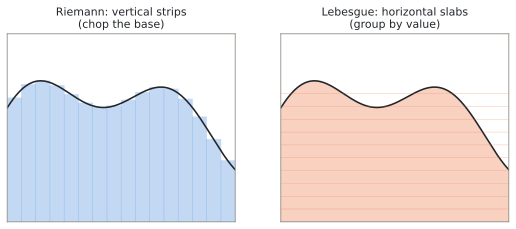
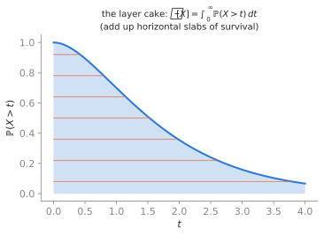
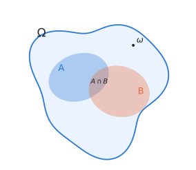
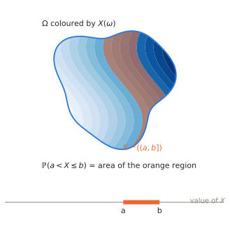

# Measuring Things — From Length to Probability {.unnumbered}

*An **Advanced** tutorial, and the first of two on the measure-theoretic view of
probability. It assumes no exposure to measure theory and is self-contained. The
story: how we measure length, area, and volume; why the Riemann integral is the
wrong tool for probability; how Lebesgue's rearrangement fixes it; and how
Kolmogorov used the resulting theory of measure to give probability a rigorous
foundation. The sequel,
[Joint, Marginal, Conditional — and Bayes](./11-joint-conditional-bayes.qmd),
builds the multivariate picture on this footing.*

::: {.callout-note}
## Optional, and where it sits

Nothing in the lectures or the other tutorials depends on this pair. The working
versions of everything here are in
[Probability 101](./01-probability-101.qmd) and
[Distributions and Maximum Likelihood](./02-distributions-mle.qmd), and you can
follow the whole course from those. Read this track when you want to know *why*
the working versions are allowed — or when a formula has surprised you and you
want the footing that explains it.
:::

::: {.callout-note}

## Why this tutorial exists

Every object in this course — density, likelihood, score, KL divergence,
pushforward, transport map — is a measure-theoretic object. One can use them by
rote, and for the lectures that is enough. But the moment a formula surprises you
(why is $P(X = x) = 0$ for every $x$ yet the density is positive? what does
$\mathbb{E}[x_0 \mid x_t]$ actually average over? why does adding noise make the
score *exist*?), the only reliable footing is the measure-theoretic one. This
tutorial builds that footing visually, with almost no machinery.

:::

## 1. How do we measure things?

Start with questions a ruler can answer.

- **Length.** The interval $[a, b]$ has length $b - a$. If a set is a *finite or
  countable* disjoint union of intervals, its length is the sum of the pieces.
  (The qualifier is not fussiness: $[0,1]$ is an uncountable disjoint union of
  single points, each of length zero.)
- **Area.** A rectangle has area width $\times$ height. For a curved region, we
  tile it with many small rectangles and add; as the tiles shrink, the sum
  converges to what we call the area.
- **Volume.** Same idea, one dimension up: boxes, then sums of boxes, then limits.

In each case the procedure is identical. Fix a set $\Omega$ and a family
$\mathcal{F}$ of subsets of it — the sets we are willing to size, about which
more in a moment. A **measure** is a rule
$m : \mathcal{F} \to [0, \infty]$ such that

1. $m(\varnothing) = 0$ — the empty set has measure zero. (Note the direction:
   plenty of *non-empty* sets are also null, as §2's rationals will show.)
2. **countable additivity** — if $A_1, A_2, \dots \in \mathcal{F}$ are pairwise
   disjoint, then
   $m\!\big(\bigcup_{i=1}^{\infty} A_i\big) = \sum_{i=1}^{\infty} m(A_i)$: the
   whole is the sum of its disjoint parts, countably many at a time.

Three details in that sentence are load-bearing and easy to skim past. The domain
is $\mathcal{F}$, not every subset. The value $+\infty$ is allowed, which is what
lets length and volume work on unbounded spaces. And the additivity is
*countable*, not merely finite — the difference is the whole content of the
letter $\sigma$, and §"What is not a $\sigma$-algebra" shows a family where
exactly that difference bites.

Length, area, volume, mass, and — this is the punchline of the tutorial —
*probability* are all instances of this one definition. Probability will simply be
a measure whose total is $1$.

But there is a catch, and it is not pedantry. Once $\Omega$ is uncountable (an
interval, the plane, the space of images), one can construct subsets that
*ordinary length cannot size* — not because no measure whatever could, but
because no **countably additive, translation-invariant** extension of length
reaches them.^[The Vitali construction shows exactly this: there is no countably
additive, translation-invariant extension of ordinary length defined on every
subset of $\mathbb{R}$. Banach–Tarski is a related but distinct
three-dimensional result about finite equidecomposition under rigid motions, not
"the 3-D version" of Vitali. Both use some form of the axiom of choice, and the
sets they produce are non-measurable.] Note the shape of the failure: it is the
*measure* that cannot be extended, not the family that fails to be a
$\sigma$-algebra — a distinction §"What is not a $\sigma$-algebra" returns to.
The
resolution is not to fix the rule but to restrict the questions: we measure only a
well-behaved family of sets, closed under the operations we need (complements,
countable unions). That family is called a **$\sigma$-algebra**, and every set in
it is called **measurable**. This single concession — *not every subset gets a
size* — is the entire entrance fee of measure theory. Everything else is payoff.

## 2. Two ways to integrate: strips versus slabs

An integral is a measured total: the area under a curve, the average of a
quantity, the expected value of a random variable. There are two ways to organize
the computation, and the difference between them is the difference between
nineteenth-century and twentieth-century analysis.

{width=100%}

**Riemann (strips).** Chop the *domain* (the $x$-axis) into small intervals; on
each, approximate $f$ by a constant; add up rectangle areas; refine. This works
beautifully when $f$ is continuous — nearby $x$'s have nearby $f(x)$'s, so the
rectangles hug the curve.

**Lebesgue (slabs).** Chop the *range* (the $y$-axis) into small levels; for each
level $y$, ask *how much of the domain* is mapped near $y$ — that is, measure the
set $\{x : f(x) \approx y\}$; multiply level by measure; add; refine. Lebesgue's
own summary: to count coins, Riemann takes them in the order they sit on the
table; Lebesgue first sorts them by denomination, then counts each pile.

Why bother with the second way?

- **It tolerates wild functions.** The indicator of the rationals on $[0,1]$
  ($1$ on rationals, $0$ on irrationals) breaks Riemann completely — every strip
  contains both values. Lebesgue shrugs: the set of rationals has measure $0$, the
  set of irrationals has measure $1$, so the integral is
  $1 \cdot 0 + 0 \cdot 1 = 0$.
- **It only needs a measure.** The slab computation never uses the geometry of
  the domain — only the ability to *measure* sets like $\{x: f(x) > y\}$. So the
  same definition of integral works when the domain is an interval, a plane, a
  space of images, or an abstract sample space with a probability on it. This is
  exactly the generality probability needs.
- **It has the strong limit theorems.** Interchanging limits and integrals — the
  daily bread of this course, every time we differentiate a loss under an
  expectation — is licensed by Lebesgue's convergence theorems, not Riemann's.

The layer-cake picture makes the definition concrete for a non-negative $f$: the
region under the graph is a stack of horizontal slabs, the slab at height $y$ has
width $m(\{x: f(x) > y\})$, and

$$
\int f \, dm \;=\; \int_0^\infty m\big(\{x : f(x) > y\}\big)\, dy .
$$

{width=88%}

::: {.callout-tip}

## Key takeaway

An integral is a *measure-weighted sum of values*. Riemann organizes the sum by
*where* you are (domain strips); Lebesgue organizes it by *what value* you see
(range slabs). The Lebesgue organization needs nothing from the domain except a
measure — which is precisely why probability, whose domains are abstract sample
spaces, is built on it.

:::

## 3. Kolmogorov's move: probability *is* a measure

Before 1933 probability had results in abundance — Borel, Lebesgue, Markov and
others had already built much of the machinery — but no agreed definition of its
basic objects. Kolmogorov's *Grundbegriffe* (1933) unified that work into the
standard framework with a single identification: a probability
space is a measure space $(\Omega, \mathcal{F}, P)$ where

- $\Omega$ is the **sample space** — the set of all outcomes of the experiment;
- $\mathcal{F}$ is a $\sigma$-algebra of subsets of $\Omega$ — the **events**,
  the questions we are allowed to ask;
- $P$ is a measure on $\mathcal{F}$ with $P(\Omega) = 1$ — the **probability
  measure**, total mass one.

That is the entire definition. The axioms you may have met as a list
(non-negativity, total mass one, additivity) are just the definition of a measure
with the normalization $P(\Omega)=1$; every rule of probability
($P(A^c) = 1 - P(A)$, inclusion–exclusion, the continuity of $P$ along monotone
sequences of events) is a theorem about measures.

::: {.callout-note}

## What is probability, though? Three readings

Kolmogorov's axioms say how probability *behaves*, deliberately not what it
*means*. The meaning question predates the axioms and has never had a unanimous
answer; three readings are worth knowing.

- **Frequentist.** $P(A)$ is the long-run frequency of occurrence of $A$ in
  independent repetitions of the experiment — the fraction of tosses that land
  heads, in the limit. This grounds probability in data but struggles with
  single-case events ("the probability this specific bridge fails").
- **Fiducial** (Fisher). Not a reading of what probability *is* so much as an
  inferential programme, but worth knowing: an attempt to obtain a probability
  statement about an unknown parameter *without* assuming a prior, by inverting a
  sampling or pivotal relation between the data and the parameter. (Not, as is
  sometimes said, by reading it off the likelihood alone.) Historically
  influential, foundationally contested, and a standing reminder that not every
  "probability of a parameter" one writes down is licensed by the axioms.
- **Measure-theoretic** (the course's working stance). Probability is a
  normalized measure; full stop. Whether a given application reads it as a
  frequency, a degree of belief, or a modeling fiction is a question *outside*
  the mathematics. This agnosticism is a feature: the same theorems serve every
  interpretation.

The axioms capture the behavior all readings agree on — which is exactly why the
theory could finally be built.

:::

Two examples calibrate the definition.

- **A die.** $\Omega = \{1,\dots,6\}$, $\mathcal{F}$ = all subsets, $P(A) =
  |A|/6$. Here every subset is an event, which is why elementary probability
  never mentions $\mathcal{F}$ — though note this is a *choice*: finite spaces
  admit coarse $\sigma$-algebras too, and §4 will use one.
- **A uniform point in $[0,1]$.** $\Omega = [0,1]$, $\mathcal{F}$ = the Borel
  sets (the $\sigma$-algebra generated by intervals), $P$ = length. Now
  $P(\{\omega\}) = 0$ for every single outcome, yet $P([0,1]) = 1$: probability
  lives on sets, not points. The common puzzles of continuous probability — density
  values above $1$, zero-probability events that nonetheless happen — dissolve
  once probability is read as measure, i.e. as generalized length.

## 4. The blob: seeing $(\Omega, \mathcal{F}, P)$

From here on, picture $\Omega$ as a blob of clay of total mass $1$. Events are
regions of the blob; $P$ weighs regions; the $\sigma$-algebra is the list of
regions we can weigh.

{width=92%}

### Two jobs, and two pictures

The $\sigma$-algebra is the object students never get a picture of, and most of
the confusion comes from the definition being asked to do *two different jobs*.
Separate them first.

- **The bookkeeping job.** The big $\mathcal{F}$ in the triple says which sets
  $P$ is even defined on, and which maps count as measurable. §1 forced the issue:
  ordinary length cannot reach every subset. In practice $\mathcal{F}$ is a
  conventional ambient choice — Borel on $\mathbb{R}$, the product
  $\sigma$-algebra on sequences, cylinder sets on path space — made once and then
  kept in the background. (There is no canonical *largest* safe choice: on
  $[0,1]$ we use the Borel sets even though length extends perfectly well to the
  larger Lebesgue family.) This job needs no picture; it needs the fence, and
  then silence.
- **The information job.** A *sub*-$\sigma$-algebra $\mathcal{G} \subseteq
  \mathcal{F}$ models something else entirely: **partial knowledge**. Not what is
  weighable in principle, but what a particular observer can tell apart. This is
  the job that matters for the rest of the course, and this is what deserves a
  picture.

Two pictures of the information job follow. They are the same mathematics; use
whichever makes a given statement obvious.

#### Picture A — a resolution

Pixelate the blob into a grid of cells and agree to describe outcomes only
cell-by-cell. The events you can then express are exactly the unions of cells: a
coarse grid asks coarse questions, a fine grid asks fine ones, and refining the
grid enlarges the $\sigma$-algebra.

This picture is honest but *narrow*: it models a $\sigma$-algebra generated by a
partition into finitely many positive-mass cells. Many of the $\sigma$-algebras
in this course are not of that kind — $\sigma(X)$ for an $X$ with nonatomic law has no
positive-mass cells at all — so read the grid as a helpful special case, never as
the definition.

#### Picture B — a report

Here is the picture that survives the general case. You never see the outcome
$\omega$. What reaches you is a **report** about it — some function $R$ evaluated
at $\omega$, and nothing else. Then

> $\sigma(R)$ is the collection of events that the report settles.

Roll a die, and suppose you are told only whether the result is odd or even. You
cannot answer "was it a 3?", because $1$, $3$ and $5$ produce an identical
report. You can answer "was it odd?". Write down *everything* the report settles:

$$
\sigma(R) \;=\; \big\{\; \varnothing,\;\; \{1,3,5\},\;\; \{2,4,6\},\;\; \Omega \;\big\}
$$

— four events, out of the $2^6 = 64$ subsets of $\Omega$. That list is a
$\sigma$-algebra, and now the axioms stop looking arbitrary, because they are
nothing but the logic of answerable questions:

| Axiom | What it says about a report |
|---|---|
| $\Omega, \varnothing \in \mathcal{G}$ | "did *something* happen?" needs no report to answer |
| closed under complement | if the report settles $A$, it settles "not $A$" — same answer, negated |
| closed under countable union | if it settles each of $A_1, A_2, \dots$, it settles "did at least one occur?" |

This table translates the axioms into the language of questions; it does not
*derive* them. In particular nothing in ordinary logic explains why the cutoff
falls at **countably** many questions rather than finitely or arbitrarily many.
Countable closure is an additional idealization, and it is chosen because it is
exactly what limits, tail events and countably additive probability require.

::: {.callout-note}

## The honest version of "settles"

Read literally, "the events the report settles" means the events whose answer is
determined by $R(\omega)$ — that is, the sets that are unions of level sets of
$R$. When $R$ has **countably many possible answers**, as in every example in
this tutorial and in the demo below, that collection is exactly $\sigma(R)$ and
the gloss is precise.

For a report with a continuum of answers it is too generous. Take $R(\omega) =
\omega$ on $[0,1]$: its level sets are single points, so *every* subset of
$[0,1]$ is a union of them, and "settled" would mean all of $2^{[0,1]}$ — which
§1 has already told us is too big to carry a length. The definition that works in
general keeps only the sets built from measurable questions about the answer,

$$
\sigma(R) \;=\; \big\{\, R^{-1}(B) \;:\; B \text{ Borel} \,\big\},
$$

and this is the definition to hold onto. The intuition — *what the report lets
you decide* — survives intact; the fine print is that "decide" must itself be
asked measurably. The same caveat is why measurability of $R$ had to be assumed
in the first place.

:::

The report picture also gives the cleanest statement of measurability there is. A
quantity can be computed by an observer who sees only the report exactly when it
is a *function of the report*:

$$
X \text{ is } \sigma(R)\text{-measurable}
\quad\Longleftrightarrow\quad
X = f \circ R \text{ for some measurable } f .
$$

This is the Doob–Dynkin lemma. Precisely: let $R : (\Omega, \mathcal{F}) \to
(S, \mathcal{S})$ be measurable and let $X$ be real-valued. Then $X$ is
$\sigma(R)$-measurable if and only if $X = f \circ R$ for some
$\mathcal{S}/\mathcal{B}(\mathbb{R})$-measurable $f : S \to \mathbb{R}$. No
probability or integrability is involved; the report just needs a measurable
space to land in, and $X$ needs real (or standard-Borel) values. Set it beside the pixel version — "$X$ is constant
on each cell" — and note that the two agree wherever both apply, but the report
version keeps working when the report has a nonatomic law and there is no finite
positive-mass partition to be constant on. (Continuous reports still have fibres;
what they lack is fibres of positive mass.)

And when $X$ is *not* a function of the report, the best an observer can do is
average $X$ over the outcomes the report fails to distinguish. For the parity
report and $X(\omega) = \omega$,

$$
\mathbb{E}[X \mid R] =
\begin{cases}
(1+3+5)/3 = 3 & \text{if the report says odd},\\
(2+4+6)/3 = 4 & \text{if the report says even}.
\end{cases}
$$

That average is **conditional expectation**: itself a function of the report — a
$\sigma(R)$-measurable random variable. In general, for $X \in L^1(P)$,
$\mathbb{E}[X \mid \mathcal{G}]$ is defined as the almost-surely unique
$\mathcal{G}$-measurable integrable $W$ with $\int_A W\, dP = \int_A X\, dP$ for
every $A \in \mathcal{G}$: *it has the same integral as $X$ over every event the
observer can ask about.* For a partition into positive-mass cells this reduces to
the cell averages above, $W|_{C} = \int_C X\,dP / P(C)$; on null cells the
definition imposes nothing, which is why "almost surely unique" is the strongest
uniqueness available.

Calling it the *closest* such function needs a loss to be named. Under squared
error, and for $X \in L^2$, it is exactly right — $\mathbb{E}[X \mid \mathcal{G}]$
is the orthogonal projection of $X$ onto the $\mathcal{G}$-measurable functions,
hence the minimum-mean-squared-error predictor. Under absolute error the best
predictor is a conditional *median* instead. Every "best denoiser" claim in this
course is the squared-error one.

::: {.callout-tip}

## Why Picture B is the one to keep

In a diffusion model the report is the noisy sample $x_t$. A denoiser is *required
to be a function of $x_t$* — it is handed nothing else — and that requirement is
exactly the statement that it is $\sigma(x_t)$-measurable. The best denoiser is
then the average of the clean signals consistent with what was seen,
$\mathbb{E}[x_0 \mid x_t]$. W01's $\tanh$ formula is this paragraph, computed for
a two-point dataset.

:::

Act I of the demo below is Picture B, made concrete: eight students, a report you
choose, and — displayed in full — the list of events that report settles, which
questions it leaves open, and the conditional expectation it supports.

**Interactive demo** — [The Measure Playground](../materials/measure-playground.html){target="_blank"}

<iframe src="../materials/measure-playground.html" width="100%" height="620" style="border: 1px solid #ddd; border-radius: 8px;" loading="lazy" title="Interactive demo: a sigma-algebra as what a report tells you, and expectation as area under the quantile curve"></iframe>

## 5. Random variables: numbers painted on the blob

A **random variable** is not random and is not a variable. It is a function

$$
X : \Omega \longrightarrow \mathbb{R},
$$

a number painted on each point of the blob. The randomness lives entirely in
$P$; $X$ just reads off a numerical feature of the outcome. (A **random vector**
is the same thing with values in $\mathbb{R}^d$ — equivalently, a map all of
whose coordinates are random variables. Images will be random vectors with
$d$ in the hundreds.)

One condition is required, and the preimage picture makes it self-evident. To ask
"what is the probability that $X \le t$?" we must *weigh* the set of outcomes for
which that holds — the **preimage** $X^{-1}((-\infty, t]) = \{\omega : X(\omega)
\le t\}$. So that set had better be in $\mathcal{F}$, i.e. weighable. A function
with this property (for every $t$) is called **measurable**, and *measurable
function* is the honest name for "random variable."

{width=92%}

This is the same condition as §4's, in the form it takes for the big
$\mathcal{F}$: measurability is the demand that the questions we want to ask
about $X$ land inside the family we are allowed to weigh. Against a *sub*-algebra
$\sigma(R)$ it becomes the sharper statement met there — $X$ is
$\sigma(R)$-measurable exactly when $X$ is a function of the report — and when it
is not, what remains is the average $\mathbb{E}[X \mid R]$ over outcomes the
report cannot separate. Act I of the demo is that whole progression: pick a
coarse report and $X$ is invisible behind its box averages; pick the finest and
$X$ is exactly recovered.

## 6. A gallery: probability spaces, fully specified

Everything so far has been definitions. Here are seven spaces written out in the
same four lines each — sample space, $\sigma$-algebra, probability measure,
random variable — so that the abstractions have somewhere to live. Read the
remarks: each example exists to make one point the others cannot.

Two warnings. A few remarks run slightly ahead of the text and use *pushforward*,
*density* and *expectation*, which §§7–8 build properly; take them on trust for
now. And "fully specified" is an aspiration for the first five: MNIST's
population reading and the path-space law are deliberately schematic, because in
those cases the whole point is that we posit the measure rather than construct
it.

### Discrete

**(1) One roll of a fair die.**

- $\Omega = \{1,2,3,4,5,6\}$.
- $\mathcal{F} = 2^\Omega$, all $64$ subsets.
- $P(A) = |A|/6$.
- $X(\omega) = \omega$, the face shown.

*Remark.* Every subset is an event, which is why elementary courses can omit
$\mathcal{F}$ entirely. But the coarse sub-algebras are still there and still
useful: the parity report of §4 generates
$\sigma(R) = \{\varnothing, \{1,3,5\}, \{2,4,6\}, \Omega\}$, four events out of
sixty-four.

**(2) Flipping until the first head.**

- $\Omega = \{1, 2, 3, \dots\}$, the index of the first head. Countably infinite.
- $\mathcal{F} = 2^\Omega$.
- $P(\{n\}) = 2^{-n}$, which sums to $1$ — *countable* additivity earning its keep.
- $X(\omega) = \omega$, the number of flips; $\mathbb{E}[X] = \sum_n n 2^{-n} = 2$.

*Remark.* For any **countable** $\Omega$ you may always take $\mathcal{F} =
2^\Omega$, every function is a random variable, and measurability is vacuous. The
$\sigma$-algebra only begins to bite *in its bookkeeping role* when $\Omega$ is
uncountable — which is the next example. Its information role is alive even here:
the parity report of §4 lives on a six-point space.

**(3) An infinite sequence of coin flips.**

- $\Omega = \{0,1\}^{\mathbb{N}}$, all infinite binary sequences. Uncountable.
- $\mathcal{F} = \sigma(\text{cylinder sets})$, generated by the events
  $\{\omega : \omega_1 = a_1, \dots, \omega_n = a_n\}$ — the events decided by
  finitely many flips.
- $P$ = the Bernoulli$(\tfrac12)$ product measure, fixed by
  $P(\text{cylinder}) = 2^{-n}$.
- $X(\omega) = \lim_{n} \frac1n \sum_{i \le n} \omega_i$ where that limit exists,
  and $X(\omega) = 0$ otherwise — a genuine function on all of $\Omega$. The
  strong law says $X = \tfrac12$ almost surely; the sequences with no limiting
  frequency form a measurable set of probability $0$.

*Remark.* Here $\mathcal{F} \subsetneq 2^\Omega$ strictly: the product
$\sigma$-algebra is generated by countably many cylinders and is far smaller than
the set of all subsets. The natural sub-algebras $\mathcal{F}_n =
\sigma(\omega_1,\dots,\omega_n)$ — "what you know after $n$ flips" — grow with
$n$. That increasing family is a **filtration**, and it is Picture B with a clock
attached.

### Continuous

**(4) A uniform point in $[0,1]$.**

- $\Omega = [0,1]$.
- $\mathcal{F} = \mathcal{B}([0,1])$, the Borel sets — generated by the intervals.
- $P$ = length.
- $X(\omega) = \omega$; or $X = Q$, the quantile function of any target law.

*Remark.* $P(\{\omega\}) = 0$ for every single $\omega$, yet $P(\Omega) = 1$.
This is the canonical blob of §7 below: with $X = Q$, the pushforward is *any*
one-dimensional distribution you like.

**(5) A standard Gaussian.**

- $\Omega = \mathbb{R}$.
- $\mathcal{F} = \mathcal{B}(\mathbb{R})$.
- $P(A) = \int_A \frac{1}{\sqrt{2\pi}} e^{-x^2/2}\,dx$.
- $X(\omega) = \omega$.

*Remark.* Compare with taking $\Omega = [0,1]$, $P$ = length, and
$X = \Phi^{-1}$ (defined on $(0,1)$, a set of full measure, since
$\Phi^{-1}(0) = -\infty$ and $\Phi^{-1}(1) = +\infty$; fix any value at the two
endpoints). Different sample space, different measure, different function —
*identical distribution*. No downstream calculation that depends only on the
**law** of $X$ can tell them apart — which is the "blob is forgettable" principle
in one line. Calculations that depend on more than the law (how $X$ is coupled to
another variable, what filtration it sits in) are of course not covered; tutorial
10 makes a point of this.

### Real data

**(6) MNIST.** Three honest set-ups, and the differences matter.

*(a) The dataset itself, as a probability space.*

- $\Omega = \{1, 2, \dots, 60000\}$, the training indices.
- $\mathcal{F} = 2^\Omega$.
- $P(\{i\}) = 1/60000$ — draw an index uniformly.
- $X(i) \in \{0,\dots,255\}^{784}$, the image; $Y(i) \in \{0,\dots,9\}$, the label.

Its joint pushforward is the **empirical distribution**. It plays two roles at
once, and they are worth separating: it is exactly the measure that ordinary
empirical risk minimization integrates against, *and* it is an estimator of the
population law in (b), in the same way that empirical risk estimates population
risk. The label report $\sigma(Y)$ contains $2^{10} = 1024$ events,
and $\mathbb{E}[X \mid Y]$ is a genuinely familiar object: the ten class-average
images, the blurry mean "$7$".

*(b) The population we wish we had.*

- $\Omega$ = an abstract space of handwriting events, never constructed.
- $X : \Omega \to \mathbb{R}^{784}$ the rendering map, and $p_{\text{data}} =
  X_\# P$ the thing we actually want to model.
- The $60000$ images are *modelled* as i.i.d. draws from it.

We never build this $\Omega$, and by §7 we never need to: only the pushforward
enters any computation.

*(c) Pixel space as the sample space.* As literally stored, MNIST lives in
$\Omega = \{0,\dots,255\}^{784}$ — which is **finite**, with about $10^{1888}$
elements. So $\mathcal{F} = 2^\Omega$ is perfectly legitimate and
$p_{\text{data}}$ is an honest pmf. Modelled instead as continuous,
$\Omega = [0,1]^{784}$ with $\mathcal{F}$ Borel, and something important changes.

::: {.callout-important}

## Why adding noise is a measure-theoretic act

Take the continuous reading, $\Omega = \mathbb{R}^{784}$ with Lebesgue as the
reference. The **manifold hypothesis** says $p_{\text{data}}$ concentrates on a
set of far lower dimension than $784$ — a set of Lebesgue measure **zero**. A
measure that puts mass $1$ on a Lebesgue-null set is *singular*: by
Radon–Nikodym it has **no density at all**. There is no function
$p_{\text{data}}(x)$ to differentiate, so the score
$\nabla_x \log p_{\text{data}}(x)$ does not exist as a function on
$\mathbb{R}^{784}$.

Now convolve with $\mathcal{N}(0, \sigma^2 I)$ — which is precisely the forward
process, $x_\sigma = x_0 + \sigma z$. For *any* probability measure $\mu$,

$$
p_\sigma(x) = \int \frac{1}{(2\pi\sigma^2)^{d/2}}
  e^{-\lVert x - y\rVert^2 / 2\sigma^2} \, d\mu(y)
$$

is smooth and strictly positive everywhere. The blurred law is absolutely
continuous no matter how singular $\mu$ was, so it *has* a density, and the score
exists and is smooth.

Two cases are worth separating. The **empirical** law — the finitely many stored
images — is supported on finitely many points, hence singular in $\mathbb{R}^{784}$
whatever one believes about manifolds; here the $t=0$ score certainly does not
exist. For the **population** law the conclusion needs the manifold hypothesis in
its exact form, $\mu(M) = 1$ for some lower-dimensional $M$; the looser "on or
near a manifold" version permits a full-dimensional law with a perfectly good
density.

So the honest statement is: wherever $p_0$ is singular, Gaussian corruption is
what brings the object we differentiate into existence; and where $p_0$ is
already smooth and full-dimensional, the noise regularizes a score that existed
but was badly behaved. Either way it explains why diffusion learns $\nabla \log
p_t$ for $t > 0$ and never $\nabla \log p_0$. (Stated here for the additive VE
corruption $x_\sigma = x_0 + \sigma z$; the VP convention convolves a rescaled
data law and reaches the same conclusion.)

:::

**(7) A diffusion path.** The course's own probability space.

- $\Omega = C([0,T]; \mathbb{R}^d)$, the continuous paths.
- $\mathcal{F} = \sigma(\text{cylinder sets})$, generated by the evaluations
  $\omega \mapsto \omega(t)$ — and on this space that family coincides with the
  Borel $\sigma$-algebra of the sup-norm, with rational times already sufficient
  to generate it.
- $P$ = the law of the forward process (Wiener measure, for pure Brownian
  motion).
- $X_t(\omega) = \omega(t)$ — each time $t$ gives a random variable, the whole
  family being the process.

*Remark.* An outcome here is an entire trajectory, which is exactly the situation
$\sigma$-algebras were invented for: $\Omega$ is a function space, and "all
subsets" is hopeless. The filtration $\mathcal{F}_t = \sigma(X_s : s \le t)$ is
everything known by time $t$ — the *whole history*, including $X_0$. A denoiser
handed only the current noisy sample is held to something stricter: it must be
$\sigma(X_t)$-measurable, and $\sigma(X_t) \subseteq \mathcal{F}_t$. The
distinction matters, since an $\mathcal{F}_t$-measurable rule would be allowed to
peek at the clean signal it is supposed to be recovering.

## What is *not* a $\sigma$-algebra

The axioms are easiest to feel by watching them fail. Throughout,
$\Omega = \{1,2,3,4\}$ unless stated.

| Candidate | Fails | Why |
|---|---|---|
| $\{\varnothing, \{1\}, \Omega\}$ | complement | $\{1\}^c = \{2,3,4\}$ is missing |
| $\big\{\varnothing, \Omega, \{1,2\}, \{3,4\}, \{2,3\}, \{1,4\}\big\}$ | union | closed under complement, but $\{1,2\} \cup \{2,3\} = \{1,2,3\}$ is missing |
| the partition $\big\{\{1,2\},\{3,4\}\big\}$ alone | almost everything | no $\varnothing$, no $\Omega$; it *generates* the $\sigma$-algebra $\{\varnothing,\{1,2\},\{3,4\},\Omega\}$ |
| the intervals of $\mathbb{R}$ | both | $[0,1]^c$ is not an interval; $[0,1]\cup[2,3]$ is not an interval |
| the finite subsets of $\mathbb{N}$ | $\Omega$, complement, countable union | $\mathbb{N} \notin$; $\{1\}^c$ is infinite; $\bigcup_n \{n\} = \mathbb{N}$ |
| the finite **and** cofinite subsets of $\mathbb{N}$ | *countable* union | see below |

That last row is the one to remember, because it is the only one that isolates
the letter $\sigma$. Call a set cofinite if its complement is finite. The
finite-or-cofinite sets are closed under complement (the two families swap) and
under *finite* unions, so they form an **algebra** — everything a $\sigma$-algebra
asks for except one word. But

$$
\{2, 4, 6, \dots\} \;=\; \{2\} \cup \{4\} \cup \{6\} \cup \cdots
$$

is a *countable* union of finite sets that is neither finite nor cofinite (both
it and its complement are infinite). So the family is an algebra and not a
$\sigma$-algebra. What the $\sigma$ buys is **closure under countable unions**,
which is what keeps limits and tail events measurable in the first place. Do not
confuse it with *countable additivity*, which is a separate axiom — one about the
measure $P$, saying how it distributes over such unions once they are known to be
events.

::: {.callout-warning}

## One correction worth making explicitly

It is tempting to conclude from §1 that $2^\Omega$ "fails" for $\Omega =
\mathbb{R}$. It does not: **$2^\Omega$ is a $\sigma$-algebra for every $\Omega$**,
trivially, since it contains everything. The problem is not with the family, it
is with the *measure*. What Vitali's construction shows is that no countably
additive, translation-invariant extension of ordinary length can be defined on
all of $2^{\mathbb{R}}$. We restrict to the Borel or Lebesgue sets not because
larger families break the axioms of a $\sigma$-algebra, but because length cannot
survive on them.

Note also that a **topology** is not generally a $\sigma$-algebra — open sets are
closed under arbitrary unions but not under complements — even though the Borel
$\sigma$-algebra is the one *generated* by a topology.

:::

## 7. Pushforward: the distribution is the image of the mass

Here is the move the whole course runs on. The map $X$ transports the blob's mass
onto the real line: the probability that lands on a set $B \subseteq \mathbb{R}$
is the mass of its preimage,

$$
\mu_X(B) \;=\; P\big(X^{-1}(B)\big) \;=\; P(X \in B).
$$

The measure $\mu_X$ on $\mathbb{R}$ is called the **pushforward** of $P$ under
$X$ (written $X_\# P$), and it is exactly what elementary courses call *the
distribution of* $X$. The CDF is $F_X(t) = \mu_X((-\infty,t])$; a *density* is a
function $p_X$ reconstructing $\mu_X$ by integration, $\mu_X(B) = \int_B
p_X(x)\,dx$, when such a function exists.

Two consequences, both load-bearing later:

- **The blob is forgettable.** Any two random variables with the same pushforward
  are indistinguishable by probability statements about their values. This is why
  probability courses can work with distributions and never mention $\Omega$ —
  and why *we* may choose $\Omega$ freely, to be whatever is convenient.

  This is the theorem behind a move
  [Probability 101](./01-probability-101.qmd) makes informally. There, the sample
  space for tomorrow's temperature is described as the set of possible states of
  the world, and $T \sim \mathcal{N}(\mu,\sigma^2)$ as a statement about the
  distribution $T$ *induces* on the line — after which the "canonical shortcut"
  throws the possible worlds away and works on $(\mathbb{R}, \mathcal{N},
  \mathrm{id})$ instead. What licenses that substitution is exactly the sentence
  above: the two constructions have the same pushforward, so no statement about
  the value of $T$ can separate them. Note also what it does *not* license — two
  variables sharing an outcome. A coupling is more than a pair of pushforwards,
  which is the whole content of
  [Joint, Marginal, Conditional](./11-joint-conditional-bayes.qmd).
- **The canonical choice is $\Omega = [0,1]$.** Take $P$ = length on $[0,1]$ and
  $X = Q$, the quantile function (inverse CDF) of any target distribution: then
  $Q_\# (\text{uniform})$ *is* that distribution. Every 1-D distribution is the
  pushforward of uniform mass through its quantile map — one blob serves all.

![Sampling as transport: uniform mass on [0,1] pushed through the quantile map Q lands as the target distribution. Every 1-D distribution arises this way.](figs/pushforward-quantile.svg){width=100%}

::: {.callout-tip}

## Key takeaway

*Sampling is transport.* A random draw from $\mu$ is uniform mass on $[0,1]$
pushed through a map. Generative modeling — the subject of this course — is the
same sentence in higher dimension with a learned map: push simple noise through
$G$ so that $G_\# (\text{noise}) \approx p_{\text{data}}$. The pushforward is not
a technicality; it is the course's definition of "generate."

:::

## 8. Expectation: the Lebesgue integral, four ways

The **expectation** of $X$ is its Lebesgue integral against $P$:

$$
\mathbb{E}[X] \;=\; \int_\Omega X(\omega)\, dP(\omega).
$$

Built in the standard four stages, each is a picture on the blob:

1. **Indicators.** $X = \mathbf{1}_A$ (paint $1$ on region $A$, $0$ elsewhere):
   $\mathbb{E}[\mathbf{1}_A] = P(A)$. *Expectation of a yes/no question is the
   probability of yes.* This is the hinge between measure and integral.
2. **Simple functions.** $X = \sum_k c_k \mathbf{1}_{A_k}$ (finitely many values,
   one region per value): $\mathbb{E}[X] = \sum_k c_k P(A_k)$ — value times mass,
   summed. This is Lebesgue's coin-sorting, verbatim.
3. **Non-negative $X$.** Approximate from below by simple functions; take the
   supremum. The layer-cake formula of §2 is this stage, drawn.
4. **General $X$.** Split $X = X^+ - X^-$ and subtract, defined whenever
   $\mathbb{E}|X| < \infty$.

And by the pushforward, the abstract integral becomes the familiar ones — this
one line is why the blob never appears in computations:

$$
\mathbb{E}[X] = \int_\Omega X \, dP
= \int_{\mathbb{R}} x \, d\mu_X(x)
= \begin{cases} \sum_x x\, P(X = x) & \text{(discrete)}\\[2pt]
\int x\, p_X(x)\, dx & \text{(density)} \end{cases}
$$

There is one more home for the same number, and it is the one this course keeps
returning to. Take the canonical blob $\Omega = [0,1]$ with $X = Q$: then

$$
\mathbb{E}[X] \;=\; \int_0^1 Q(u)\, du
\;=\; \text{signed area under the quantile curve.}
$$

![Expectation as area: the integral of the quantile function over [0,1]. Left, a smooth mixture; right, a two-point distribution, where the area is two rectangles.](figs/quantile-area.svg){width=100%}

For a two-point distribution taking values $-1$ and $+1$ with masses $\pi$ and
$1-\pi$, the quantile curve is a staircase with one step, the area is two
rectangles, and $\mathbb{E}[X] = (-1)\pi + (+1)(1-\pi) = 1 - 2\pi$ — read
directly off the picture. Act II of the demo animates the whole construction:
the staircase (a simple function) refines, its sum converges to the exact area,
and sliding $\sigma \to 0$ morphs a smooth mixture into this staircase.

### Properties, and where each one lives

With the four-stage construction in hand, the standard properties sort into two
piles: those *visible on the blob* and those that are *theorems of the limit
stage*.

| Property | Statement | Why |
|---|---|---|
| Linearity | $\mathbb{E}[aX + bY] = a\mathbb{E}[X] + b\mathbb{E}[Y]$ | Obvious for simple functions (regroup regions); survives the limit. Needs **no independence** — the most-used, least-appreciated fact in probability. |
| Monotonicity | $X \le Y \Rightarrow \mathbb{E}[X] \le \mathbb{E}[Y]$ | Lower paint, lower total. |
| Normalization | $\mathbb{E}[c] = c$ | The blob has mass 1. |
| Indicator bridge | $\mathbb{E}[\mathbf{1}_A] = P(A)$ | Definition, stage 1. |
| Null sets are invisible | $X = Y$ except on a set of measure $0$ $\Rightarrow \mathbb{E}[X] = \mathbb{E}[Y]$ | Regions of mass 0 contribute value $\times$ 0. |
| Limit interchange | $X_n \to X$ $\Rightarrow$ $\mathbb{E}[X_n] \to \mathbb{E}[X]$ *under conditions* (monotone or dominated convergence) | The Lebesgue theory's crown jewels; **not** free, and the reason the theory wins. |

The last row is the one to respect. Every "differentiate under the integral sign"
and every "swap the limit and the expectation" in this course is an appeal to
*some* theorem whose hypotheses have to be checked — often dominated convergence,
but sometimes a Leibniz rule, domination of difference quotients, Fubini–Tonelli,
or uniform convergence. Riemann's theory is not without interchange theorems
either (uniform convergence gives one). What Lebesgue's theory offers is markedly
more flexible hypotheses, which is why it is the one everyone reaches for.

## 9. The dictionary, and what comes next

| Measure theory | Probability | Picture |
|---|---|---|
| Measure space $(\Omega, \mathcal{F}, m)$ | Probability space $(\Omega, \mathcal{F}, P)$, $P(\Omega)=1$ | Blob of clay, mass 1 |
| Measurable set | Event | Weighable region |
| $\sigma$-algebra | Family of askable questions | What a report settles |
| Measurable function | Random variable | Numbers painted on the blob |
| Pushforward $X_\# P$ | Distribution of $X$ | Mass transported to $\mathbb{R}$ |
| Lebesgue integral $\int X\, dP$ | Expectation $\mathbb{E}[X]$ | Value $\times$ mass, totaled; area under $Q$ |
| Almost everywhere | Almost surely | Except on mass-0 dust |
| Density (Radon–Nikodym derivative) | pdf $p_X$ | Mass per unit length |

The sequel, [Joint, Marginal, Conditional — and Bayes](./11-joint-conditional-bayes.qmd),
puts *two* numbers on the blob and develops joints as mountains, marginals as
shadows, conditionals as renormalized slices, and Bayes' rule as the freedom to
slice in either direction — the grammar in which every diffusion-model statement
($p(x_t \mid x_0)$, $\mathbb{E}[x_0 \mid x_t]$, the posterior over mixture
components) is written. A later installment will build likelihood, score, and KL
divergence on the same footing.

## Exercises

1. Show from additivity alone that $P(A \cup B) = P(A) + P(B) - P(A \cap B)$.
   (Cut the blob into three disjoint pieces.)
2. On $\Omega = [0,1]$ with length, compute $\mathbb{E}[X]$ for
   $X(\omega) = \mathbf{1}_{[0,1/2]}(\omega) - \mathbf{1}_{(1/2,1]}(\omega)$
   twice: by stage 2 of the construction, and as an area under a staircase. Note
   that $X$ itself steps $+1$ then $-1$ while its quantile function steps $-1$
   then $+1$ — the two are different functions with the same integral. Why must
   that be so?
3. The indicator of the rationals: verify that every Riemann sum on $[0,1]$ can
   be made $0$ or $1$ by choice of sample points, while the Lebesgue integral
   is $0$. Which axiom of the measure makes the rationals a null set?
   *(Hint: cover the $n$-th rational by an interval of length
   $\varepsilon/2^n$.)*
4. Let $Q$ be the quantile function of the mixture in the demo. Explain, using
   the pushforward, why `Q(rand())` is a correct sampler for *every*
   one-dimensional law. Then show the sampling map is **not** unique: if $U$ is
   uniform so is $1 - U$, so $Q(1 - U)$ is an equally correct and generally
   different sampler. What extra condition singles $Q$ out?
5. For the two-point distribution with masses $\pi$ (at $-1$) and $1-\pi$ (at
   $+1$), draw the quantile staircase, shade the signed area, and confirm
   $\mathbb{E}[X] = 1-2\pi$. Then check it against the demo's readout.
6. Take $\Omega = [0,1]^2$ with uniform area as the measure, the $2 \times 2$
   quadrant partition as the resolution, and $X(\omega_1,\omega_2) = \omega_1$.
   Is $X$ measurable with respect to this resolution? Compute its average on each
   cell. Then show that *no* finite grid makes $X$ measurable, and say precisely
   what does happen to the cell averages as the dyadic grids refine.
7. *(The report picture.)* Roll two distinguishable dice, so
   $\Omega = \{1,\dots,6\}^2$ with all $36$ outcomes equally likely, and let the
   report be the **sum**. How many values can the report take, and hence how many
   events does $\sigma(R)$ contain, out of the $2^{36}$ subsets of $\Omega$? Is
   the first die's value a function of the report? Compute
   $\mathbb{E}[\,\omega_1 \mid R = 5\,]$, and then explain — without computing
   anything — why $\mathbb{E}[\,\omega_1 \mid R\,]$ must equal $R/2$.
8. *(Specify a space.)* Write out $(\Omega, \mathcal{F}, P)$ and one random
   variable, in the four-line format of §6, for each of: (a) drawing a card from
   a standard deck; (b) the arrival time of the next bus, modelled as
   Exponential$(\lambda)$; (c) an uncompressed $256 \times 256$ RGB image at 8 bits per channel. For (c),
   is $\Omega$ finite? Is $2^\Omega$ an acceptable $\sigma$-algebra? Is it a
   *useful* one? Note that fixing the file format pins down $\Omega$ but not $P$
   — choose a $P$ and say what it models.
9. *(Failures.)* For each family, say which axiom fails and give the witness:
   (a) $\{\varnothing, \{1,2\}, \{2,3\}, \Omega\}$ on $\Omega = \{1,2,3\}$;
   (b) the open subsets of $\mathbb{R}$; (c) the countable subsets of
   $\mathbb{R}$; (d) the sets that are countable **or** co-countable in
   $\mathbb{R}$.
   One of these four *is* a $\sigma$-algebra — which, and why does it not help
   us measure length?
10. *(Why noise creates the score.)* Let $\mu$ be the uniform distribution on the
    unit circle in $\mathbb{R}^2$. Show $\mu$ has no density with respect to
    Lebesgue measure on $\mathbb{R}^2$, so $\nabla \log p$ is undefined. Then
    write down $p_\sigma$ for $\mu * \mathcal{N}(0, \sigma^2 I)$ as an integral,
    argue it is strictly positive and smooth everywhere, and describe what
    happens to $\nabla \log p_\sigma$ near the circle as $\sigma \to 0$.
11. *(Refinement.)* Let $R$ be a report and $R'$ a *finer* one, meaning every
   event $\sigma(R)$ settles is also settled by $\sigma(R')$. Show
   $\sigma(R) \subseteq \sigma(R')$, and explain in the roster demo's terms why
   $\mathbb{E}\big[\,\mathbb{E}[X \mid R'] \;\big|\; R\,\big] = \mathbb{E}[X \mid R]$
   — averaging a fine answer down to a coarse report gives the coarse answer.
   (This is the tower property in the form the course actually uses.)
