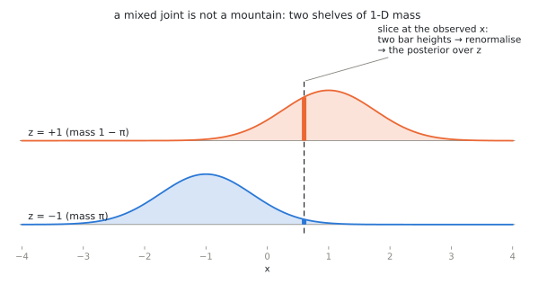

# Joint, Marginal, Conditional — and Bayes {.unnumbered}

*An **Advanced** tutorial, the second of two on the measure-theoretic view of
probability, continuing [Measuring Things](./10-measuring-things.qmd). Like its
predecessor it is optional: the working versions of joints, marginals and
conditioning are in [Probability & Random Variables](./01-probability-101.qmd). One new
move — paint **two** numbers on the blob instead of one — generates the entire
multivariate vocabulary: joints as mountains, marginals as shadows, conditionals
as renormalized slices, Bayes' rule as the license to slice in either direction.
No new measure theory is needed.*

## 1. Two colorings, one blob

Recall the picture: a blob $\Omega$ of unit mass, a probability measure $P$
weighing its regions, and a random variable as numbers painted on the blob. Now
paint the blob **twice**: two measurable functions

$$
X : \Omega \to \mathbb{R}, \qquad Y : \Omega \to \mathbb{R},
$$

on the *same* blob. This co-residence is the whole point. "$X$ and $Y$ are
jointly distributed" is not an extra assumption bolted on later; it is the
statement that one outcome $\omega$ determines both numbers at once —
height *and* weight of the same person, today's price *and* tomorrow's price of
the same stock, clean image *and* noisy image from the same generation run.

The pair is a single map into the plane,

$$
(X, Y) : \Omega \to \mathbb{R}^2,
\qquad
\mu_{X,Y} \;=\; (X,Y)_\# P,
$$

and the pushforward $\mu_{X,Y}$ — the blob's mass transported to the plane — is
the **joint distribution**. When it has a density $p(x,y)$, picture the joint as
a **mountain** of mass over the plane: total volume $1$, height = mass per unit
area.

## 2. Marginals are shadows — and shadows forget

The **marginal** of $X$ is nothing new: it is the pushforward of $P$ under $X$
alone, obtained from the joint by integrating out the other coordinate,

$$
p(x) = \int p(x, y)\, dy ,
\qquad
p(y) = \int p(x, y)\, dx .
$$

Geometrically: collapse the mountain onto one axis — the marginal is the
mountain's **shadow**. And a shadow forgets. It records how much mass sits over
each $x$, but nothing about how that mass is distributed in $y$.

This forgetting is a one-way street with a name you will meet again:

::: {.callout-tip}

## Key takeaway: many mountains, same shadows

The map from joints to marginal pairs is **many-to-one**. Fix both shadows to be
standard normal; then *every* correlation $\rho \in (-1, 1)$ gives a different
mountain casting those same two shadows (Act I of the demo below — drag $\rho$
and watch the mountain twist while the shadows stand still). Those are only the
*jointly Gaussian* couplings of two standard normals; that pair admits many
non-Gaussian couplings too.

Twisting one ellipse is the mild version of the point. Here is the version you
cannot argue with. Write $N_{(u,v)}(x,y) = \mathcal{N}(x; u, s^2)\,
\mathcal{N}(y; v, s^2)$ for a round Gaussian lump of width $s$ centred at
$(u,v)$, fix $a > s > 0$, and put lumps at the four corners $(\pm a, \pm a)$.
Build three joints by placing mass on them differently:

$$
\begin{aligned}
p_{\nearrow}(x,y) &= \tfrac12 N_{(-a,-a)} + \tfrac12 N_{(+a,+a)}, \\
p_{\searrow}(x,y) &= \tfrac12 N_{(-a,+a)} + \tfrac12 N_{(+a,-a)}, \\
p_{\boxplus}(x,y) &= \tfrac14 \big( N_{(-a,-a)} + N_{(+a,+a)} + N_{(-a,+a)} + N_{(+a,-a)} \big).
\end{aligned}
$$

Integrating $N_{(u,v)}$ over $y$ leaves exactly $\mathcal{N}(x; u, s^2)$, so each
joint's $x$-marginal is the weighted sum of its lumps' $x$-factors. In every one
of the three, the total weight sitting at $u = -a$ is $\tfrac12$ and at $u = +a$
is $\tfrac12$ — and likewise in $y$. So all three have the **identical** pair of
shadows, exactly and not approximately: the same two-bump curve

$$
p(x) \;=\; \tfrac12\, \mathcal{N}(x; -a, s^2) + \tfrac12\, \mathcal{N}(x; +a, s^2)
$$

on each axis. Yet one is two lumps on the rising diagonal, one is two lumps on
the falling diagonal, and one is four lumps in a square. Their correlations are
$+\tfrac{a^2}{a^2 + s^2}$, $-\tfrac{a^2}{a^2 + s^2}$ and $0$ — strongly positive,
strongly negative, and exactly zero (using $\operatorname{Var}(X) = a^2 + s^2$).
The third is genuinely independent — it is the product of its marginals. The
first two are dependent, with correlation magnitude approaching $1$ as $a/s$
grows.

Click through the three in Act I of the demo and watch the shadow curves on the
edges: they do not so much as flicker. Nothing computed from the marginals alone
— not their means, not their variances, not their complete one-dimensional shapes
— distinguishes joints this different. And note where the correlation sits in
this: it is *not* computable from the marginals either. It is joint information,
one number's worth, which the shadows have thrown away along with everything
else. A joint with
prescribed marginals is called a **coupling** of them, and the set of couplings
is enormous. Many generative constructions induce a coupling of noise and data — a particular
mountain over the (noise, data) plane — and some, such as minibatch-OT flow
matching, select one on purpose. The transport tutorials
([the intuitive story](./03-transport-story.qmd) and
[the rigorous account](./08-transport-rigorous.qmd)) study what *additional*
structure picks out a map, a coupling, a kernel or a path; tutorial 10 is
insistent that merely exhibiting a coupling explains less than it appears to. The mathematics of that choice starts here, with the fact
that shadows do not determine the mountain.

:::

One special coupling deserves its name now: $X$ and $Y$ are **independent** when
the joint is the product of the marginals, $p(x,y) = p(x)\,p(y)$ — the mountain
built by extruding one shadow along the other, with no interaction. Independence
is thus *one point* in the vast space of couplings, not the typical case;
elementary courses over-expose it because it is the easiest mountain to compute
with.

**Interactive demo** — [The Joint Slicer](../materials/joint-slicer.html){target="_blank"}

<iframe src="../materials/joint-slicer.html" width="100%" height="640" style="border: 1px solid #ddd; border-radius: 8px;" loading="lazy" title="Interactive demo: a correlated Gaussian joint with fixed marginals and draggable slices; a mixed two-shelf joint with posterior readout"></iframe>

## 3. Conditionals are slices, renormalized

Fix a value $x_0$ and ask: *given* that $X = x_0$, how is $Y$ distributed? On the
mountain, the answer is geometric: cut a vertical **slice** through the mountain
at $x = x_0$. The slice's profile $y \mapsto p(x_0, y)$ has the right *shape* but
the wrong *total* — it is a sliver of mass, not a probability distribution. So
renormalize: divide by the slice's own area, which is exactly the marginal
$p(x_0)$. The result is the **conditional density**

$$
p(y \mid x_0) \;=\; \frac{p(x_0, y)}{p(x_0)} .
$$

*Slice, then renormalize.* That is the entire definition, and Act I of the demo
lets you drag the slice line and watch both steps: the raw sliver (dashed) and
its re-inflated version (solid).

In blob language, for an event $B$ with $P(B) > 0$, conditioning genuinely does
restrict the blob to $B$ and rescale: $P(A \mid B) = P(A \cap B)/P(B)$, ordinary
division.

For $X = x_0$ with a continuous $X$ that story is not available, and it is worth
being exact about why. The fibre $\{X = x_0\}$ has mass **zero**; there is
nothing to rescale, and $0/0$ is not a definition. So the displayed formula is
not restriction-and-rescaling in disguise — it is a *new* object, and it comes
with hypotheses. Assume the joint has a density that is continuous near $x_0$ and
that $p(x_0) > 0$. Then the quotient defines a natural continuous version of the
conditional density, and it is recovered as the limit of thickened slices
$\{x_0 \le X \le x_0 + \varepsilon\}$ as $\varepsilon \to 0$.

Two caveats to file away. The function $y \mapsto p(x_0, y)$ is a **density
cross-section**, not a sliver of mass: its integral is the marginal *density*
$p(x_0)$, not the probability of a zero-width strip. And in general — without the
continuity assumption — a conditional law is a *disintegration*, pinned down only
for $P_X$-almost every $x_0$, so different versions may disagree at any
particular value.

::: {.callout-warning}

## A lean caution: conditioning on probability-zero events (Borel–Kolmogorov)

Because that limit is taken along shrinking *bands*, the answer can depend on the
**shape of the bands**. The same probability-zero set can be presented in two
ways — say, as the vertical line $\{X = 0\}$ or as a diagonal-parameterized
family that happens to collapse onto that same line — and the two shrinking
procedures can yield *different* conditional distributions. This is the
Borel–Kolmogorov paradox. The first half of the rule is simple: **a conditional
distribution is defined relative to a chosen slicing variable** (formally: a
chosen $\sigma$-algebra), never relative to the bare event. Always know *which
variable* you are conditioning on.

But naming the variable is not quite enough either, and it would be dishonest to
stop there. Conditioning on $\sigma(X)$ determines the conditional law only for
$P_X$-*almost every* value; at any single null value $x_0$ a regular conditional
kernel may be redefined at will. So what actually keeps this course safe is not
that the slicing variable is explicit — though it always is — but that Gaussian
smoothing gives every $p(x_t \mid x_0)$ and $p_t$ a positive, smooth density.
That supplies a canonical continuous version, and identities between conditionals
should otherwise be read as holding almost everywhere.

:::

## 4. Bayes' rule is the freedom to slice both ways

The mountain does not care which axis you slice along. Vertical slices give
$p(y \mid x)$; horizontal slices give $p(x \mid y)$; and both factorizations
rebuild the same mountain:

$$
p(x, y) \;=\; p(y \mid x)\, p(x) \;=\; p(x \mid y)\, p(y).
$$

Read the second equality as a statement about one object — *ribbons of
conditional mass, weighted by the shadow, tile the mountain, in either
direction* — and division gives

$$
p(x \mid y) \;=\; \frac{p(y \mid x)\, p(x)}{p(y)} ,
\qquad
p(y) = \int p(y \mid x)\, p(x)\, dx .
$$

That is Bayes' rule. On the measure-theoretic picture it is not a new axiom, not
a philosophy, not even a theorem of any depth: it is the observation that a
mountain admits two slicings. All of its power in applications comes from an
asymmetry of *availability*, not of mathematics — models are naturally specified
in one direction (a cause $x$ producing an observation $y$ via $p(y \mid x)$),
while inference needs the other ($p(x \mid y)$). Bayes' rule is the pivot between
them.

## 5. Mixed joints: the two-shelf picture

Diffusion models constantly condition between a *discrete* variable and a
*continuous* one, and there the mountain picture needs one adjustment. Let $z \in
\{-1, +1\}$ be a latent label with $P(z = -1) = \pi$, and let $x \mid z \sim
\mathcal{N}(z, \sigma^2)$. The joint of $(z, x)$ is not a mountain over the
plane: it is **two shelves** of 1-D density, one per value of $z$, holding masses
$\pi$ and $1 - \pi$:

$$
p(z, x) \;=\;
\begin{cases}
\pi \cdot \mathcal{N}(x; -1, \sigma^2) & z = -1,\\[2pt]
(1-\pi) \cdot \mathcal{N}(x; +1, \sigma^2) & z = +1.
\end{cases}
$$

{width=100%}

Everything from §§2–4 transfers verbatim, with one integral replaced by a sum:

- **Marginal of $x$** (shadow of both shelves): the mixture
  $p(x) = \pi\, \mathcal{N}(x; -1, \sigma^2) + (1-\pi)\, \mathcal{N}(x; +1,
  \sigma^2)$.
- **Conditional of $x$ given $z$** (one shelf, renormalized): just
  $\mathcal{N}(x; z, \sigma^2)$ — the model as specified.
- **Conditional of $z$ given $x$** — slice vertically at $x$. The slice meets
  *two points* of mass, the heights of the two shelves; renormalizing the pair
  gives the **posterior**

$$
P(z = +1 \mid x)
= \frac{(1-\pi)\, \mathcal{N}(x; +1, \sigma^2)}
       {\pi\, \mathcal{N}(x; -1, \sigma^2) + (1-\pi)\, \mathcal{N}(x; +1, \sigma^2)} .
$$

This is Bayes' rule again, but now the slice-and-renormalize is a two-bar
histogram — Act II of the demo, where the slice line drags across both shelves
and the posterior bars re-balance live.

### The worked example this course runs on

Set $\pi = \tfrac12$. Cancel the common factor and simplify the ratio of
Gaussians:

$$
P(z = +1 \mid x)
= \frac{\exp\!\big(\!-\tfrac{(x-1)^2}{2\sigma^2}\big)}
       {\exp\!\big(\!-\tfrac{(x+1)^2}{2\sigma^2}\big) + \exp\!\big(\!-\tfrac{(x-1)^2}{2\sigma^2}\big)}
= \frac{1}{1 + e^{-2x/\sigma^2}}
= \operatorname{sigmoid}\!\left(\frac{2x}{\sigma^2}\right),
$$

and therefore the **posterior mean** of the label is

$$
\mathbb{E}[z \mid x]
= (+1)\,P(z{=}{+1} \mid x) + (-1)\,P(z{=}{-1} \mid x)
= \tanh\!\left(\frac{x}{\sigma^2}\right).
$$

This sigmoid/tanh pair is the exact object that appears in
[Two-Point Diffusion](./05-two-point-diffusion.qmd) as the optimal denoiser
$\mathbb{E}[x_0 \mid x]$ — under the dictionary $z \leftrightarrow x_0$ and
$x \leftrightarrow x_\sigma$, since $x = z + \sigma\varepsilon$ here is that
tutorial's VE corruption $x_\sigma = x_0 + \sigma\varepsilon$. (Mind the letter:
$z$ is the *clean label* here and the *noise* there.) Concretely: what a denoiser computes *is* a posterior mean — a
slice through a joint of (clean, noisy), renormalized, then averaged. Seen from
this tutorial, the W01 formula is one drag of the slice line in Act II.

::: {.callout-tip}

## Key takeaway

Four pictures, one object. The **joint** is the complete description (mountain,
or shelves). **Marginals** are its shadows — lossy, with many joints per
shadow-pair. **Conditionals** are its slices, renormalized to unit mass —
well-defined once you say which variable slices. **Bayes' rule** is the identity
between the two ways of slicing. Every probabilistic statement in this course —
$p(x_t \mid x_0)$, the posterior over components, $\mathbb{E}[x_0 \mid x_t]$ —
is one of these four moves on some joint.

:::

## 6. What is deferred, deliberately

Three objects belong to this storyline but deserve their own installment:
**likelihood** (the conditional read as a function of the parameter, not the
data), the **score** (the gradient of a log-density, i.e. of a log-slice), and
**KL divergence** (a measure-theoretic comparison of two mountains). Where each
is actually picked up: likelihood in [Distributions and Maximum
Likelihood](./02-distributions-mle.qmd), and the score in
[Two-Point Diffusion](./05-two-point-diffusion.qmd) and
[the probability-flow ODE](./07-probability-flow-ode.qmd). KL has no
measure-theoretic treatment in the present sequence — it is used in lecture in
its working form, and a proper installment is still owed.

## Exercises

1. Two fair coin tosses; $X$ = first toss, $Y$ = number of heads. Write the four
   nonzero entries of the joint as a $2 \times 3$ table, compute both marginals
   (shadow along each axis), and both conditional families. Verify Bayes' rule on
   $P(X = H \mid Y = 1)$.
2. The standard bivariate normal with correlation $|\rho| < 1$ has density
   $$
   p(x,y) = \frac{1}{2\pi\sqrt{1-\rho^2}}
     \exp\!\Big(\!-\tfrac{x^2 - 2\rho x y + y^2}{2(1-\rho^2)}\Big).
   $$
   Verify by completing the square in $y$ that the vertical slice at $x_0$,
   renormalized, is $\mathcal{N}(\rho x_0,\, 1 - \rho^2)$. Confirm both readings
   against the demo: the slice's centre moves with $x_0$ (unless $\rho = 0$),
   while its width is the same for every $x_0$.
3. Construct two *different* joints on $\{0,1\}^2$ with both marginals uniform.
   (You have found two couplings of the same shadows. How many are there?)
4. Show that if $p(x,y) = p(x)\,p(y)$ then every vertical slice, renormalized, is
   the same distribution $p(y)$ — independence means *the slices don't move*.
   Check this in Act I at $\rho = 0$. Note carefully why that check is legitimate
   here: the family is *jointly Gaussian*, and for jointly Gaussian pairs zero
   correlation does imply independence. In general it does not — the four-lump
   joint above is uncorrelated and dependent.
5. Derive the sigmoid posterior above, keeping general $\pi \in (0,1)$; show the
   effect of $\pi \neq \tfrac12$ is an additive shift $\tfrac{\sigma^2}{2}\log
   \tfrac{1-\pi}{\pi}$ in $x$. Watch the bars in Act II shift as you drag $\pi$.
6. For general $\pi$ the posterior mean is the *shifted* tanh of Exercise 5,
   $$
   \mathbb{E}[z \mid x] = \tanh\!\Big(\tfrac{x}{\sigma^2}
     + \tfrac12 \log \tfrac{1-\pi}{\pi}\Big),
   $$
   which reduces to $\tanh(x/\sigma^2)$ only at $\pi = \tfrac12$. Integrating
   *that* against the mixture marginal gives
   $\mathbb{E}[\,\mathbb{E}[z \mid x]\,]$ — and you should be able to name the
   answer, $1 - 2\pi$, *without computing any integral*. (This is the tower
   property; it will become the workhorse identity of the course. Check what goes
   wrong if you integrate the unshifted $\tanh(x/\sigma^2)$ against an unequal
   mixture.)
7. *(Borel–Kolmogorov, lean.)* On the unit square with uniform mass, the event
   "$Y = X$" has probability zero. Two different variables vanish exactly on it:
   $$
   U = Y - X, \qquad V = \frac{Y - X}{1 + X}.
   $$
   Both band families $\{|U| \le \varepsilon\}$ and
   $\{|V| \le \varepsilon\} = \{|Y - X| \le \varepsilon(1+X)\}$ shrink to the
   same diagonal. Parameterising that diagonal by $x \in [0,1]$, show the first
   induces the uniform limiting density $1$ and the second induces
   $\tfrac{2(1+x)}{3}$. Same limiting set, different answers — so it is the
   *variable*, not the event, that the conditional depends on.
