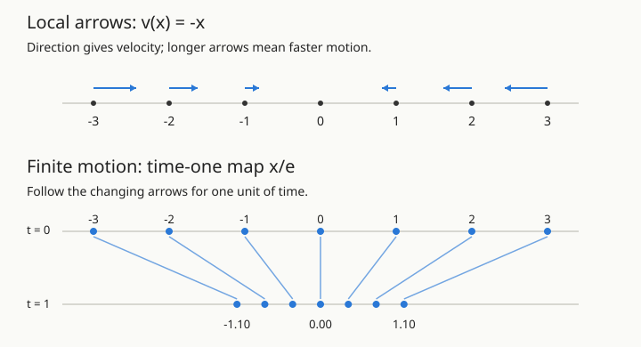

# From Local Arrows to Score-Based Diffusion {.unnumbered}

*The geometric introduction: vector fields, ODEs, flows, scores, and sampling. You need
derivatives, Gaussian distributions, and the idea of an expectation. No previous
stochastic calculus is assumed.*

**How to use these three notes.** Start with Sections 1–8 here for fields, flows,
and the difference between ascent and sampling. Then read
[Sampling with Scores](./24-sampling-with-scores.qmd) for the worked Gaussian
samplers and probability flows. Use
[Tweedie's Formula](./23-tweedie-bayes-denoising.qmd) for the statistical proof
behind score estimation. The remaining sections here provide a geometric
overview and a two-mode example; they can also be read as a self-contained route.

Imagine drawing an arrow at every possible image. The arrow has one component
for every pixel value. It says how to change the image by a small amount. If we
keep following the arrows, can a random image become a sample from a collection
of real images?

That question has two parts. First, how do local arrows produce motion and a
global transformation? Second, which arrows move an entire **distribution** in
the right way? ODEs answer the first question. Scores and diffusion answer the
second. We will build both answers in one dimension, where we can see everything.

The route is

$$
\text{vector field}\ \longrightarrow\ \text{ODE and flow}
\ \longrightarrow\ \text{score}\ \longrightarrow\ \text{SDE sampler}
\ \longrightarrow\ \text{probability-flow ODE}.
$$

Open the [Score and Flow Lab](../materials/score-flow-lab.html) alongside this
note. Its first three experiments follow that order; the fourth explores Tweedie denoising. All scores in the lab are known
analytically; no neural network is needed to isolate the mathematics.

## Notation shared with The Probability-Flow ODE

This introduction uses the same symbols and backward-step convention as
[The Probability-Flow ODE](./07-probability-flow-ode.qmd). The new
[Sampling with Scores](./24-sampling-with-scores.qmd) tutorial uses them too,
with fully solved Gaussian examples and a sampler-first teaching sequence.

| Symbol | Meaning |
|---|---|
| $X_t$, $x$ | Random state at noise level $t$; a particular position |
| $p_0=p_{\text{data}}$, $p_t$ | Clean-data law; forward-noised marginal density |
| $f(x,t)$, $g(t)$, $W_t$ | Forward drift, scalar diffusion coefficient, Brownian motion |
| $s_t(x)$, $s_\theta(x,t)$ | Exact score $\nabla_x\log p_t(x)$; its learned approximation |
| $v(x,t)$ | ODE velocity; for probability flow, $f-\tfrac12g^2s_t$ |
| $\Psi_{s\to t}$ | Flow taking a position at time $s$ to its position at time $t$ |
| $\Phi$ | Standard normal CDF, never a flow map |
| $\beta(t)$, $\alpha_t$, $\sigma_t$ | VP noise schedule, signal scale, corruption-noise standard deviation |
| $\tau=T-t$, $\bar W_\tau$ | Increasing reverse clock and its Brownian motion |
| $h_k=t_{k-1}-t_k<0$ | Backward step on $T=t_N>\cdots>t_0=\epsilon$ |
| $\epsilon$, $\varepsilon$ | Small endpoint time; a standard Gaussian corruption draw |
| $\widehat X_0(x,t)$ | Posterior-mean denoiser $\mathbb E[X_0\mid X_t=x]$ |

Before diffusion is introduced, $t$ is simply elapsed ODE time. We use $u$ for
the independent clock of fixed-target score ascent and Langevin dynamics. A positive
Euler step in those elementary examples is denoted $h$; backward diffusion
steps are explicitly $h_k<0$. Gaussian draws are $\varepsilon$ in fixed-time
corruption and $z_k$ in numerical SDE steps, as in the detailed note.

## 1. A vector field attaches a velocity to each position

On a line, a vector is a signed number: its sign gives direction and its magnitude
gives speed. A **vector field** is a function $v:\mathbb R\to\mathbb R$ assigning
one such vector to every position.

For $v(x)=-x$, the arrow at $2$ points left with speed $2$, the arrow at $-3$
points right with speed $3$, and the arrow at $0$ has zero length. The arrows are
already there, whether or not a particle is present. A field is a rule on space;
a trajectory is what happens to one particle following that rule.

In $d$ dimensions, $v:\mathbb R^d\to\mathbb R^d$. For example,
$v(x,y)=(-x,-y)$ points toward the origin, whereas $v(x,y)=(-y,x)$ points around
the origin. A field need not point toward a destination, and need not be the
gradient of any scalar function. The rotation field will keep moving a particle
around a circle.

We will also need fields $v(x,t)$ whose arrows change with time, even at a fixed
position. Think of wind that changes throughout the day.

## 2. An ODE tells a particle to follow the field

Place a particle at $x(0)=x_0$. Its motion is specified by the initial-value problem

$$
\boxed{\frac{dx(t)}{dt}=v(x(t),t),\qquad x(0)=x_0.}
$$

The derivative is velocity. The right side evaluates the arrow **at the particle's
current location and current time**. Over a short interval $h$,

$$x(t+h)\approx x(t)+h\,v(x(t),t).$$

Read the arrow, move a little, then read the new arrow. The particle does not need
to know where it will eventually arrive.

### Constant motion

If $v(x)=2$, then $\dot x=2$ and

$$x(t)=x_0+2t.$$

Every particle moves right at the same speed. The distance between any two
particles stays constant.

### Motion toward the origin

If $v(x)=-x$, then $\dot x=-x$. For a nonzero solution, separation gives

$$\frac{dx}{x}=-dt,\qquad \log|x|=-t+C,$$

so $x(t)=x_0e^{-t}$. The solution $x(t)\equiv0$, excluded when dividing by $x$,
also satisfies the equation. Thus for every starting point,

$$\boxed{x(t)=x_0e^{-t}.}$$

A particle starting at $5$ is at approximately $1.84$ after one time unit,
$0.68$ after two, and $0.25$ after three. It approaches zero without reaching it
at any finite time. A negative starting point approaches zero from the other side.

### Motion around the origin

For $\dot x=-y$ and $\dot y=x$,

$$
\begin{pmatrix}x(t)\\y(t)\end{pmatrix}
=\begin{pmatrix}\cos t&-\sin t\\\sin t&\cos t\end{pmatrix}
\begin{pmatrix}x_0\\y_0\end{pmatrix}.
$$

The radius stays constant. Local arrows can therefore create translation,
contraction, rotation, or much more complicated motion.

## 3. The flow collects all the trajectories into a map

For each starting point, solve the ODE. Holding the elapsed time fixed gives a map

$$\boxed{\Psi_{0 \to t}(x_0)=x(t).}$$

We use $\Psi$ for flow maps, reserving $\Phi$ for the Gaussian CDF used elsewhere
in the course. For contraction, $\Psi_{0 \to t}(x)=e^{-t}x$. At time zero the map is the
identity; at time one it shrinks the line by $e^{-1}$.

{fig-alt="Arrows of v(x)=-x point toward zero with length proportional to distance. The flow maps each x to x/e, contracting all distances while preserving order."}

For an **autonomous** field $v(x)$, unique solutions satisfy

$$\Psi_{0 \to t+s}=\Psi_{0 \to t}\circ\Psi_{0 \to s},$$

whenever the solutions exist for the times involved. Evolving for $s$ and then
for $t$ is the same as evolving for $s+t$.

For a time-dependent field, the starting clock time matters. Write
$\Psi_{s \to t}(x)$ for the position at time $t$ of a particle placed at $x$ at time
$s$. The correct composition law is

$$\boxed{\Psi_{s \to t}=\Psi_{r \to t}\circ\Psi_{s \to r}.}$$

Here $r$ is an intermediate clock time between $s$ and $t$.

For instance, $\dot x=t$ gives $\Psi_{s \to t}(x)=x+(t^2-s^2)/2$. Restarting the
clock at zero would give a different motion. Diffusion samplers use these
time-dependent flows.

::: {.callout-note}
## When does a flow exist?

Continuity in time and local Lipschitz continuity in position give local
existence and uniqueness. Global existence needs additional control, such as
linear growth; $\dot x=x^2$ can blow up in finite time. Under suitable regularity,
finite-time flow maps are invertible where both forward and backward solutions
exist. Even the contraction $e^{-t}x$ is invertible at every finite $t$; collapse
to a point occurs only in the limit $t\to\infty$.
:::

## 4. Euler's method turns arrows into a computation

When an exact solution is unavailable, choose a step size $h>0$ and use

$$\boxed{x_{k+1}=x_k+h\,v(x_k,t_k),\qquad t_{k+1}=t_k+h.}$$

This is **explicit Euler**: freeze the current arrow for one step. For
$v(x)=-x$, the update is $x_{k+1}=(1-h)x_k$. Compare it with the exact multiplier
$e^{-h}$:

| Step size | Euler's behavior for $\dot x=-x$ |
|---|---|
| $0<h<1$ | Approaches zero from the same side |
| $h=1$ | Jumps to zero in one step |
| $1<h<2$ | Alternates sides while shrinking |
| $h=2$ | Alternates sides without shrinking |
| $h>2$ | Magnitude grows |

Overshooting here is a numerical artifact, not a property of the ODE. For the
rotation field, Euler multiplies the radius by $\sqrt{1+h^2}$ each step and
spirals outward, even though the exact solution stays on a circle.

**Lab 1 — fields and flows.** Choose contraction, translation, or rotation.
Compare the exact path with Euler's path. Increase the step size for contraction
past $1$ and then past $2$. Before looking, predict what changes.

## 5. Move a cloud, and you move a distribution

Now choose the starting point randomly: $X_0\sim p_0$. Applying the same flow to
every particle gives $X_t=\Psi_{0 \to t}(X_0)$. The randomness comes from the starting
point; conditional on that point, an ODE trajectory is deterministic.

For contraction, if $X_0\sim\mathcal N(0,1)$, then

$$X_t=e^{-t}X_0\sim\mathcal N(0,e^{-2t}).$$

The whole distribution narrows. In one dimension, conservation of probability
gives the change-of-variables relation

$$p_t(\Psi_{0 \to t}(x))\,|\Psi_{0 \to t}'(x)|=p_0(x).$$

Contraction makes intervals shorter, so their density must become taller to keep
the same probability mass. A generative model must control this movement of
**mass**, not merely make each individual particle look more probable.

That observation is our bridge to scores.

## 6. Why a score is a natural vector field

Let $p(x)>0$ be a differentiable density. Its **data-space score** is

$$\boxed{s(x)=\nabla_x\log p(x)=\frac{\nabla_xp(x)}{p(x)}.}$$

The derivative is with respect to the sample coordinates $x$, holding any model
parameters fixed. In statistics, “score” often means
$\nabla_\theta\log p_\theta(x)$, a parameter gradient. Here it means the
gradient of the **log density in data space**. Calling it a log-likelihood
gradient is only unambiguous after specifying this differentiation variable.

Here are four reasons this is a useful field, followed by a Gaussian example.

### It gives one component for each direction of motion

In $d$ dimensions,

$$s(x)=\left(\frac{\partial\log p}{\partial x_1},\ldots,
\frac{\partial\log p}{\partial x_d}\right)\in\mathbb R^d.$$

Its input and output dimensions match. This already makes it a vector field.
Where it is sufficiently regular, it can serve as an ODE velocity.

### It measures local relative changes in density

For a small displacement $\delta$,

$$\log\frac{p(x+\delta)}{p(x)}=s(x)^\top\delta+o(\|\delta\|).$$

Among unit directions, the score direction maximizes the first-order increase in
log density, when the score is nonzero. This is Euclidean geometry: “steepest”
depends on the coordinates and metric. The score describes a local density
change, not the probability of an individual point or the location of the
nearest training example.

### The unknown normalizing constant disappears

If $p(x)=\widetilde p(x)/Z$ with $Z$ independent of $x$, then

$$\nabla_x\log p(x)=\nabla_x\log\widetilde p(x).$$

For an energy model $p(x)\propto e^{-E(x)}$, the score is $-\nabla E(x)$.
This connects to [Sampling What You Cannot Normalise](./18-metropolis-hastings.qmd).
Unlike $\nabla p$, the score is unchanged when the density is multiplied by an
unknown positive constant.

### It is precisely what converts diffusion into probability transport

The identity $p\,s=\nabla p$ will allow us to rewrite the diffusion term in a
density evolution equation as a probability current. This is the mathematical
reason the score appears in the sampler. Being an uphill direction alone would
not determine the correct sampling dynamics.

### The Gaussian example connects to our first ODE

For $p=\mathcal N(\mu,\varrho^2)$,

$$\log p(x)=C-\frac{(x-\mu)^2}{2\varrho^2},\qquad
\boxed{s(x)=-\frac{x-\mu}{\varrho^2}.}$$

For a standard Gaussian, $s(x)=-x$: exactly our contraction field. In several
dimensions, a Gaussian with positive-definite covariance $\Sigma$ has score
$-\Sigma^{-1}(x-\mu)$. Narrow directions have stronger restoring arrows.

## 7. Following the score uphill is not yet sampling

Consider the ODE $dx/du=s(x)=-x$ for the standard Gaussian. Even if the initial
cloud already has the correct law $\mathcal N(0,1)$, its variance becomes
$e^{-2u}$ and eventually approaches zero. The particles concentrate at the mode.
They do **not** keep sampling the Gaussian.

More generally, along score ascent,

$$\frac{d}{du}\log p(x(u))=\|s(x(u))\|^2\geq0.$$

This is an optimization behavior. A distribution needs appropriate spread as
well as high-density locations. In high dimensions, much of the probability mass
can lie far from the density's maximizer.

To maintain the spread for a fixed target, add calibrated random motion:

$$\boxed{dX_u=s(X_u)\,du+\sqrt2\,dW_u.}$$

This is overdamped **Langevin dynamics**. The clock $u$ is sampling time for a
fixed target, not a diffusion noise level. Under suitable conditions, $p$ is
invariant and the dynamics converge to it from other starting distributions.
Invariance alone does not guarantee fast mixing between separated modes.

For the standard Gaussian, the variance $V(u)$ satisfies

$$\frac{dV}{du}=-2V+2,\qquad
V(u)=1+(V(0)-1)e^{-2u}.$$

Contraction removes spread; the Brownian term restores it. Their balance selects
variance one. With the noise omitted, only the first term remains.

## 8. Euler–Maruyama: an arrow plus a random kick

Brownian motion has independent increments with

$$W_{t+h}-W_t\sim\mathcal N(0,hI).$$

An SDE $dX_t=f(X_t,t)dt+g(t)dW_t$ can therefore be approximated by

$$\boxed{X_{k+1}=X_k+h\,f(X_k,t_k)+g(t_k)\sqrt h\,z_k,
\qquad z_k\overset{\mathrm{iid}}\sim\mathcal N(0,I).}$$

This is **Euler–Maruyama**. The deterministic displacement scales as $h$; the
random displacement scales as $\sqrt h$. Using $hz_k$ instead would give
vanishing accumulated noise variance as the mesh is refined.

For Langevin sampling, the update becomes

$$X_{k+1}=X_k+h\,s(X_k)+\sqrt{2h}\,z_k.$$

Even a perfect score does not eliminate discretization error. For the standard
Gaussian and $0<h<2$, this discrete chain has stationary variance

$$V_h=(1-h)^2V_h+2h
\quad\Longrightarrow\quad
\boxed{V_h=\frac{1}{1-h/2}.}$$

It is too large at a finite step size. As $h\to0$, it approaches one.

**Lab 2 — ascent versus sampling.** Both clouds start from the same standard
Gaussian particles. One follows score ascent; the other uses Euler–Maruyama for
Langevin dynamics. Watch their histograms and variances. Increase $h$ and compare
the Langevin cloud with the discrete stationary variance above.

::: {.callout-note}
## Why Langevin preserves the target

The density $q_u$ of Langevin particles obeys
$\partial_u q=-\nabla\cdot(qs)+\Delta q$. At $q=p$, the identity
$ps=\nabla p$ makes the right side zero. Here $\nabla\cdot$ is divergence, or
net outward flow, and $\Delta$ is the sum of second spatial derivatives. Suitable
boundary or tail conditions ensure that probability does not leak away.
:::

## 9. Diffusion supplies a whole family of easier densities

Directly learning and sampling a complicated data density is difficult. Instead,
choose a **forward noising process**

$$\boxed{dX_t=f(X_t,t)\,dt+g(t)\,dW_t,\qquad X_0\sim p_{\rm data}.}$$

We restrict attention to a scalar diffusion coefficient $g(t)$ shared by all
coordinates and independent of position. Position-dependent diffusion requires
additional terms in the formulas below.

The process defines marginal densities $p_t$ and their scores

$$s_t(x)=\nabla_x\log p_t(x).$$

At each time, the score belongs to the density of **all noisy data**, not to the
Gaussian corruption of a single training example. With Gaussian corruption and
positive noise, even discrete data produce a smooth, positive density.

An especially simple variance-preserving example is

$$dX_t=-\tfrac12\beta(t)X_t\,dt+\sqrt{\beta(t)}\,dW_t,$$

with $f(x,t)=-\tfrac12\beta(t)x$ and $g(t)=\sqrt{\beta(t)}$. Its coefficients are

$$\alpha_t=\exp\!\left(-\tfrac12\int_0^t\beta(s)\,ds\right),
\qquad \sigma_t^2=1-\alpha_t^2.$$

We now choose $\beta(t)\equiv1$ to keep the first calculations transparent:

$$dX_t=-\tfrac12X_t\,dt+dW_t.$$

At a fixed time its conditional law can be sampled as

$$X_t\overset d=\alpha_tX_0+\sigma_t\varepsilon,
\qquad \alpha_t=e^{-t/2},\quad \sigma_t^2=1-e^{-t},
\quad\varepsilon\sim\mathcal N(0,I),\quad\varepsilon\perp X_0.$$

The signal fades as noise grows. As $t\to\infty$, the law approaches
$\mathcal N(0,I)$. At a finite terminal time $T$, replacing $p_T$ by that Gaussian
is an approximation. The fixed-time identity above does not describe an entire
Brownian trajectory using a single fixed $\varepsilon$.

## 10. Reverse the diffusion using the score

We have a path $p_0\to p_t\to p_T$. Generation starts at the noisy end and follows
the path back. Use the increasing **reverse clock** $\tau=T-t$, exactly as in
[The Probability-Flow ODE](./07-probability-flow-ode.qmd). In reverse-clock
formulas, $X$ denotes the current sampler state and $t=T-\tau$ its noise level.

The time-reversal theorem, under appropriate smoothness and nondegeneracy
conditions, gives

$$\boxed{
dX=\left[-f(X,t)+g(t)^2s_t(X)\right]d\tau
+g(t)\,d\bar W_\tau,\qquad t=T-\tau.
}$$

Here $\bar W_\tau$ is Brownian motion in the increasing reverse clock. The reverse
drift contains both the reversed forward drift and a score correction. The
random kicks remain. This theorem and its use in score-based generation are
presented in [Song et al., §§3–4](https://arxiv.org/html/2011.13456v2#S3).

Why should the score enter? A noisy point can have many possible predecessors.
Bayes' rule favors predecessor regions with more prior probability mass. For a
small step, the local log-density gradient supplies the leading correction to
simply reversing the drift. The full theorem makes that heuristic precise.

For computation, use the detailed note's descending grid

$$T=t_N>t_{N-1}>\cdots>t_0=\epsilon,\qquad
h_k=t_{k-1}-t_k<0.$$

The index now counts down, $k=N,N-1,\ldots,1$, as the noise level decreases.
The positive reverse-clock increment is $|h_k|$. Euler–Maruyama gives

$$\boxed{
X\leftarrow X+h_k\left[f(X,t_k)-g(t_k)^2s_{t_k}(X)\right]
+g(t_k)\sqrt{|h_k|}\,z_k,
\qquad z_k\overset{\mathrm{iid}}\sim\mathcal N(0,I).
}$$

Evaluate everything at the current state and time, then move to $t_{k-1}$. The
noise variance uses $|h_k|$, never a negative time increment. The lab displays
this positive step magnitude as $h=|h_k|$; it is the same update in that display
convention. With smooth data we may take $\epsilon=0$; for singular data we
usually stop at positive $\epsilon$.

Fixed-target Langevin dynamics and reverse diffusion both use scores, but solve
different problems. Langevin seeks equilibrium at one fixed density. Reverse
diffusion tracks a prescribed, changing density $p_t$ with a drift and noise
scale determined by the forward process.

## 11. A deterministic flow can follow the same density path

The surprising next step is that we can transport the same marginals without
injecting fresh noise along each trajectory. The coefficient of the score must
change when we do this.

The forward SDE density satisfies the **Fokker–Planck equation**

$$\partial_t p_t=-\nabla\cdot(f p_t)+\tfrac12g(t)^2\Delta p_t.$$

Read this as conservation of probability. Drift carries mass; diffusion spreads
it. Since $\Delta p_t=\nabla\cdot(p_t s_t)$, we can collect the two terms:

$$
\partial_t p_t
=-\nabla\cdot\left[p_t\left(f-\tfrac12g(t)^2s_t\right)\right].
$$

But the density of particles following an ODE $\dot x=v(x,t)$ satisfies the
**continuity equation** $\partial_t p=-\nabla\cdot(pv)$. Therefore choose

$$\boxed{v(x,t)=f(x,t)-\tfrac12g(t)^2s_t(x).}$$

This gives the **probability-flow ODE**

$$\boxed{\frac{dX_t}{dt}=f(X_t,t)-\tfrac12g(t)^2s_t(X_t).}$$

Given the exact score, matching initial law, and conditions ensuring well-posed
dynamics, it has the same one-time marginals $p_t$ as the forward SDE. In more
than one dimension, other velocity fields can transport the same density path;
this construction supplies a particular one.

For generation, integrate from $T$ downward. In the increasing reverse clock,

$$\frac{dX}{d\tau}=-f(X,t)+\tfrac12g(t)^2s_t(X),\qquad t=T-\tau.$$

On the same descending grid, the **Euler sampler** is

$$\boxed{X\leftarrow X+h_k\,v(X,t_k)
=X+h_k\left[f(X,t_k)-\tfrac12g(t_k)^2s_{t_k}(X)\right].}$$

| Sampler, with $h_k<0$ | Deterministic increment | Fresh noise |
|---|---|---|
| Reverse SDE | $h_k(f-g^2s_t)$ | $g\sqrt{|h_k|}\,z_k$ |
| Probability-flow ODE | $h_k(f-\tfrac12g^2s_t)$ | None |

**Removing noise from the reverse SDE without halving its score term does not
give the probability-flow ODE.** The reverse SDE needs a stronger concentration
drift because its Brownian term is still spreading particles.

There is a useful sanity check. If the forward process
$dX=-X\,dt/2+dW$ already has $p_t=\mathcal N(0,1)$, then $s_t=-x$ and the
probability-flow velocity is $-x/2-(-x)/2=0$. Every probability-flow ODE particle stays put, whereas the score-ascent ODE
of Section 7 contracts toward zero. The SDE particles keep moving, yet the cloud has the same Gaussian law. **Same
marginals do not mean same paths or the same joint distribution across times.**

## 12. A complete example with two modes and no learned quantities

Use a smooth data distribution so that the score remains finite even at $t=0$:

$$p_0=\tfrac12\mathcal N(-m,a^2)+\tfrac12\mathcal N(m,a^2),
\qquad m=2,\quad a=0.35.$$

Under $dX_t=-X_t\,dt/2+dW_t$, each component stays Gaussian. Set

$$b_t=e^{-t/2}m,\qquad q_t=e^{-t}a^2+1-e^{-t}.$$

Then

$$p_t(x)=\tfrac12\mathcal N(x;-b_t,q_t)+\tfrac12\mathcal N(x;b_t,q_t).$$

To compute its score, let $w_+(x,t)$ be the posterior probability of the positive
component. Differentiating the mixture gives a **posterior-weighted** average of
component scores:

$$s_t(x)=w_+(x,t)\frac{b_t-x}{q_t}
+(1-w_+(x,t))\frac{-b_t-x}{q_t}.$$

The log odds of the positive component are $2b_tx/q_t$, so
$2w_+-1=\tanh(b_tx/q_t)$. Hence

$$\boxed{s_t(x)=\frac{b_t\tanh(b_tx/q_t)-x}{q_t}.}$$

At high noise, this field is nearly $-x$. At low noise, it points toward the two
high-density regions. The midpoint has score zero by symmetry even when it lies
in a density valley. Zero score does not necessarily mean a mode.

For this example, the generation updates simplify to

$$
\begin{aligned}
\text{SDE:}\quad X&\leftarrow X+|h_k|\left(\tfrac12X+s_{t_k}(X)\right)+\sqrt{|h_k|}\,z_k,\\
\text{ODE:}\quad X&\leftarrow X+|h_k|\left(\tfrac12X+\tfrac12s_{t_k}(X)\right).
\end{aligned}
$$

**Lab 3 — two routes through the same distributions.** Both samplers start from
the same particles at $T=8$. The default initialization samples the exact mixture
$p_T$, separating discretization error from initialization error. A second option
starts from $\mathcal N(0,1)$, as in a practical model. Scrub the generation clock
to see paths, histograms, the analytic $p_t$, and the current score arrows.

Predict what you will see before changing the controls:

1. ODE paths are smooth; SDE paths remain irregular.
2. Both histograms approach the two-mode target as the step size is refined.
3. A particle's SDE and ODE endpoints need not match, even from the same start.
4. At a finite step size and finite particle count, neither histogram exactly
   equals the analytic curve.

In one dimension, unique exact ODE solutions preserve particle order. The mass
splits into two regions without crossing trajectories. A particle starting
exactly at zero stays there by symmetry, but a continuous initial distribution
assigns that single point probability zero.

The [lab's numerical core](../materials/score-flow-core.js) exposes the exact
mixture density and score, and the three simulation routines, without external
libraries. A small standalone Python sampler is available in
[the companion script](../materials/score-diffusion-example.py).

## 13. How a neural network supplies the missing field

Real data do not come with the analytic mixture score. They do come with samples
$x_0$. Draw $x_0$ and a standard Gaussian $\varepsilon$ independently. Gaussian
corruption then creates training pairs without knowing $p_t$:

$$x_t=\alpha_t x_0+\sigma_t\varepsilon,\qquad
\varepsilon\sim\mathcal N(0,I).$$

The score of the **conditional corruption density** is known:

$$\nabla_{x_t}\log p_t(x_t\mid x_0)
=-\frac{x_t-\alpha_t x_0}{\sigma_t^2}
=-\frac{\varepsilon}{\sigma_t}.$$

Train a network using denoising score matching:

$$\mathcal L(\theta)=\mathbb E\left[
\lambda(t)\left\|s_\theta(x_t,t)+\frac{\varepsilon}{\sigma_t}\right\|^2
\right],\qquad \lambda(t)>0.$$

Use positive noise levels and weights or a lower cutoff that keep the objective
finite. Why does a conditional target learn a marginal score? Squared-error
regression fits its target's conditional mean. At the population optimum,

$$
\begin{aligned}
s^\star(x,t)
&=\mathbb E[\nabla_x\log p_t(x\mid X_0)\mid X_t=x]\\
&=\frac{\int\nabla_xp_t(x\mid x_0)\,p_0(dx_0)}{p_t(x)}
=\nabla_x\log p_t(x),
\end{aligned}
$$

where differentiation under the integral is justified by suitable regularity.
The sampled target varies across examples; the learned field averages the
targets compatible with the observed noisy input.

There is also a direct denoising interpretation:

$$\widehat X_0(x,t):=\mathbb E[X_0\mid X_t=x],\qquad
\boxed{\sigma_t^2s_t(x)=\alpha_t\widehat X_0(x,t)-x.}$$

The scaled score points from the noisy observation toward the posterior mean of
the attenuated clean signal. It does not identify the particular clean example
that produced the observation. The standalone
[Tweedie tutorial](./23-tweedie-bayes-denoising.qmd) proves this identity and its
Bayes optimality under squared error. See
[One Estimator, Many Parameterizations](./21-one-estimator-many-parameterizations.qmd)
for the relation to noise prediction.

After training, replace $s_t$ by $s_\theta$ in either sampler. The network learns
the score; the known drift and scaling construct the velocity or reverse drift.
A generic network is not guaranteed to be an exact gradient field, and imperfect
scores need not make the SDE and ODE share the same marginals. Their equivalence
is an exact-score statement.

## 14. What has actually been learned?

The hierarchy is now concrete. A field assigns local arrows. An ODE integrates
those arrows into trajectories. A flow collects the trajectories into a global
map. A score describes local relative density change. Diffusion supplies the
time-indexed densities whose scores determine a stochastic reverse sampler and
a deterministic probability flow.

In standard score-based training, the network does not directly learn an
endpoint transport map. It estimates local information from which a numerical
solver constructs that map, or a stochastic sampling process.

One terminological refinement: the ODE's *infinitesimal generator* is the
operator $\mathcal L_t\varphi=v(\cdot,t)\cdot\nabla\varphi$ acting on test
functions. For the forward SDE, it is
$\mathcal L_t\varphi=f\cdot\nabla\varphi+\tfrac12g^2\Delta\varphi$.
Calling the network itself “the generator” is informal; **learning local score
information that determines the dynamics** is the precise statement.

For an exact sampling claim we need an exact terminal law, exact scores, and
exact integration under appropriate regularity. Practical models approximate all
three. Stopping at a small positive time adds an endpoint approximation when
the data score is singular at zero. Our smooth-mixture lab avoids that last
issue so that the numerical effects remain easy to see.

## Questions to work through

1. For $v(x)=-3x$, derive the exact flow and the range of stable Euler step sizes.
2. For $p=\mathcal N(\mu,\varrho^2)$, derive the score and show that
   $dX=s(X)du+\sqrt2dW$ has stationary variance $\varrho^2$.
3. Explain why scaling an unnormalized density does not change its score, but
   multiplying the score by two generally changes a Langevin sampler's target.
4. For pure Brownian noising $dX=dW$, write both generation updates. Where does
   the factor of one-half appear?
5. In the stationary Gaussian example, remove the random term from the reverse
   SDE without changing its drift. What happens to the cloud's variance?

::: {.callout-tip collapse="true"}
## Checks for your answers

1. $\Psi_{0 \to t}(x)=e^{-3t}x$; Euler is asymptotically stable for $0<h<2/3$.
2. $s(x)=-(x-\mu)/\varrho^2$; $V'=-2V/\varrho^2+2$, so $V=\varrho^2$ at equilibrium.
3. A constant vanishes on differentiating its logarithm. With unchanged noise,
   using $2s$ instead of $s$ gives invariant density proportional to $p^2$, when
   this is normalizable and the usual conditions hold.
4. On the descending grid, SDE: $X\leftarrow X-h_k s_{t_k}(X)+\sqrt{|h_k|}z_k$;
   ODE: $X\leftarrow X-\tfrac12h_k s_{t_k}(X)$, with $h_k<0$.
5. The reverse drift is $-x/2$. Without noise, $V(\tau)=e^{-\tau}V(0)$; the correct
   probability-flow ODE has zero velocity and preserves the variance.
:::

## Reading and next steps

- Lai, Song, Kim, Mitsufuji, and Ermon,
  [*The Principles of Diffusion Models*](https://arxiv.org/abs/2510.21890).
  In the current text, Chapter 3 develops the score-based perspective, and
  Chapter 4 develops the score-SDE framework. Read §§3.2–3.3 for scores and
  denoising, then §§4.1–4.3 for reverse dynamics, matching marginals, and sampling.
- Song et al., [*Score-Based Generative Modeling through Stochastic Differential
  Equations*](https://arxiv.org/abs/2011.13456), especially §§3.2, 4.1, 4.3 and
  Appendix D: reverse SDEs, numerical sampling, and probability flow.
- The course's [Probability-Flow ODE](./07-probability-flow-ode.qmd) draft gives
  a more detailed treatment after this introduction.
