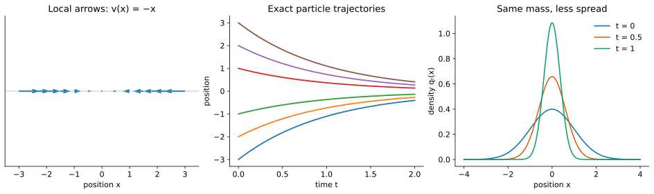
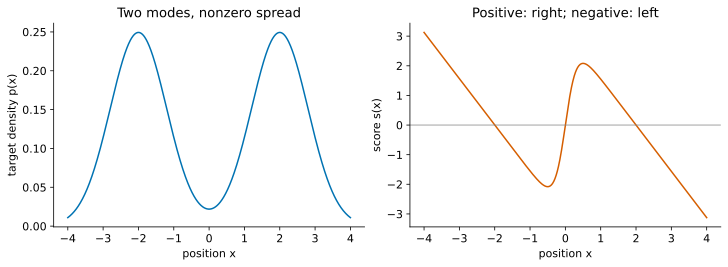

# ODEs in One Dimension: Particles, Flows, and Densities {.unnumbered}

::: {.callout-note}
## Tutorial 1 of 4 · Deterministic transport

**Start here.** This is a stand-alone introduction using derivatives, integrals,
and Gaussian distributions. No SDEs, stochastic calculus, or fluid mechanics
are assumed. All states in this tutorial are real numbers.

**Reading route:** local arrows → trajectories → flow maps → conservation of
probability → scores → mode seeking → distribution transport.
Longer calculations sit in derivation subsections.
[Series guide and notation](./score-based-diffusion-guide.qmd).
:::

*Looking for the earlier score-learning material? It is now in
[Tutorial 3](./27-diffusion-neural-odes-normalizing-flows.qmd#learn-the-score-only-after-understanding-its-use).*

## A data point as a particle

Imagine a collection of data values placed on a line. Regard each value as the
position of a particle. To transform the data, move the particles. This analogy
lets us borrow two questions from mechanics and fluids:

1. Where does each particle go?
2. How much of the population lies in each interval as time passes?

The first question concerns a **trajectory**; the second concerns a **density**.
A finite collection has an empirical distribution, a set of point masses. Its
histogram approximates an underlying population density. When differentiating
a density below, we mean that smooth population model, not the raw histogram.

Write $x_t$ for the position of one particle. Write $X_t$ when its position is
random because the starting particle was selected randomly. Its density is
$q_t(x)$: $q_t(x)\,dx$ approximates the probability in a short interval of width
$dx$. Density can exceed one; the integral over the whole line must equal one.

## Local arrows define an ODE

A **vector field** in one dimension is a signed velocity $v(x,t)$ at each
position and time. Positive means right, negative means left, and magnitude
means speed. The ordinary differential equation is

$$\boxed{\frac{dx_t}{dt}=v(x_t,t),\qquad x_0\text{ given}.}$$

It says to follow the arrow at the particle's current position. Euler's method
makes the instruction computational. For a positive step $h$,

$$x_{k+1}=x_k+h\,v(x_k,t_k),\qquad t_{k+1}=t_k+h.$$

The subscript $k$ indexes numerical steps; $t$ is continuous time. An exact
trajectory solves the differential equation; Euler is generally an approximation.

### First example: constant motion

If $v(x,t)=c$, integration gives $x_t=x_0+ct$. Every particle translates by the
same amount. Distances between particles stay fixed. The map from a starting
position at time $r$ to its position at time $t$ is

$$\Psi_{r\to t}(x)=x+c(t-r).$$

This map is the **flow map**. It collects all starting points' solutions.

### Solved example: contraction toward zero

If $v(x)=-x$, then positive positions move left and negative positions move
right. The origin is an equilibrium. For $x_0\ne0$, separation gives

$$\frac{dx}{x}=-dt,\qquad \log|x_t|-\log|x_0|=-t,
\qquad \boxed{x_t=e^{-t}x_0.}$$

The solution $x_t=0$ covers $x_0=0$, where dividing by $x$ was not valid.
A particle starting at $5$ has positions $5$, $5e^{-1}$, $5e^{-2}$ at times
$0,1,2$. It approaches zero without reaching it in finite time.

The flow is $\Psi_{r\to t}(x)=e^{-(t-r)}x$. For finite times it is invertible:
$\Psi_{t\to r}(x)=e^{t-r}x$. A shrinking cloud does not collapse to a point
until the infinite-time limit.

### Time-dependent fields need two time labels

For $r<t_*<t$, following the flow first to $t_*$ and then to $t$ gives

$$\Psi_{r\to t}=\Psi_{t_*\to t}\circ\Psi_{r\to t_*}.$$

For a time-dependent field, the starting time matters; an arrow tomorrow need
not equal today's arrow at the same location. Under suitable existence and
uniqueness conditions, trajectories cannot meet at the same position at the
same time and then have different histories. We assume smooth fields with
solutions existing in both directions on the finite intervals used here.

## From moving particles to a moving density

A flow tells us where each particle goes. To find the new density, preserve
the probability in corresponding intervals. One-dimensional regular ODE flows
are increasing because trajectories cannot cross. Thus $X_t\le x$ exactly when
$X_0\le\Psi_{t\to0}(x)$, and

$$P(X_t\le x)=P(X_0\le\Psi_{t\to0}(x)).$$

Differentiating in $x$ gives the change-of-variables formula:

$$\boxed{q_t(x)=q_0(\Psi_{t\to0}(x))\,\partial_x\Psi_{t\to0}(x).}$$

The inverse flow's derivative is positive. This is a precise version of
$q_t(x)dx=q_0(x_0)dx_0$: the same probability occupies corresponding intervals.

An interval that shrinks contains the same probability in less space, so its
density rises. This is the fluid picture: particles mark portions of a moving
population; compression changes concentration, not total mass.

For translation, $q_t(x)=q_0(x-ct)$. For contraction,

$$\boxed{q_t(x)=e^t q_0(e^t x).}$$

If $X_0\sim\mathcal N(m_0,a_0^2)$, then

$$X_t=e^{-t}X_0\sim\mathcal N(e^{-t}m_0,e^{-2t}a_0^2).$$

Notice both changes: particle positions shrink and the density peak becomes taller.

## Conservation of probability: the continuity equation {#continuity}

The probability in an interval $[x_L,x_R]$ is $\int_{x_L}^{x_R} q_t(x)\,dx$. It changes only
when particles cross the endpoints. Define the **probability flux**

$$J(x,t)=q_t(x)v(x,t).$$

Why this product? Over a small time $h$, rightward velocity $v$ carries the
particles in a strip of width approximately $vh$ across the boundary. Their
probability is approximately $q_tvh$. A negative $v$ reverses the direction.
Thus flux measures signed probability crossing per unit time.

### Derivation: inflow minus outflow

At the left boundary rightward flux enters; at the right boundary it leaves:

$$\frac{d}{dt}\int_{x_L}^{x_R} q_t(x)\,dx=J(x_L,t)-J(x_R,t)
=-\int_{x_L}^{x_R}\partial_xJ(x,t)\,dx.$$

Since this holds for arbitrary intervals, smooth densities satisfy

$$\boxed{\partial_tq_t(x)=-\partial_x\big(q_t(x)v(x,t)\big).}$$

This is the **continuity equation**, conservation of probability. It is also
the zero-noise case of the Fokker–Planck equation introduced in Tutorial 2.
We have derived it without stochastic calculus.

Here $\partial_t$ changes time while holding $x$ fixed; $\partial_x$ changes
position while holding time fixed. The equation describes the whole density,
not an individual trajectory. Given the velocity, initial density, and suitable
boundary conditions, it determines the density evolution. On the whole line
we assume flux vanishes at infinity so total probability stays one.

### Worked checks: translation and contraction

For translation, differentiating $q_t(x)=q_0(x-ct)$ gives
$\partial_tq_t=-c q_0'(x-ct)=-\partial_x(cq_t)$.

For contraction, $q_t(x)=e^tq_0(e^tx)$ gives

$$\partial_tq_t=q_t+x\partial_xq_t
=\partial_x(xq_t)=-\partial_x((-x)q_t).$$

Thus the flow calculation and conservation equation give the same answer.
For $q_0=\mathcal N(0,1)$, writing the density explicitly yields

$$q_t(x)=\frac{e^t}{\sqrt{2\pi}}\exp[-e^{2t}x^2/2].$$

Its integral is one at every finite time, even though its height at zero grows.

### Derivation: follow the density along one particle {#along-density}

Expanding conservation gives $\partial_tq=-v\partial_xq-q\partial_xv$.
Where $q>0$, apply the chain rule along $\dot x_t=v(x_t,t)$:

$$\frac{d}{dt}\log q_t(x_t)
=\frac{\partial_tq_t}{q_t}+v\frac{\partial_xq_t}{q_t}
=\boxed{-\partial_xv(x_t,t)}.$$

A negative velocity slope compresses nearby particles and raises their density.
For $v=-x$, the slope is $-1$, so log density along each trajectory grows at
rate one. A fixed observer and a moving particle measure different derivatives.

## The score supplies a particular vector field {#score}

Suppose we know a smooth positive **target density** $p(x)$. Keep this symbol
separate from $q_t(x)$, the density of our current particle population. Define

$$\boxed{s(x)=\partial_x\log p(x)=\frac{p'(x)}{p(x)}.}$$

This is a derivative with respect to the data coordinate, not a model parameter.
It assigns one signed number to each position, so it is a vector field on the
line. Its local meaning follows from Taylor expansion:

$$\log p(x+\delta)\approx\log p(x)+s(x)\delta.$$

Taking $\delta=h s(x)$ increases log density by approximately $h s(x)^2$.
For the exact score ODE $\dot x=s(x)$,

$$\frac{d}{dt}\log p(x_t)=s(x_t)^2\ge0.$$

The score therefore points uphill in log density. Conservation alone does
**not** force the velocity to be the score. We are now studying one plausible
choice of velocity and asking what population it produces.

### The energy interpretation

If $p(x)=e^{-E(x)}/Z$ with $Z=\int e^{-E(x)}dx<\infty$, then

$$s(x)=-E'(x).$$

Following the score is gradient descent on energy. The unknown normalizing
constant disappears on differentiation. This makes a score accessible even
when evaluating the normalized density is difficult. Energy descent alone
finds low-energy locations; sampling requires the correct spread as well.

## Three solved score ODEs {#gaussian-score}

### Target 1: standard normal

For $p=\mathcal N(0,1)$, $s(x)=-x$. We already solved its trajectories, flow,
density, and continuity equation. Starting even from the target itself gives
$q_t=\mathcal N(0,e^{-2t})$, which immediately differs from $p$.

### Target 2: normal with mean mu and unit variance

For $p=\mathcal N(\mu,1)$, $s(x)=-(x-\mu)$. Set $y_t=x_t-\mu$. Then
$\dot y_t=-y_t$, so

$$x_t=\mu+e^{-t}(x_0-\mu),\qquad
\Psi_{0\to t}(x)=\mu+e^{-t}(x-\mu).$$

If $X_0\sim\mathcal N(m_0,a_0^2)$, then
$q_t=\mathcal N(\mu+e^{-t}(m_0-\mu),e^{-2t}a_0^2)$.

### Target 3: normal with mean mu and variance a squared

For $p=\mathcal N(\mu,a^2)$, $a>0$,

$$s(x)=-\frac{x-\mu}{a^2},\qquad
x_t=\mu+e^{-t/a^2}(x_0-\mu),$$

$$\boxed{q_t(x)=e^{t/a^2}q_0\!\left(\mu+e^{t/a^2}(x-\mu)\right).}$$

For Gaussian $q_0$, its mean is $\mu+e^{-t/a^2}(m_0-\mu)$ and variance is
$e^{-2t/a^2}a_0^2$. Smaller target variance means faster contraction.

**Density-equation check.** Differentiating the displayed $q_t$ gives

$$\partial_tq_t=\frac1{a^2}\left[q_t+(x-\mu)\partial_xq_t\right]
=-\partial_x(sq_t).$$

At $q_t=p$, the right side is $-p''$, generally nonzero. The desired target is
not stationary under its own score ODE.

## Why score ascent is mode seeking {#mode-seeking}

For the Gaussian every particle approaches the mode $\mu$. A sampler for
$\mathcal N(\mu,a^2)$ must instead return values with variance $a^2$. Higher
pointwise density and correct population density are different objectives.

For a smooth mixture, let $p(x)=\tfrac12\phi_a(x-m)+\tfrac12\phi_a(x+m)$,
where $\phi_a$ is the centered Gaussian density with standard deviation $a$.
Direct differentiation gives

$$s(x)=\frac{m\tanh(mx/a^2)-x}{a^2}.$$

When $m>a$, $s'(0)=(m^2-a^2)/a^4>0$: the middle equilibrium repels, while the
two modes attract. Their locations solve $x=m\tanh(mx/a^2)$; they are not
exactly $\pm m$. A smooth unique ODE flow cannot cross the equilibrium at zero.
The limiting proportions in each attraction region depend on the initial
population, and within-region spread disappears. There is usually no useful
closed-form trajectory; Euler computes it numerically.

## Deterministic transport can still generate samples {#gaussian-transport}

Randomness may enter through the initial position. A deterministic map applied
to a random input still gives a random output. We need a velocity chosen for
the desired **density path**, rather than unmodified ascent of one fixed target.

Choose differentiable $m_t$ and positive $a_t$. If $X_0\sim\mathcal N(m_0,a_0^2)$,
set

$$x_t=m_t+\frac{a_t}{a_0}(x_0-m_0).$$

This flow gives $q_t=\mathcal N(m_t,a_t^2)$. Differentiating and eliminating
$x_0$ identifies its velocity:

$$\boxed{v(x,t)=\dot m_t+\frac{\dot a_t}{a_t}(x-m_t).}$$

For example, from standard normal to $\mathcal N(2,4)$ over $0\le t\le1$, use
$m_t=2t$, $a_t=1+t$. Then $x_t=2t+(1+t)x_0$ and
$v(x,t)=2+(x-2t)/(1+t)$. At $t=1$, $X_1=2+2X_0$ has exactly the target law.

### Derivation: check the density equation

Write $y=(x-m_t)/a_t$ and $q_t=a_t^{-1}\phi_1(y)$. Then

$$\partial_x\log q_t=-\frac{y}{a_t},\qquad
\partial_t\log q_t=-\frac{\dot a_t}{a_t}
+\frac{\dot m_t}{a_t}y+\frac{\dot a_t}{a_t}y^2.$$

Meanwhile,

$$-\partial_xv-v\partial_x\log q_t
=-\frac{\dot a_t}{a_t}+(\dot m_t+\dot a_t y)\frac{y}{a_t},$$

which is the same expression.
Multiplication by $q_t$ verifies conservation. All probability moves into the
new Gaussian without collapsing its variance.

## The next question: can noise balance score contraction?

A preview of Langevin sampling is

$$x_{k+1}=x_k+h s(x_k)+\sqrt{2h}\,\xi_k,\qquad
\xi_k\sim\mathcal N(0,1)\text{ independently}.$$

The drift pulls inward; fresh noise spreads the cloud. The relative coefficients
matter. [Tutorial 2](./26-probability-flow-sampling.qmd) develops Brownian motion,
the SDE, and Fokker–Planck before deriving this balance. Later, Tutorial 3
constructs an ODE velocity that reproduces a diffusion's density evolution.

## Check your understanding

1. What distinguishes a trajectory, a flow map, and a density?
2. Why does contraction raise density without creating probability?
3. Does $\dot x=\partial_x\log p$ preserve $p=\mathcal N(\mu,1)$?
4. What randomness remains in deterministic generation?

::: {.callout-tip collapse="true"}
## Answers

1. One particle's history; a map of all starting positions; probability per unit length.
2. The same probability occupies a shorter interval; the change-of-variables factor compensates.
3. No. Even starting at $p$, its variance becomes $e^{-2t}$.
4. The random initial position. An appropriate flow transports its full distribution.
:::
