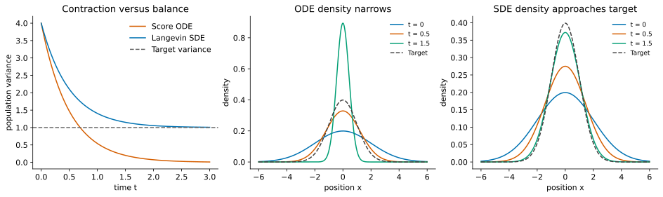

# SDEs in One Dimension: Brownian Motion, Itô Calculus, and Langevin Sampling {.unnumbered}

::: {.callout-note}
## Retired material

This earlier tutorial sequence is retained for reference. The current teaching
sequence is [Probability-Flow ODE, Parts 1–5](./07-probability-flow-ode.qmd)
(Lectures 12–16). Follow those lectures for the current notation, derivations,
and notebook exercises. These older notes contain additional background but
are no longer part of the main reading sequence.
:::

::: {.callout-note}
## Tutorial 2 of 4 · Random motion and density evolution

**Stand-alone prerequisites:** elementary calculus, Taylor expansion, means,
variances, and Gaussian distributions. No prior stochastic calculus is needed.
The deterministic transport recap below supplies the needed ODE background.
All states here are real numbers.

**Reading route:** random walks → Brownian motion → Euler–Maruyama → Itô
integral and lemma → Fokker–Planck → Gaussian Langevin sampling.
[Shared notation](./score-based-diffusion-guide.qmd).
:::

*Looking for probability-flow sampling? It is now in
[Tutorial 3](./27-diffusion-neural-odes-normalizing-flows.qmd#probability-flow).*

## Recap: velocity, particles, and conservation

A particle follows $\dot x_t=v(x_t,t)$. A random initial position makes a
population with density $q_t(x)$. Its signed probability flux is $vq_t$, and
conservation gives $\partial_tq_t=-\partial_x(vq_t)$. The derivative in time
holds position fixed. For $v=-x$, trajectories contract as $e^{-t}x_0$ and a
standard normal population becomes $\mathcal N(0,e^{-2t})$.

For a fixed target density $p$, its score is $s(x)=\partial_x\log p(x)$.
For $p=\mathcal N(\mu,a^2)$ it equals $-(x-\mu)/a^2$. Following that score
alone collapses particles toward the mean. We now introduce a spreading
mechanism and ask how to balance it with this contraction.

## Random walks: many small independent kicks

At times $t_k=kh$, draw independent $\xi_k\sim\mathcal N(0,1)$ and define

$$W^{(h)}_{kh}=\sqrt h\sum_{j=0}^{k-1}\xi_j.$$

The mean is zero. Independence makes variances add, so
$\operatorname{Var}(W^{(h)}_{kh})=kh=t_k$. Halving $h$ doubles the number of
steps but halves each step's variance; the spread at a fixed time is unchanged.
Using $h\xi_j$ instead would give variance $t_kh\to0$.

**Brownian motion** $W_t$ is the continuous-path random process modeled by
this limiting construction. It satisfies $W_0=0$, has independent increments,
and

$$W_{t+h}-W_t\sim\mathcal N(0,h).$$

Its paths are continuous but almost surely (with probability one) nowhere differentiable. A typical
increment is of size $\sqrt h$; dividing it by $h$ does not produce an ordinary
finite velocity as $h\to0$. Brownian motion is specified by increments and
joint laws, not by a conventional derivative.

Piecewise interpolation of finer random walks motivates this limit. A rigorous
construction is beyond the prerequisite level; the increment properties above
are what our calculations use.

## From Euler to Euler–Maruyama {#euler-maruyama}

For a positive step $h$, Euler uses $x_{k+1}=x_k+h f(x_k,t_k)$. Add fresh
Gaussian kicks:

$$\boxed{\widehat X_{k+1}=\widehat X_k+h f(\widehat X_k,t_k)
+g(t_k)\sqrt h\,\xi_k.}$$

This is **Euler–Maruyama** for the stochastic differential equation

$$\boxed{dX_t=f(X_t,t)\,dt+g(t)\,dW_t.}$$

$f$ is the drift, the deterministic part of the infinitesimal change. It is
not the derivative of a rough sample path. $g(t)$ is the noise amplitude;
we restrict it to depend only on time. Throughout, $X_0$ is independent of the
Brownian motion $W$. In numerical schemes, $\xi_k$ is independent of
$\widehat X_0,\xi_0,\ldots,\xi_{k-1}$. The next section gives the $dW$ notation
its integral meaning. A hat denotes a numerical approximation.
Smaller steps approximate the SDE under suitable regularity and moment bounds.

From $x=2$, with $f=-x/2$, $g=1$, $h=0.01$, the next numerical state is
$1.99+0.1\xi$. Its conditional mean is $1.99$ and conditional variance is $0.01$.
A finite Euler–Maruyama step is generally not the exact SDE transition.

## What the Itô integral means {#ito-integral}

An SDE is shorthand for an integral equation:

$$X_t=X_0+\int_0^t f(X_r,r)\,dr+\int_0^t g(r)\,dW_r.$$

The first integral accumulates drift. The second accumulates weighted random
increments. For a continuous deterministic function $c$ on a finite interval,

$$\int_0^t c(r)\,dW_r
=\lim_{\max\Delta t_k\to0}\sum_k c(t_k)
       (W_{t_{k+1}}-W_{t_k}),$$

where the limit is in **mean square**: the expected squared error tends to zero.
Independence of disjoint Brownian increments gives zero mean and

$$\boxed{\mathbb E\left[\left(\int_0^t c(r)\,dW_r\right)^2\right]
=\int_0^t c(r)^2\,dr.}$$

This is Itô isometry for deterministic integrands. General square-integrable
integrands are defined by approximation by step functions; arbitrary pointwise
left-endpoint samples need not converge for such functions. A deterministic
integrand gives a Gaussian integral,
because its approximating sums are weighted sums of independent Gaussians.

### Random integrands and the left endpoint

Itô integrals also allow random $H_r$ determined by information available by
time $r$, with $\mathbb E\int_0^t H_r^2dr<\infty$. The left-endpoint sums use
$H_{t_k}$ before seeing the next Brownian increment. This is the non-anticipating
rule. More precisely, one first defines these sums for such step processes and
extends by mean-square limits. The isometry becomes

$$\mathbb E\left[\left(\int_0^t H_r\,dW_r\right)^2\right]
=\mathbb E\int_0^t H_r^2\,dr.$$

The integral still has mean zero, but need not be Gaussian for a random integrand.
The endpoint convention matters; ordinary Riemann integration rules cannot be
applied to a Brownian path as though it had finite variation.

## Why the chain rule changes: Itô's lemma {#expected-taylor-step}

Condition on $X_t=x$ and examine a small Euler–Maruyama increment
$\Delta X=hf+g\sqrt h\xi$. For a smooth function $\varphi(x)$,

$$\varphi(x+\Delta X)-\varphi(x)
=\varphi'(x)\Delta X+\tfrac12\varphi''(x)(\Delta X)^2+\cdots.$$

Here $\mathbb E\Delta X=hf$ and
$\mathbb E(\Delta X)^2=g^2h+f^2h^2$. The squared random increment survives
at order $h$. With bounded coefficients and bounded third derivative locally,
$\mathbb E|\Delta X|^3=O(h^{3/2})$, so the Taylor remainder vanishes after
dividing by $h$. Under conditions justifying passage to the continuous process,

$$\boxed{\frac{d}{dt}\mathbb E[\varphi(X_t)]
=\mathbb E[f\varphi'+\tfrac12g^2\varphi''].}$$

To follow paths rather than averages, retain the random parts. The sum of
$\varphi'(x)g\sqrt h\xi_k$ builds an Itô integral. The quadratic contribution
contains $h\xi_k^2$. Over a uniform grid, the differences between
$\tfrac12\varphi''g^2h\xi_k^2$ and $\tfrac12\varphi''g^2h$ have conditional mean
zero. With bounded, non-anticipating coefficients, cross terms have zero
expectation and the total variance is $O(h)$. Their sum vanishes in mean square.
Localization and remainder estimates extend this reasoning beyond bounded
coefficients; the following explanation is the mechanism, not a full proof.

For Brownian motion itself, $\sum_k(\Delta W_k)^2\to t$ in mean square: its
mean is $t$ and variance is $2\sum_k(\Delta t_k)^2\to0$. This accumulated squared
motion is **quadratic variation**. It explains the mnemonic $(dW)^2=dt$, which
refers to a limit of sums rather than ordinary algebra of differentials.

The full **Itô lemma**, for a function $F(x,t)$ once differentiable in time
and twice in space, is

$$\boxed{dF(X_t,t)=
\left(\partial_tF+f\partial_xF+\tfrac12g^2\partial_{xx}F\right)dt
+g\partial_xF\,dW_t.}$$

All coefficients are evaluated at $(X_t,t)$. The extra second-derivative term
is the Itô correction. The Taylor calculation motivates it; making the
remainder estimates rigorous requires stochastic-calculus results.

### Worked example: the square of Brownian motion

For $F(x)=x^2$ and $X_t=W_t$,

$$d(W_t^2)=2W_t\,dW_t+dt.$$

Therefore $\mathbb E W_t^2=t$ and

$$\int_0^t W_r\,dW_r=\tfrac12(W_t^2-t).$$

The $-t$ is exactly what the ordinary chain rule would miss. The quadratic
variation calculation explains why the correction remains even as steps shrink.

## Fokker–Planck: the density of stochastic particles {#fokker-planck}

Individual paths are random, but their population density has a deterministic
evolution equation:

$$\boxed{\partial_tq_t=-\partial_x(fq_t)
+\tfrac12g(t)^2\partial_{xx}q_t.}$$

This is the **Fokker–Planck equation**. Drift moves mass; noise spreads it.
At $g=0$ it reduces to the ODE's continuity equation.

### Derivation: use a smooth probe of the density

Take a smooth $\varphi$ vanishing outside a bounded interval. Since
$\mathbb E\varphi(X_t)=\int\varphi(x)q_t(x)dx$, Itô's expectation formula gives

$$\int\varphi\,\partial_tq_t\,dx
=\int f q_t\varphi'\,dx+\tfrac12g^2\int q_t\varphi''\,dx.$$

Integrate the first term by parts once and the second twice. Boundary terms
vanish because of the probe's support. The result is

$$\int\varphi\,\partial_tq_t\,dx
=\int\varphi[-\partial_x(fq_t)+\tfrac12g^2\partial_{xx}q_t]dx.$$

Equality for all such probes identifies the density equation when the density
is smooth. This is a derivation of the PDE, not an assumption about it.

### Probability flux explains the two terms

Write the equation again as conservation, $\partial_tq_t=-\partial_xJ$, with

$$\boxed{J=fq_t-\tfrac12g^2\partial_xq_t.}$$

The first flux transports particles with the drift. The second goes down the
density gradient: random motion has more particles available to leave a dense
region than to enter it from a sparse neighbor. On the whole line, vanishing
flux at both infinities ensures conservation of total probability.

## Solved example: pure Brownian spreading

For $dX_t=g\,dW_t$ with constant $g$, and independent
$X_0\sim\mathcal N(m_0,a_0^2)$,

$$X_t=X_0+gW_t,\qquad q_t=\mathcal N(m_0,a_0^2+g^2t).$$

The mean stays fixed, while variance grows. Set $V_t=a_0^2+g^2t$.
Direct differentiation of the Gaussian gives

$$\partial_tq_t=\frac{g^2}{2}
\left[\frac{(x-m_0)^2}{V_t^2}-\frac1{V_t}\right]q_t
=\frac{g^2}{2}\partial_{xx}q_t.$$

This checks Fokker–Planck. At the peak, $q_t''<0$ so density falls; farther
into the tails it rises. Spreading redistributes probability rather than
creating it.

## Derive Langevin dynamics from a desired stationary density {#langevin}

Let $p(x)$ be a fixed smooth positive target. We want a drift that balances
constant noise amplitude $g>0$. At stationarity,
$\partial_tq=-\partial_xJ=0$, so flux $J$ must be constant in space.
Vanishing boundary flux at $\pm\infty$ forces that constant to be zero:

$$J=fp-\tfrac12g^2p'=0,\qquad
\boxed{f=\tfrac12g^2\frac{p'}p=\tfrac12g^2s.}$$

In one dimension, this is the only drift making $p$ stationary for this noise
amplitude with vanishing boundary flux. The conventional choice $g=\sqrt2$
makes the drift exactly the score:

$$\boxed{dX_t=s(X_t)\,dt+\sqrt2\,dW_t.}$$

This is overdamped **Langevin dynamics**. The score appears because it is the
drift that exactly balances spreading at the target density. No normalization
constant is needed if $p\propto e^{-E}$: the drift is $-E'$.

Its Euler–Maruyama sampler is

$$x_{k+1}=x_k+h s(x_k)+\sqrt{2h}\xi_k.$$

In this tutorial $t$ is algorithmic time and $p$ is fixed. In Tutorial 3,
$t$ will parameterize a prescribed corruption path $p_t$; that different
sampling objective will always be stated explicitly.

### Derivation: verify stationarity in Fokker–Planck

Substitute $q_t=p$ into $\partial_tq_t=-\partial_x(sq_t)+q_t''$:

$$-\partial_x(sp)+p''=-\partial_x(p')+p''=0.$$

If initialized at $p$, the density stays at $p$ under appropriate well-posedness
and boundary conditions. Individual particles still move. **Stationarity does
not by itself prove convergence from another initial law.** Convergence needs
conditions ensuring confinement and exploration. Separated modes can mix slowly.

## Solve Langevin for Gaussian targets {#gaussian-langevin}

For $p=\mathcal N(\mu,a^2)$,

$$dX_t=-\frac{X_t-\mu}{a^2}dt+\sqrt2\,dW_t.$$

This linear Gaussian process is an Ornstein–Uhlenbeck process. Standard normal
uses $\mu=0,a=1$; shifted unit normal uses the same relaxation rate toward $\mu$.

### Derivation: exact process using an integrating factor

Apply Itô's lemma to $F(x,t)=e^{t/a^2}(x-\mu)$. Its derivatives are
$\partial_tF=F/a^2$, $\partial_xF=e^{t/a^2}$, and $\partial_{xx}F=0$.
Thus the drift cancels and there is no Itô correction:
$dF(X_t,t)=\sqrt2 e^{t/a^2}dW_t$. Integrate and multiply by $e^{-t/a^2}$:

$$\boxed{X_t=\mu+e^{-t/a^2}(X_0-\mu)
+\sqrt2\int_0^t e^{-(t-r)/a^2}\,dW_r.}$$

The integral is independent of $X_0$ and Gaussian, with variance

$$2\int_0^t e^{-2(t-r)/a^2}dr=a^2(1-e^{-2t/a^2}).$$

Thus, for $X_0\sim\mathcal N(m_0,a_0^2)$,

$$\boxed{q_t=\mathcal N\!\left(
\mu+e^{-t/a^2}(m_0-\mu),\;
 a^2+(a_0^2-a^2)e^{-2t/a^2}\right).}$$

The mean approaches $\mu$ and the variance approaches $a^2$. Without noise, the stochastic integral—the source of the limiting variance
$a^2$—is absent, and variance $a_0^2e^{-2t/a^2}$ collapses to zero. For any
initial probability law, the decaying initial contribution and the independent
Gaussian term also establish convergence in distribution to this target: the CDFs converge at every
continuity point of the target CDF.

### Derivation: moments and the density equation agree

Itô applied to $X_t$ and $X_t^2$ gives, with $m_t=\mathbb E X_t$ and
$V_t=\operatorname{Var}(X_t)$,

$$\dot m_t=-\frac{m_t-\mu}{a^2},\qquad
\dot V_t=-\frac{2V_t}{a^2}+2.$$

Solving recovers the parameters above. For a Gaussian density, define
$z=x-m_t$. Direct differentiation gives

$$\frac{\partial_tq_t}{q_t}
=-\frac{\dot V_t}{2V_t}+\frac{z\dot m_t}{V_t}
+\frac{z^2\dot V_t}{2V_t^2}.$$

Meanwhile the Fokker–Planck right side divided by $q_t$ is

$$\frac1{a^2}-\frac{(z+m_t-\mu)z}{a^2V_t}
+\frac{z^2}{V_t^2}-\frac1{V_t}.$$

Substituting the moment equations makes the expressions equal. We have checked
the same solution through its stochastic representation, moments, and density PDE.

## Finite numerical steps introduce sampling bias {#ula-bias}

The unadjusted Langevin algorithm (ULA) is the Euler–Maruyama update above.
For the Gaussian, write $r=1-h/a^2$. Then

$$x_{k+1}-\mu=r(x_k-\mu)+\sqrt{2h}\xi_k.$$

When $0<h<2a^2$, its stationary variance solves
$V_h=r^2V_h+2h$, hence

$$\boxed{V_h=\frac{2h}{1-(1-h/a^2)^2}
=\frac{a^2}{1-h/(2a^2)}.}$$

It exceeds $a^2$. Running longer removes transient initialization effects, not
this finite-step bias. At $h\ge2a^2$ this Gaussian update has no finite stationary
variance. Stability for a general target requires more than this Gaussian bound.

For comparison, the exact Gaussian transition over a step $h$ is

$$x_{k+1}=\mu+e^{-h/a^2}(x_k-\mu)
+a\sqrt{1-e^{-2h/a^2}}\xi_k.$$

It preserves the target for every $h>0$. General targets rarely have such an
explicit exact transition.

## Mixtures: stationarity survives, fast convergence may not

Take $p(x)=\tfrac12\phi_a(x-m)+\tfrac12\phi_a(x+m)$, an equal mixture of
$\mathcal N(\pm m,a^2)$, where $m>0$ and $\phi_a$ is the $\mathcal N(0,a^2)$
density. Its likelihood ratio is $\phi_a(x-m)/\phi_a(x+m)=e^{2mx/a^2}$.
Weighting the two component scores by their local density fractions gives
$s(x)=[m\tanh(mx/a^2)-x]/a^2$. Use this score in the Langevin update. The same zero-flux proof
shows the target is stationary for the continuous process. Noise permits paths
to cross the low-density region between modes, unlike the score ODE's separated
attraction regions. If the valley is deep, crossings can be rare. Consecutive
samples are correlated; many steps are not necessarily many independent samples.

There is no elementary closed-form solution comparable to the Gaussian case.
Numerical simulation illustrates mixing but does not replace a convergence proof.
A smoothed, high-noise target can ease movement between modes; Tutorial 3
explains annealed Langevin and its distinction from reverse diffusion.

## Check your understanding

1. Why use $\sqrt h\xi$ rather than $h\xi$?
2. What does the Itô correction contribute to $d(X_t^2)$?
3. Why does a stationary Gaussian not collapse under Langevin?
4. Does doubling ULA iterations remove its fixed-step stationary bias?

::: {.callout-tip collapse="true"}
## Answers

1. It produces variance proportional to elapsed time in the continuous limit.
2. The additional $g(t)^2dt$ term due to accumulated squared random increments.
3. Noise adds variance at exactly the rate the score drift removes it at equilibrium.
4. No. Reduce the step or use a suitable corrected/exact sampler.
:::

**Continue:** [Score-based diffusion](./27-diffusion-neural-odes-normalizing-flows.qmd)
uses these density tools to construct a changing distribution path and generate
by following it backward.
