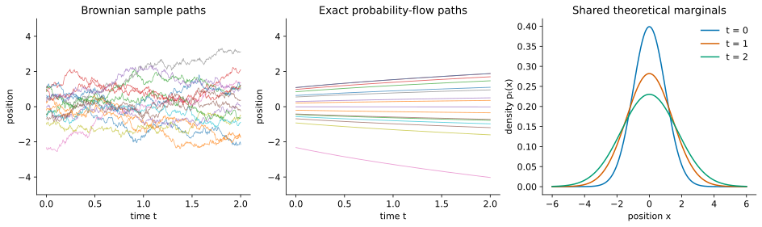

# Score-Based Diffusion in One Dimension: Corruption, Sampling, and Denoising {.unnumbered}

::: {.callout-note}
## Retired material

This earlier tutorial sequence is retained for reference. The current teaching
sequence is [Probability-Flow ODE, Parts 1–5](./07-probability-flow-ode.qmd)
(Lectures 12–16). Follow those lectures for the current notation, derivations,
and notebook exercises. These older notes contain additional background but
are no longer part of the main reading sequence.
:::

::: {.callout-note}
## Tutorial 3 of 4 · A changing density path

**Before this:** [ODEs and conservation](./25-learning-the-score.qmd) and
[SDEs and Fokker–Planck](./26-probability-flow-sampling.qmd). All states are
one-dimensional. The higher-dimensional extension is postponed to Tutorial 4.

**Reading route:** prescribe corruption → derive probability-flow velocity →
reverse for sampling → compare Langevin → learn scores → interpret denoising.
[Shared notation](./score-based-diffusion-guide.qmd).
:::

*Looking for neural ODEs and normalizing flows? They are now in
[Tutorial 4](./28-langevin-dynamics.qmd).*

## A fixed target and a changing density path are different problems

Langevin used a fixed target $p$ and let a current density $q_t$ approach it.
Diffusion models first prescribe a family of corrupted-data laws $p_t$, starting
at $p_0=p_{\mathrm{data}}$. Here **forward time $t$ means data to noise**.
The goal is to generate by traversing this family backward.

Keep $q_t$ for a generic or approximate sampler's density. Writing $q_t=p_t$
is a claim to establish, not a notational convenience. Define

$$s_t(x)=\partial_x\log p_t(x),\qquad
 dX_t=f(X_t,t)dt+g(t)dW_t.$$

The forward SDE specifies the corruption process. The score describes its
marginal density, not the trajectory of one clean training example.

## A solvable forward process: variance-preserving diffusion {#vp}

Choose a nonnegative schedule $\beta(t)$ and set

$$f(x,t)=-\tfrac12\beta(t)x,\qquad g(t)=\sqrt{\beta(t)}.$$

Draw $X_0\sim p_{\mathrm{data}}$ independently of $W$.
The forward drift contracts and the noise spreads. This balance preserves
unit variance if the initial variance is one; it need not preserve the mean,
second moment, or non-Gaussian shape.

### Derivation: the Gaussian corruption law {#gaussian-kernel}

Define

$$\alpha_t=\exp\!\left[-\tfrac12\int_0^t\beta(r)dr\right],\qquad
\sigma_t^2=1-\alpha_t^2.$$

Apply Itô's lemma to $F(x,t)=x/\alpha_t$. The term
$\partial_tF=\beta x/(2\alpha_t)$ cancels the drift contribution
$-\beta x/(2\alpha_t)$, and $\partial_{xx}F=0$. Therefore
$d(X_t/\alpha_t)=\alpha_t^{-1}\sqrt{\beta(t)}dW_t$, and

$$X_t=\alpha_tX_0+\alpha_t\int_0^t
\frac{\sqrt{\beta(r)}}{\alpha_r}\,dW_r.$$

The added term is an independent centered Gaussian. Its variance is

$$\alpha_t^2\int_0^t\frac{\beta(r)}{\alpha_r^2}dr
=\alpha_t^2(\alpha_t^{-2}-1)=\sigma_t^2,$$

using $(\alpha_r^{-2})'=\beta(r)\alpha_r^{-2}$. Therefore

$$\boxed{X_t\mid X_0=x_0\sim\mathcal N(\alpha_tx_0,\sigma_t^2).}$$

A direct noisy observation can be generated by

$$X_t=\alpha_tX_0+\sigma_t\epsilon,\qquad
\epsilon\sim\mathcal N(0,1),\quad\epsilon\text{ independent of }X_0.$$

This represents a **one-time conditional law**. Reusing the same $\epsilon$
across times does not generate a Brownian path. For $r<t$, the actual transition
has fresh noise with mean $(\alpha_t/\alpha_r)X_r$ and variance
$1-(\alpha_t/\alpha_r)^2$.

### Means, variances, and the terminal approximation

Independence gives

$$m_t=\alpha_tm_0,\qquad
V_t=\alpha_t^2V_0+\sigma_t^2.$$

Itô's lemma gives the same equations: $\dot m_t=-\beta m_t/2$ and
$\dot V_t=\beta(1-V_t)$. For $X_0\sim\mathcal N(3,1)$, variance stays one but
mean is $3\alpha_t$ and second moment is $1+9\alpha_t^2$.

Conditional noise variance $\sigma_t^2$ is not total marginal variance $V_t$.
At finite $T$, $p_T$ is generally only approximately standard normal. For
$X_0\sim\mathcal N(m_0,a_0^2)$ it is exactly
$\mathcal N(\alpha_Tm_0,\alpha_T^2a_0^2+\sigma_T^2)$.
For constant $\beta$, $\alpha_t=e^{-\beta t/2}$. For the linear schedule
$\beta(t)=\beta_{\min}+t(\beta_{\max}-\beta_{\min})$ on $0\le t\le1$,
$\log\alpha_t=-\beta_{\min}t/2-(\beta_{\max}-\beta_{\min})t^2/4$.

## Derive the probability-flow ODE from conservation {#probability-flow}

Fokker–Planck for the forward SDE is

$$\partial_tp_t=-\partial_x(fp_t)+\tfrac12g(t)^2\partial_{xx}p_t.$$

At positive smooth density, $\partial_xp_t=p_ts_t$. Consequently,

$$\partial_tp_t=-\partial_x\!\left[p_t
\left(f-\tfrac12g(t)^2s_t\right)\right].$$

Compare with the ODE continuity equation $\partial_tq_t=-\partial_x(vq_t)$.
The velocity

$$\boxed{v(x,t)=f(x,t)-\tfrac12g(t)^2s_t(x)}$$

makes $p_t$ solve that equation. With the same initial law and the required
existence, regularity, and uniqueness of the density evolution, the ODE and
forward SDE have the same one-time marginal densities.

This explains the score's second role. In Langevin it supplied an equilibrium
balancing drift. Here it appears because dividing the diffusive probability
flux $-g^2p_t'/2$ by density $p_t$ produces a **transport velocity**.
The score is neither chosen arbitrarily nor used without its coefficient.

### Solved example: deterministic motion reproduces Brownian spreading

Let the forward SDE be $dX_t=g\,dW_t$ with constant $g$ and
$p_0=\mathcal N(\mu,a_0^2)$, $a_0>0$. Then

$$V_t=a_0^2+g^2t,\quad p_t=\mathcal N(\mu,V_t),\quad
s_t(x)=-\frac{x-\mu}{V_t}.$$

The probability-flow velocity is **outward**:

$$v(x,t)=\frac{g^2}{2V_t}(x-\mu),\qquad
\boxed{x_t=\mu+\sqrt{\frac{V_t}{V_0}}(x_0-\mu).}$$

This is Tutorial 1's Gaussian transport with $a_t=\sqrt{V_t}$. Its
change-of-variables density is exactly $p_t$. The SDE spreads particles by
random kicks; the ODE stretches their distances from the mean. Their
trajectories and pairings of initial and final particles differ.

### Solved example: VP Gaussian transport

For Gaussian clean data, write $a_t=\sqrt{V_t}$, where
$m_t=\alpha_tm_0$, $V_t=\alpha_t^2a_0^2+\sigma_t^2$. Substitution gives

$$v(x,t)=-\tfrac12\beta(t)x+
\frac{\beta(t)}{2V_t}(x-m_t)
=\dot m_t+\frac{\dot a_t}{a_t}(x-m_t).$$

Hence $x_t=m_t+(a_t/a_0)(x_0-m_0)$, the same Gaussian transport already solved
and checked against conservation in Tutorial 1.

For standard normal clean data, $m_t=0,V_t=1$, so $v=0$: ODE particles stay
still while SDE particles move, and both populations stay standard normal.
For $p_0=\mathcal N(\mu,1)$, $v=-\beta m_t/2=\dot m_t$: the ODE simply
translates the population's mean toward zero. It does not shrink its variance.

## Generate by integrating backward {#backward-integration}

For an exact smooth flow, sample $x_T$ from the actual terminal law $p_T$ and
integrate the same ODE from $T$ down to zero. In original-time notation, a
backward step of positive magnitude $h$ is $x(t-h)\approx x(t)-hv(x(t),t)$.

For a common numerical convention, introduce an increasing generation clock
$\tau=T-t$, $Y_\tau=X_{T-\tau}$, and $y_0=x_T$. Then

$$\frac{dy_\tau}{d\tau}=-v(y_\tau,T-\tau),\qquad
\boxed{y_{k+1}=y_k-hv(y_k,t_k),\quad t_k=T-kh.}$$

The step index $k$ increases during generation for both ODE and SDE samplers;
the associated corruption time $t_k$ decreases. All step magnitudes remain
positive. No fresh noise is needed in the ODE because $y_0=x_T$ is random.
For the Gaussian example, backward transport is explicitly
$x_0=m_0+(a_0/a_T)(x_T-m_T)$.

### Song's forward SDE, reverse SDE, and probability-flow ODE {#song-sde-conventions}

[Song's blog](https://yang-song.net/blog/2021/score/#reversing-the-sde-for-sample-generation)
writes the reverse SDE using the original time coordinate and **negative** $dt$.
Here are the distinct equations in that convention:

- Forward SDE, $t:0\to T$:
  $$dX_t=f(X_t,t)dt+g(t)dW_t.$$
- Reverse SDE, $t:T\to0$:
  $$dX_t=[f(X_t,t)-g(t)^2s_t(X_t)]dt+g(t)d\overline W_t.$$
- Probability-flow ODE, usable in either direction:
  $$dx_t=[f(x_t,t)-\tfrac12g(t)^2s_t(x_t)]dt.$$

$\overline W$ represents Brownian motion in reverse time, not a replay of the
original increments. Over a descending step $dt=-h$, its noise variance is
$g(t)^2h$, never a negative variance.

Using the increasing clock $\tau=T-t$, the reverse SDE becomes

$$\boxed{dY_\tau=[-f(Y_\tau,t)+g(t)^2s_t(Y_\tau)]d\tau
+g(t)d\overline W_\tau,\qquad t=T-\tau.}$$

Here $\overline W_\tau$ is standard Brownian motion in the increasing clock,
independent of $Y_0\sim p_T$. Successive numerical noises are independent of
each other and of that initial state. With $t_k=T-kh$, Euler–Maruyama gives

$$\boxed{y_{k+1}=y_k+h[-f(y_k,t_k)+g(t_k)^2s_{t_k}(y_k)]
+g(t_k)\sqrt h\xi_k.}$$

The reverse SDE has the full $g^2$ score coefficient; the ODE has half that
coefficient and no noise. Deleting only the noise changes the density evolution.

### Derivation: obtain the reverse drift from density conservation {#reverse-sde}

Let $q_\tau(x)=p_{T-\tau}(x)$. Reversing time changes the sign of the forward
density derivative, so

$$\partial_\tau q_\tau=\partial_x(fq_\tau)-\tfrac12g^2q_\tau''.$$

Seek a drift $\bar f$ for $dY_\tau=\bar f(Y_\tau,\tau)d\tau+g(t)d\overline W_\tau$.
Its Fokker–Planck equation must match the required reverse derivative:

$$-\partial_x(\bar f q_\tau)+\tfrac12g^2q_\tau''
=\partial_x(fq_\tau)-\tfrac12g^2q_\tau''.$$

Rearranging yields $\partial_x[(\bar f+f)q_\tau-g^2q_\tau']=0$.
The bracket is constant in space. Under the vanishing boundary-current
conditions used here, that constant is zero, so

$$\boxed{\bar f=-f+g^2q_\tau'/q_\tau=-f+g^2s_t.}$$

We have derived a drift giving the reversed marginals. Identifying the actual
reversed stochastic path law additionally uses a time-reversal theorem;
marginal equations alone do not determine a joint path law.

### Worked check: reverse Brownian spreading

Start the forward SDE $dX_t=g\,dW_t$ from $\mathcal N(\mu,a_0^2)$ with constant
$g$. Its variance is $V_t=a_0^2+g^2t$. Reverse from
$Y_0\sim\mathcal N(\mu,V_T)$ using

$$dY_\tau=-\frac{g^2}{V_{T-\tau}}(Y_\tau-\mu)d\tau+g\,d\overline W_\tau.$$

This linear SDE keeps a Gaussian law; its mean remains $\mu$. Itô gives its
variance $R_\tau=\operatorname{Var}Y_\tau$ the equation

$$\dot R_\tau=-\frac{2g^2}{V_{T-\tau}}R_\tau+g^2.$$

The desired solution $R_\tau=V_{T-\tau}$ has derivative $-g^2$ and satisfies
this equation with the correct initial variance. The Gaussian Fokker–Planck
calculation in Tutorial 2 then confirms the density evolution.

The probability-flow ODE has half this drift and no noise; its variance
satisfies $\dot R_\tau=-g^2R_\tau/V_{T-\tau}$, giving the same derivative
$-g^2$ on the desired path. Keeping the full drift while deleting the noise
would give $-2g^2$ there: contraction would be twice too fast.

## Langevin and reverse diffusion: related, different objectives {#langevin-comparison}

At a fixed diffusion level $t$, use a separate algorithmic clock $u$ to run
Langevin targeting $p_t$. For constants $A,D>0$, the frozen process

$$dZ_u=A s_t(Z_u)du+\sqrt{2D}\,dB_u$$

has zero-flux equilibrium $q\propto p_t^{A/D}$, when normalizable and under
suitable boundary conditions: $A s_t q-Dq'=0$ implies
$\partial_x\log q=(A/D)s_t$. To target $p_t$, choose $A=D$.

For drift-free forward diffusion, the reverse SDE has $A=g^2$, $D=g^2/2$
if frozen artificially. Its frozen equilibrium would be proportional to
$p_t^2$, not $p_t$. A clock change scales $A$ and $D$ equally and cannot
remove this mismatch. The true reverse process is not frozen: it transports
a changing density and need not equilibrate at each level.

For VP there is also reversed forward drift:

$$dY_\tau=[\tfrac12\beta(t)Y_\tau+\beta(t)s_t(Y_\tau)]d\tau
+\sqrt{\beta(t)}d\overline W_\tau.$$

The useful decomposition is

$$\boxed{-f+g^2s_t=\underbrace{-f+\tfrac12g^2s_t}_{\text{probability-flow transport}}
+\underbrace{\tfrac12g^2s_t}_{\text{balanced Langevin drift}}.}$$

Pair the second term with noise amplitude $g$: it has $A=D=g^2/2$ and
leaves the frozen target unchanged. This is a decomposition of drifts and
density operators, not an addition of two independent sample trajectories.

### Optional derivation: verify the decomposition on arbitrary densities

For a current density $q$, the reverse-SDE equation is

$$\partial_\tau q=\partial_x(vq)
+\tfrac12g^2[q''-\partial_x(s_tq)].$$

The first term is reverse ODE transport. When $q=p_t$, the bracket vanishes,
leaving the required transport. For other $q$, it need not vanish.

### Annealed Langevin and predictor–corrector sampling

Annealed Langevin chooses decreasing noise levels $\sigma_1>\cdots>\sigma_L>0$.
At level $i$, it targets $p_{\sigma_i}$, the law of $X_0+\sigma_i\epsilon$ with
independent standard Gaussian $\epsilon$. This is additive smoothing with no
$\alpha_t$ factor. For constant $g$, it is the law of drift-free corruption
$dX_t=g\,dW_t$ at $\sigma_i^2=g^2t$. Increasing this noise variance is a
variance-exploding construction. Define $s_\sigma=\partial_x\log p_\sigma$.
Run several updates $x\leftarrow x+h_i s_{\sigma_i}(x)+\sqrt{2h_i}\xi$, then lower
the noise level. The subscript $\sigma$ denotes noise standard deviation, not
a clock. High noise can ease crossing between modes. Finite iterations and
step sizes do not guarantee equilibrium, and the final target remains smoothed.

A predictor–corrector sampler instead advances a diffusion level with a reverse
SDE or ODE predictor, then holds that level fixed for Langevin corrections.
The predictor moves the target; the corrector explores the current target.
Exact Langevin transitions preserve that target, whereas finite Euler steps
introduce bias. Corrector steps are not automatically an improvement for every
choice of step size or approximate score.

## Learn the score only after understanding its use

So far we assumed $s_t$ was known. For real data we can sample clean examples,
but cannot evaluate their marginal density. Gaussian corruption supplies known
conditional targets and lets us learn the unknown marginal score.

### Conditional and marginal densities

At a specified time $t$, the **conditional density** $p_t(x\mid x_0)$ describes noise around one fixed
clean point. The **marginal density** averages these conditional densities over
all possible clean origins:

$$p_t(x)=\int p_t(x\mid x_0)p_{\mathrm{data}}(x_0)\,dx_0.$$

For a discrete distribution replace the integral by a weighted sum. For the
empirical distribution on $N$ training points, it is $N^{-1}\sum_i p_t(x\mid x_0^{(i)})$.
Gaussian corruption gives a smooth positive marginal at $\sigma_t>0$ even
when the clean distribution is discrete.

The conditional Gaussian score is known:

$$\partial_x\log p_t(x\mid x_0)=-\frac{x-\alpha_t x_0}{\sigma_t^2}.$$

Evaluated at a random training pair, this target is

$$\left.\partial_x\log p_t(x\mid X_0)\right|_{x=X_t}
=-\frac{\epsilon}{\sigma_t}.$$

We generated $\epsilon$, so we know the target. But the sampler needs the
**marginal score** $s_t(x)=\partial_x\log p_t(x)$, which need not equal this
single pair's conditional score.

### Worked example: conditional expectation as a posterior average {#two-point-posterior}

Let $X_0$ be $+1$ or $-1$, each with probability one half. Observing $X_t=x$
does not reveal its clean origin. Bayes' rule assigns relative weights using

$$\frac{p_t(x\mid X_0=+1)}{p_t(x\mid X_0=-1)}
=\exp\left[\frac{(x+\alpha_t)^2-(x-\alpha_t)^2}{2\sigma_t^2}\right]
=e^{2\alpha_t x/\sigma_t^2}.$$

Thus, with $w(x)=P(X_0=+1\mid X_t=x)$,

$$w(x)=\frac1{1+e^{-2\alpha_t x/\sigma_t^2}},\qquad
\mathbb E[X_0\mid X_t=x]=w(x)-(1-w(x))
=\tanh\left(\frac{\alpha_t x}{\sigma_t^2}\right).$$

The notation $\mathbb E[A\mid X_t=x]$ means the average of $A$ under the
posterior distribution associated with the observed value $x$. For a continuous
observation, we compute that posterior using densities, rather than divide by
$P(X_t=x)$, which is zero. A useful identity is the **tower property**:
averaging these conditional averages over the observations gives the original
average, $\mathbb E[\mathbb E[A\mid X_t]]=\mathbb E[A]$.

At $x=0$ both origins have weight one half. Their conditional-score targets are
$+\alpha_t/\sigma_t^2$ and $-\alpha_t/\sigma_t^2$. The appropriate average is zero.

### Derivation: averaging conditional scores gives the marginal score {#marginal-score}

Differentiate the mixture, using Gaussian smoothness to justify the operation:

$$\begin{aligned}
\partial_xp_t(x)
&=\int p_t(x\mid x_0)\partial_x\log p_t(x\mid x_0)
                  p_{\mathrm{data}}(x_0)\,dx_0,\\
\partial_x\log p_t(x)
&=\int p_t(x_0\mid x)\partial_x\log p_t(x\mid x_0)\,dx_0.
\end{aligned}$$

The second line follows by dividing by $p_t(x)>0$ and applying Bayes' rule.
The same algebra holds with sums for a discrete prior. Consequently,

$$\boxed{s_t(x)=\mathbb E[-\epsilon/\sigma_t\mid X_t=x].}$$

For the two-point example, averaging the two targets gives

$$s_t(x)=\frac{\alpha_t\tanh(\alpha_t x/\sigma_t^2)-x}{\sigma_t^2}.$$

### Derivation: why squared-error regression learns this average {#mse-lemma}

Let $Y$ be a square-integrable target, $Z$ an input, and
$m(Z)=\mathbb E[Y\mid Z]$. For a predictor $a(Z)$, write

$$a(Z)-Y=[a(Z)-m(Z)]+[m(Z)-Y].$$

On squaring and averaging, the cross term is zero: conditional on $Z$,
$\mathbb E[m(Z)-Y\mid Z]=0$. The tower property therefore gives

$$\boxed{\mathbb E|a(Z)-Y|^2
=\mathbb E|a(Z)-m(Z)|^2+\mathbb E|Y-m(Z)|^2.}$$

Only the first term depends on the predictor, and it is minimized by $a=m$.
At fixed $t>0$ with $\sigma_t>0$, use $Z=X_t$, $Y=-\epsilon/\sigma_t$:

$$\mathcal L_t(\theta)=\mathbb E|s_\theta(X_t,t)+\epsilon/\sigma_t|^2,
\qquad s^*(x,t)=s_t(x).$$

This is **denoising score matching (DSM)**. Its minimum is generally positive:
a single noisy observation does not determine its training target. At $x=0$
in the two-point example, even the ideal output zero leaves conditional loss
$\alpha_t^2/\sigma_t^4$.

### Train across noise levels without a singular target {#training-recipe}

A concrete training loop is:

1. Draw $X_0$ from the data and $t$ from $[t_{\min},T]$, where $t_{\min}>0$.
2. Draw independent $\epsilon\sim\mathcal N(0,1)$.
3. Construct $X_t=\alpha_tX_0+\sigma_t\epsilon$ directly.
4. Choose a positive time weight $\lambda(t)$ and minimize $\lambda(t)|s_\theta(X_t,t)+\epsilon/\sigma_t|^2$.

Use positive weights $\lambda(t)>0$ and choose an interval where $\sigma_t$ is bounded away from zero. This avoids the
singular endpoint target. For a smooth schedule with $\beta(0)>0$,
$\sigma_t^2\approx\beta(0)t$, so
$\mathbb E|\epsilon/\sigma_t|^2=1/\sigma_t^2$ grows like $1/t$.
With smooth clean densities, even the irreducible unweighted DSM loss can
have a divergent time integral at zero. Endpoint behavior depends on the data
and schedule; positive-time training is the simple prescription used here.

### Noise prediction and time weighting

Define $\epsilon_\theta(x,t)=-\sigma_t s_\theta(x,t)$. Then pointwise,

$$\boxed{\sigma_t^2|s_\theta(X_t,t)+\epsilon/\sigma_t|^2
=|\epsilon_\theta(X_t,t)-\epsilon|^2.}$$

Thus choosing $\lambda(t)=\sigma_t^2$ gives the noise-prediction loss. This
removes the explicit inverse-noise scaling; finite expected loss still requires
finite second moments of the predictions. At the population optimum,
$\epsilon^*(x,t)=\mathbb E[\epsilon\mid X_t=x]=-\sigma_t s_t(x)$.
The targets contain equivalent information, but different time weights and
finite-capacity parameterizations can produce different learned fits.

## Tweedie: the Bayes-optimal denoiser

### Derivation: Tweedie's formula {#tweedie}

First consider $Y=X+\sigma\epsilon$, with independent $\epsilon\sim\mathcal N(0,1)$,
$\sigma>0$, and a clean variable with finite second moment. For a continuous
prior,

$$p_Y(y)=\int p(y\mid x)p_X(x)dx,\qquad
\partial_y p(y\mid x)=\frac{x-y}{\sigma^2}p(y\mid x).$$

Differentiate under the integral and divide by $p_Y(y)>0$:

$$\begin{aligned}
\partial_y\log p_Y(y)
&=\int\frac{x-y}{\sigma^2}
\frac{p(y\mid x)p_X(x)}{p_Y(y)}dx\\
&=\frac{\mathbb E[X\mid Y=y]-y}{\sigma^2}.
\end{aligned}$$

Bayes' rule identifies the fraction as the posterior density. Use sums for a
discrete prior, or integration against its probability measure in general.
Thus $\mathbb E[X\mid Y=y]=y+\sigma^2\partial_y\log p_Y(y)$.

For diffusion's scaled observation, average the conditional Gaussian score over the clean posterior:

$$s_t(x)=\frac{\alpha_t\mathbb E[X_0\mid X_t=x]-x}{\sigma_t^2}.$$

For $\alpha_t>0$ this rearranges to

$$\boxed{\mathbb E[X_0\mid X_t=x]
=\frac{x+\sigma_t^2s_t(x)}{\alpha_t}.}$$

The MSE lemma above, now with target $X_0$, proves that this posterior mean is
the Bayes-optimal squared-error denoiser. It averages uncertainty rather than
selecting one possible clean sample.
A denoised posterior mean need not itself be a data sample: for the two-point
prior and observation zero it equals zero, although the clean values are $\pm1$.

## Work through discrete and continuous targets

### Two-point data: reuse the posterior, construct the motion

Let $P(X_0=+1)=P(X_0=-1)=1/2$. This is a distribution with two atoms, not an
ordinary density at $t=0$. Write $\mathcal N(x;m,V)$ for the Gaussian density
evaluated at $x$, with mean $m$ and variance $V$. At positive noise,

$$p_t(x)=\tfrac12\mathcal N(x;-\alpha_t,\sigma_t^2)
+\tfrac12\mathcal N(x;\alpha_t,\sigma_t^2).$$

The earlier [two-point calculation](#two-point-posterior)
and marginal-score identity give

$$\widehat x_0(x,t)=\mathbb E[X_0\mid X_t=x]=\tanh(\alpha_t x/\sigma_t^2),
\qquad s_t(x)=\frac{\alpha_t\widehat x_0(x,t)-x}{\sigma_t^2}.$$

Substitute into the VP velocity:

$$v(x,t)=-\frac{\beta(t)}2
\left[x+\frac{\alpha_t\tanh(\alpha_t x/\sigma_t^2)-x}{\sigma_t^2}\right].$$

Positive-time trajectories preserve their order and cannot cross zero under
uniqueness, since zero is itself an equilibrium trajectory. In the limit
$t\downarrow0$, the exact flow takes positive terminal points to $+1$ and
negative points to $-1$. The endpoint is therefore $\operatorname{sign}(X_T)$
almost surely under a terminal law with a density. The zero trajectory stays zero,
a probability-zero exception. The quantile argument below explains this limit.

Starting with a symmetric Gaussian also gives equal endpoint masses in this
special example. That symmetry does not make its intermediate marginals exact,
and does not justify replacing $p_T$ arbitrarily for other data distributions.
The sign map is a singular limit, not a finite-time diffeomorphism.

### Derivation: one-dimensional flow preserves probability rank

Let $F_t(x)=P(X_t\le x)$ be the CDF. A one-dimensional ODE with unique solutions
preserves order: trajectories cannot cross at the same time. Thus its map
between two smooth positive-density marginals is increasing. For such a map,

$$F_t(\Psi_{T\to t}(x))=F_T(x),\qquad
\boxed{\Psi_{T\to t}(x)=F_t^{-1}(F_T(x)).}$$

The first equality says that all particles below $x$ remain below its image;
their total probability is unchanged. This derives the map without solving
the ODE explicitly. In the symmetric two-point limit, ranks below one half
approach $-1$ and ranks above one half approach $+1$.

### A continuous two-Gaussian target and the terminal-prior approximation

Let

$$p_0=\tfrac12\mathcal N(-1,\varrho^2)+\tfrac12\mathcal N(1,\varrho^2),
\qquad\varrho>0.$$

Now the endpoint density is smooth and the exact probability-flow map is
$F_0^{-1}\circ F_T$. The actual finite-time terminal density is

$$p_T=\tfrac12\mathcal N(-\alpha_T,\alpha_T^2\varrho^2+\sigma_T^2)
+\tfrac12\mathcal N(\alpha_T,\alpha_T^2\varrho^2+\sigma_T^2).$$

It is generally only close to standard normal. Let $\Phi$ denote the standard
normal CDF and $Z\sim\mathcal N(0,1)$. The ideal direct Gaussian-to-data map is
$F_0^{-1}(\Phi(Z))$. Feeding $Z$ into the finite-time probability-flow map
instead gives $F_0^{-1}(F_T(Z))$, which need not have density $p_0$.
This makes the terminal-prior approximation visible in a single formula.

### A posterior denoiser is not a transport endpoint

Tweedie's estimate $\widehat x_0(x,t)=(x+\sigma_t^2s_t(x))/\alpha_t$ averages possible clean
origins under the **stochastic corruption** model. The ODE map follows one
particle through scores at successive times. They solve different problems.
For two-point data, a small positive observation can have posterior mean close
to zero, whereas its limiting ODE endpoint is $+1$.

## A practical sampling recipe and its limitations

1. Choose $T>t_{\min}>0$ and a descending grid.
2. Initialize from a chosen terminal law $\pi_T$, usually a Gaussian approximation to $p_T$.
3. At each level evaluate $s_\theta(x,t)$ and apply either the reverse ODE Euler
   step or the reverse SDE Euler–Maruyama step derived above.
4. Return the sample at $t_{\min}$. An optional posterior-mean denoiser is an
   additional operation, not the exact endpoint transport.

Score error, terminal-law approximation, finite integration steps, and the
positive endpoint cutoff are separate approximations. Improving the solver
alone does not remove the others. Exact recovery statements require the exact
score, the correct terminal law, and exact evolution on a regular interval.
Discrete clean targets can occur only through a singular zero-noise limit;
a smooth finite-time invertible flow cannot turn a smooth density into atoms.

## Check your understanding

1. Why is the forward probability-flow score term outward for a spreading Gaussian?
2. Why is simply removing reverse-SDE noise not the probability-flow ODE?
3. Which score does denoising score matching learn at its population optimum?
4. Is a posterior mean necessarily a sample from the clean distribution?

::: {.callout-tip collapse="true"}
## Answers

1. It is $-g^2s_t/2$, reversing the inward Gaussian score's sign.
2. The drift must also lose half of its score coefficient to compensate for the removed spreading.
3. The marginal score, obtained by posterior averaging the conditional targets.
4. No. For equally likely $\pm1$ and observation zero, the posterior mean is zero.
:::

**Continue:** [Transport, neural ODEs, and higher dimensions](./28-langevin-dynamics.qmd).
For additional practice, the [stand-alone Tweedie tutorial](./23-tweedie-bayes-denoising.qmd)
develops the same statistical identity independently.

## Sources

The forward/reverse SDE framework, probability-flow ODE, and predictor–corrector
samplers are developed in [Song et al., Score-Based Generative Modeling through
Stochastic Differential Equations](https://arxiv.org/abs/2011.13456).
Annealed score-based sampling is developed in [Song and Ermon](https://arxiv.org/abs/1907.05600).
