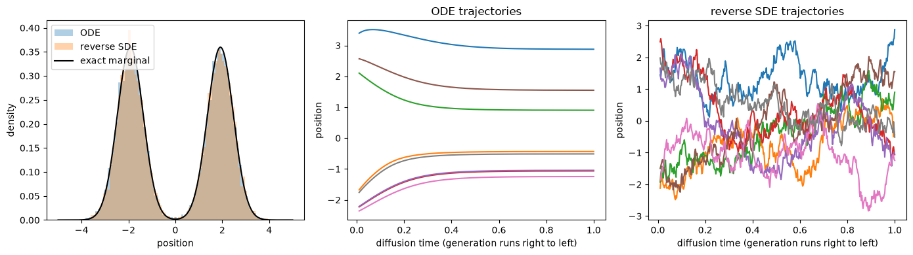
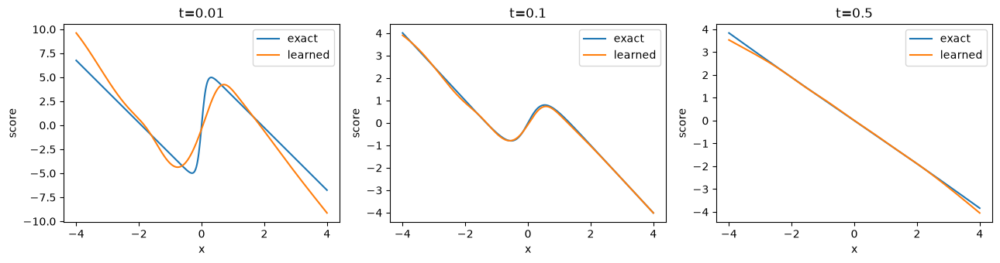
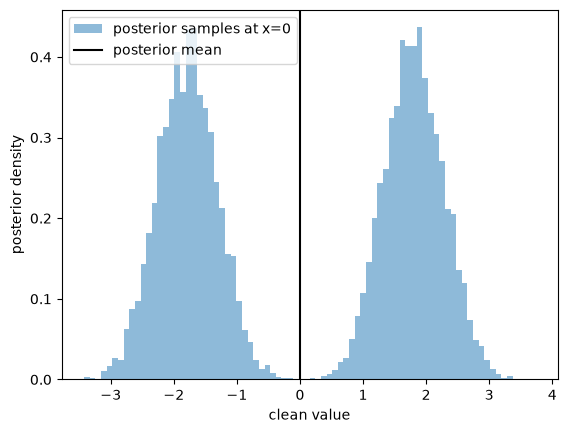

# 15 · Probability-Flow ODE - Part 4 {.unnumbered}

::: {.callout-note}
## Draft — CPU notebooks

These lecture notes are in development and may be revised. Four self-contained mini-tutorial notebooks accompany Parts 1–3. Each introduces the mathematical problem, derives or explains the equations before the code, interprets the outputs, and ends with exercises. They use synthetic one-dimensional data, fixed seeds, and small models; no dataset download or GPU is needed. The notebooks include executed outputs and figures.
:::

## 1. Read or run the experiments

Use the **Read** links below to view the code, saved outputs, and figures directly in your browser. No Python installation is needed to read them. To change parameters or rerun the experiments, download the notebooks and use a Python environment.

Download the [complete teaching bundle](../materials/probability-flow/probability-flow-code.zip), extract it, and open its `notebooks` directory in a Jupyter-compatible editor. Create a Python environment and install the included requirements:

```bash
python -m venv .venv
source .venv/bin/activate
python -m pip install -r requirements.txt
```

On Windows, activate with `.venv\Scripts\activate`. Select this environment as the notebook kernel. Run cells from top to bottom. The notebooks contain their own mathematical helpers, so each can also be downloaded individually.

| Notebook | Main question | Read | Download |
|---|---|---|---|
| 1. Transport and conservation | How does particle motion change density while conserving probability? | [Read](../materials/probability-flow/notebooks/01-transport-and-conservation.html) | [Download .ipynb](../materials/probability-flow/notebooks/01-transport-and-conservation.ipynb) |
| 2. Exact-score sampling | Does the constructed field recover the prescribed marginals? | [Read](../materials/probability-flow/notebooks/02-exact-score-sampling.html) | [Download .ipynb](../materials/probability-flow/notebooks/02-exact-score-sampling.ipynb) |
| 3. Learn a score | How does regression error affect the generated distribution? | [Read](../materials/probability-flow/notebooks/03-learn-a-score.html) | [Download .ipynb](../materials/probability-flow/notebooks/03-learn-a-score.ipynb) |
| 4. Tweedie and denoising | How are scores, posterior means, and posterior samples related? | [Read](../materials/probability-flow/notebooks/04-tweedie-and-denoising.html) | [Download .ipynb](../materials/probability-flow/notebooks/04-tweedie-and-denoising.ipynb) |

Notebook 3 saves `toy-noise.pt`. Notebook 4 reuses it if present; otherwise it trains its own small model. No checkpoint is required to start.

## 2. Transport and conservation

Begin with $X_0\sim\mathcal N(0,1)$ and solve two ODEs:

$$v(x)=2:\quad X_t=X_0+2t,\qquad
v(x)=-x:\quad X_t=e^{-t}X_0.$$

Plot particle histograms and the exact density at $t=0,0.5,1$. Then compare a fixed interval with one whose endpoints follow the flow. For a fixed interval $[a,b]$,

$$\frac{d}{dt}P(a\le X_t\le b)=p_t(a)v(a)-p_t(b)v(b).$$

The notebook compares the rate of change of exact interval probability with this boundary flux. A moving interval keeps exactly the same particle membership under these invertible flows. Its empirical probability remains constant, even though its spatial width can change.

Finally, refine Euler's step size for contraction. This exposes numerical trajectory error independently of histogram noise. The derivation of continuity remains in [Part 1's appendices](./07-probability-flow-ode.qmd).

## 3. Exact scores make sampling errors measurable

Use the smooth two-component data distribution

$$p_0(x)=\tfrac12\mathcal N(x;-2,0.25)+\tfrac12\mathcal N(x;2,0.25).$$

For $\beta=8$ and $\alpha_t=e^{-4t}$, its noisy components have means $\alpha_t(-2)$ and $\alpha_t(2)$ and common variance

$$V_t=0.25\alpha_t^2+1-\alpha_t^2.$$

Write $m_1=-2$ and $m_2=2$ for the clean component means. Let $w_j(x,t)$ be the posterior probability of component $j$ given position $x$. The exact score is

$$s_t(x)=\sum_{j=1}^2w_j(x,t)\frac{\alpha_tm_j-x}{V_t}.$$

The notebook evaluates the weights using normalized log probabilities to avoid numerical underflow. A finite-difference derivative of $\log p_t$ checks the score implementation.

Generate with both the probability-flow ODE and the reverse SDE. The target of the displayed comparison is **$p_{0.01}$**, because both samplers stop at $t_{\min}=0.01$. This distinction matters: stopping at positive noise changes the intended output law.

A second experiment follows deterministic quantiles. Starting from exact quantiles of $p_1$ removes Monte Carlo variation and lets us compare numerical ODE trajectories with the CDF-defined transport. A third uses the same solver and matched quantiles from a Gaussian prior to isolate terminal-law substitution.



## 4. Learn the missing quantity

Notebook 3 trains a small time-conditioned network for 2,500 updates. It minimizes noise MSE with fresh synthetic data and times sampled uniformly in $[0.01,1]$. Convert its output to a score using the formula from Part 3.

The score plot alone is not sufficient to assess the model. The notebook also reports

$$\mathbb E_{X_t\sim p_t}\bigl[(s_\theta(X_t,t)-s_t(X_t))^2\bigr]$$

at three noise levels. This weights error by locations actually visited under the marginal. Then compare exact-score and learned-score samples using the same initial particles and the same Euler resolution.

The learned score is imperfect, especially at the lowest noise level. Increasing solver resolution cannot eliminate that estimation error. This provides a concrete reason to evaluate training and sampling separately.



## 5. Denoising is a conditional estimation problem

Notebook 4 computes the posterior mean of the clean Gaussian mixture in two ways: by conditioning each component and by Tweedie's formula. Their agreement is checked to numerical precision. It also plots the estimate obtained from the learned noise predictor.

At $t=0.15$, for an ambiguous observation $x_t=0$, the posterior remains symmetric and can have two separated regions of high density. Its mean is zero. Draw posterior samples and compare their histogram with the single posterior-mean estimate. This experiment distinguishes squared-error optimal estimation from sampling an uncertain clean value.

The final cell verifies the loss conversions among score, noise, and clean-data prediction on the same generated examples.



## 6. Recorded local results

The following results were obtained by executing all four notebooks on a CPU with the included seed. They are checks of this teaching implementation, not hardware-independent performance guarantees.

| Check | Recorded result |
|---|---|
| Moving-interval particle probability | Constant at every sampled time |
| Contraction Euler error, 10 → 200 steps | 0.01920 → 0.00092 |
| Mixture ODE mean quantile-position error, 50 → 400 steps | 0.07347 → 0.00883 |
| Exact-score ODE empirical CDF error against $p_{0.01}$ | 0.0053, with 12,000 samples |
| Exact-score reverse-SDE empirical CDF error against $p_{0.01}$ | 0.0059, with 12,000 samples |
| Learned-score versus exact-score output CDF error, matched 6,000 initial samples | 0.0322 versus 0.0123 |
| Analytic posterior mean versus exact-score Tweedie estimate | Maximum error below $10^{-12}$ |

The empirical CDF error is the maximum difference between the empirical CDF and the known reference CDF. It includes finite-sample fluctuation as well as model and numerical effects; do not interpret a single value as pure solver error. The quantile experiment avoids this ambiguity for the deterministic solver.

Recorded cell runtimes were approximately 0.3, 1.4, 2.0, and 0.4 seconds, respectively, excluding kernel startup and using the saved model in Notebook 4. Runtime varies by machine; training from scratch in Notebook 4 adds the small network-training cost. Tested package versions are included in the bundle.

[Part 5](./34-probability-flow-ode-part-5.qmd) replaces the scalar network with an image U-Net and makes the discrete schedule and sampling conventions explicit.
